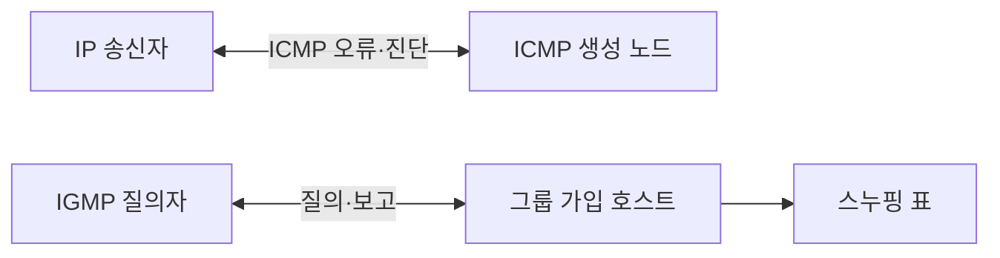

---
sidebar:
  order: 14
  label: "014. ICMP·IGMP (ICMP IGMP)"
  badge:
    text: "기출 · 30%"
    variant: note
title: "ICMP·IGMP (ICMP IGMP)"
date: "2026-07-27T23:59:59+09:00"
tags:
  - "notes-network"
weight: 14
extra:
  question_no: "014"
  source_status: "기출"
  source_history: "132회"
  priority: 30
  priority_note: "비교형: 132회 ICMP·IGMP 역할 직접 비교"
---

## 미리 알고가기

- **인터넷 프로토콜(Internet Protocol, IP)**: ‘아이피’로 읽고 영문 머리글자를 딴 약어이며, 목적지 주소로 패킷을 네트워크 사이에 전달함
- **인터넷 제어 메시지 프로토콜(Internet Control Message Protocol, ICMP)**: ‘아이시엠피’로 읽고 영문 머리글자를 딴 약어이며, IP 전달 오류와 진단 상태를 알림
- **인터넷 그룹 관리 프로토콜(Internet Group Management Protocol, IGMP)**: ‘아이쥐엠피’로 읽고 영문 머리글자를 딴 약어이며, IPv4 호스트와 라우터가 멀티캐스트 그룹 가입 상태를 교환함
- **인터넷 프로토콜 버전 4(Internet Protocol version 4, IPv4)**: ‘아이피 버전 포’로 읽고 네 번째 규격을 숫자로 표시하며, 32비트 주소로 패킷을 전달함
- **멀티캐스트(Multicast)**: 하나의 송신 데이터를 특정 그룹에 가입한 여러 수신자에게 전달하는 방식
- **유형·코드(Type·Code)**: ICMP 메시지 종류와 그 안의 세부 오류·상태 원인을 구분하는 필드
- **질의·보고·탈퇴(Query·Report·Leave)**: 라우터의 가입 확인, 호스트의 가입 응답, 그룹 탈퇴를 나타내는 IGMP 메시지
- **IGMP 스누핑(IGMP Snooping)**: 스위치가 IGMP 메시지를 관찰해 그룹별 가입 포트에만 멀티캐스트를 전달하는 기능
- **경로 최대 전송 단위 탐색(Path Maximum Transmission Unit Discovery, PMTUD)**: ‘피엠티유디’로 읽고 영문 머리글자를 딴 약어이며, ICMP 오류로 경로의 분할 없는 최대 패킷 크기를 찾음
- **가상 근거리 통신망(Virtual Local Area Network, VLAN)**: 하나의 물리 스위치망을 여러 논리 브로드캐스트 영역으로 나누는 기술
- **질의자(Querier)**: 링크의 호스트에게 멀티캐스트 그룹 가입 상태를 주기적으로 묻는 라우터
- **알 수 없는 멀티캐스트 플러딩**: 가입 포트를 모르는 멀티캐스트 프레임을 VLAN의 여러 포트로 전달하는 동작
- **전송률 제한(Rate Limiting)**: 일정 시간에 처리할 메시지 수를 제한해 제어 메시지 과부하를 억제하는 기능
- **방화벽(Firewall)**: 주소·프로토콜·연결 상태 규칙으로 네트워크 트래픽을 허용하거나 차단하는 보안 장비

## Ⅰ. 개요

- 정의/개념: ICMP는 **IP 오류·진단**, IGMP는 **그룹 가입 관리**
- 기존 한계: IP 단독 전달의 **실패 원인·그룹 수신자 미관리**

### 쉽게 이해하기 (학습용)
- ICMP는 배달 실패를 알리고 IGMP는 방송 수신자를 관리한다

## Ⅱ. 특징

- ICMP 유형·코드의 **오류 원인·진단 구분**
- ICMP 원 패킷 인용의 **실패 흐름 식별**
- IGMP 질의·보고·탈퇴의 **가입 상태 갱신**

### 쉽게 이해하기 (학습용)

- 오류 쪽지는 실패한 소포 정보를 일부 넣고 방송 가입표는 누가 어느 채널을 듣는지 계속 갱신한다

## Ⅲ. 아키텍처 및 구성요소

| 설계 요소 | 설명 |
|:---|:---|
| IP 송신자 | ICMP 오류·진단 응답을 수신 |
| ICMP 생성 노드 | 오류 유형·코드와 원 패킷 일부를 반환 |
| IGMP 질의자 | 그룹 수신자 존재 여부를 주기적으로 질의 |
| 그룹 가입 호스트 | 가입 보고·탈퇴로 수신 의사를 알림 |
| 스누핑 표 | VLAN·그룹·가입 포트 관계를 저장 |

> 요약: ICMP는 오류 진단, IGMP는 멀티캐스트 범위 제어

### 쉽게 이해하기 (학습용)

- ICMP는 실패 원인을 보내고 IGMP는 방송 가입자를 관리해 서로 다른 문제를 해결한다

## Ⅳ. 원리 및 절차 흐름도

| 작동 원리 | 설명 |
|:---|:---|
| ICMP 오류 통보 | 유형·코드와 원 패킷 일부를 반환 |
| IGMP 가입 관리 | 질의·보고·탈퇴로 가입 상태 갱신 |

> 요약: ICMP는 오류 반환, IGMP는 가입 상태 갱신

### 쉽게 이해하기 (학습용)

- 전달 오류는 송신자에게 알리고 방송 가입 변화는 수신 포트 표에 반영한다

## Ⅴ. 종류 및 비교

| 제어 프로토콜 | ICMP | IGMP |
|:---|:---|:---|
| 적용 기준 | 도달성·경로·**패킷 크기 진단** | 멀티캐스트 **수신자·가입 포트 관리** |
| 핵심 특징 | 유형·코드의 **IP 오류·상태 통보** | 질의·보고·탈퇴의 **가입 교환** |
| 한계 | 과도 차단 시 **진단·PMTUD 실패** | 상태 오류 시 **과다 전달·수신 단절** |

> 요약: ICMP는 오류 진단, IGMP는 그룹 가입 관리

### 쉽게 이해하기 (학습용)

- ICMP는 배달 실패를 알리고 IGMP는 방송 가입 상태를 관리한다

## Ⅵ. 실무 사례

1. 방화벽은 PMTUD용 ICMP를 허용하고 전송률 제한

### 쉽게 이해하기 (학습용)

- ICMP를 전부 차단하면 큰 패킷이 막힌 이유를 몰라 전송이 계속 실패할 수 있다

## Ⅶ. 결론

- IP 오류 진단과 멀티캐스트 가입 제어가 과도한 차단으로 손상되는 것을 막기 위해 메시지 유형·발신 범위·서비스 필요성·남용 위험을 검토하여, ICMP와 IGMP 정책을 역할별로 분리해야 한다.

### 쉽게 이해하기 (학습용)

- 실패 알림과 방송 가입 관리의 역할이 다르므로 허용 규칙을 따로 정한다
