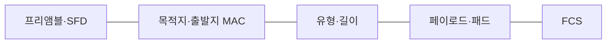
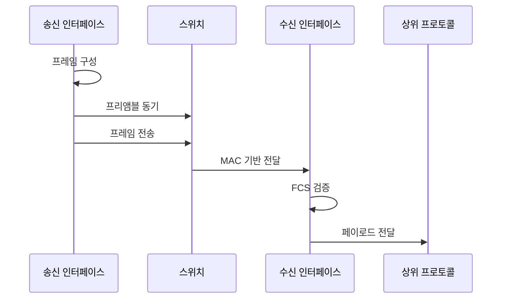

---
sidebar:
  order: 15
  label: "015. 이더넷 프레임 구조·IEEE 802.3 (Ethernet Frame)"
  badge:
    text: "기출 · 50%"
    variant: note
title: "이더넷 프레임 구조·IEEE 802.3 (Ethernet Frame)"
date: "2026-07-27T23:59:59+09:00"
tags:
  - "notes-network"
weight: 15
extra:
  question_no: "015"
  source_status: "기출"
  source_history: "128회, 129회"
  priority: 50
  priority_note: "설명형: 129회 IEEE 802.3 Frame 서술"
---

## 미리 알고가기

- **이더넷(Ethernet)**: 유선 근거리 통신망에서 프레임 형식과 매체 접근 방식을 정한 표준
- **매체 접근 제어 주소(Media Access Control Address, MAC 주소)**: ‘맥 주소’로 읽고 영문 머리글자를 딴 약어이며, 같은 링크의 출발지·목적지 인터페이스를 식별하는 48비트 주소
- **근거리 통신망(Local Area Network, LAN)**: ‘랜’으로 읽고 영문 머리글자를 딴 약어이며, 제한된 범위의 장치를 링크로 연결한 네트워크
- **이더타입(EtherType)**: 이더넷 프레임의 페이로드를 처리할 상위 프로토콜을 나타내는 값
- **프레임 검사 순서(Frame Check Sequence, FCS)**: ‘에프시에스’로 읽고 영문 머리글자를 딴 약어이며, 수신 측이 비트 오류를 검출하도록 프레임 끝에 붙이는 검사값
- **최대 전송 단위(Maximum Transmission Unit, MTU)**: ‘엠티유’로 읽고 영문 머리글자를 딴 약어이며, 링크가 한 프레임에서 전달할 수 있는 최대 상위 데이터 크기
- **국제전기전자기술자협회(Institute of Electrical and Electronics Engineers, IEEE)**: '아이 트리플 이'로 읽는 머리글자 약어이며 802.3 이더넷 표준을 제정하는 국제 전문 단체
- **프로토콜 데이터 단위(Protocol Data Unit, PDU)**: 각 계층의 데이터와 제어 정보를 합친 처리 단위
- **순환 중복 검사(Cyclic Redundancy Check, CRC)**: 송수신 측이 비트열을 같은 다항식으로 나눈 나머지를 비교해 오류를 검출하는 기법
- **프리앰블·프레임 시작 구분자(Start Frame Delimiter, SFD)**: 수신 클록을 맞추는 반복 비트와 프레임 시작을 표시하는 비트 패턴
- **페이로드·패드(Payload·Pad)**: 프레임이 운반하는 상위 데이터와 최소 프레임 길이를 채우는 추가 바이트
- **논리 링크 제어(Logical Link Control, LLC)**: IEEE 802.3 길이 필드 뒤에서 상위 프로토콜을 구분하는 데이터링크 상위 기능
- **가상 근거리 통신망(Virtual Local Area Network, VLAN) 태그**: IEEE 802.1Q가 프레임에 넣는 VLAN 식별·우선순위 정보
- **점보 프레임(Jumbo Frame)**: 표준 이더넷 MTU보다 큰 페이로드를 운반하도록 장비가 별도로 지원하는 프레임
- **트렁크 포트(Trunk Port)**: VLAN 태그를 사용해 여러 VLAN 프레임을 한 링크로 전달하는 스위치 포트
- **CRC-32**: '씨알씨 삼십이'로 읽고 32비트 검사값을 쓰는 순환 중복 검사임을 하이픈 뒤 숫자로 표시해 FCS 오류 검출에 사용

## Ⅰ. 개요

- 정의/개념: 주소·데이터·검사값의 **데이터링크 전송 단위**
- 기존 한계: 연속 비트 신호의 **경계·수신자·오류 식별 불가**

### 쉽게 이해하기 (학습용)
- 연속된 신호에 시작·주소·내용·검사표를 붙여 하나의 운송 봉투로 구분한다

## Ⅱ. 특징

- 프리앰블·SFD의 **클록 동기·프레임 경계**
- 목적지 MAC의 **링크 수신 인터페이스 식별**
- FCS의 **비트 오류 검출·정정 불가**

### 쉽게 이해하기 (학습용)

- 검사값이 틀린 프레임은 버리고 재전송은 필요한 상위 계층이 맡는다

## Ⅲ. 아키텍처 및 구성요소

| 설계 요소 | 설명 |
|:---|:---|
| 프리앰블·SFD | 클록 동기화 및 프레임 시작 경계 표시 |
| 목적지·출발지 MAC | 수신·송신 인터페이스를 식별 |
| 유형·길이 | 상위 프로토콜 또는 페이로드 길이 |
| 페이로드·패드 | 상위 데이터와 최소 길이 보충 바이트 |
| FCS | 전송 비트 오류 검출용 CRC-32 값 |

> 요약: 주소·유형·데이터·검사값으로 전달·검증

### 쉽게 이해하기 (학습용)

- 앞의 주소와 내용 종류로 전달·해석하고 뒤의 검사표로 운송 중 손상됐는지 확인한다

## Ⅳ. 원리 및 절차 흐름도

| 절차 | 설명 |
|:---|:---|
| 프레임 구성 | 주소·유형·페이로드·FCS를 배치 |
| 프리앰블 동기 | 수신 클록과 프레임 시작을 맞춤 |
| 프레임 전송 | 비트열을 링크 신호로 송신 |
| MAC 기반 전달 | 목적지 MAC의 출력 포트로 중계 |
| FCS 검증 | CRC 계산값 불일치 프레임을 폐기 |
| 페이로드 전달 | 유형값에 해당하는 상위 프로토콜로 전달 |

> 요약: FCS가 유효한 프레임만 상위 계층에 전달

### 쉽게 이해하기 (학습용)

- 봉투 시작을 찾고 주소로 포트를 선택한 뒤 오류 검사를 통과한 내용만 담당 프로토콜에 넘긴다

## Ⅴ. 종류 및 비교

| 이더넷 프레임 형식 | 이더넷 II | IEEE 802.3 LLC |
|:---|:---|:---|
| 적용 기준 | 일반 **IP 기반 이더넷 통신** | IEEE 802 계열 **LLC 서비스** |
| 핵심 특징 | 이더타입의 **상위 프로토콜 표시** | 길이 뒤 LLC의 **상위 서비스 표시** |
| 한계 | 이더타입 **오해석·비호환** | 길이·LLC **헤더 오해석** |

> 요약: 유형·길이 필드값으로 프레임 형식 판별

### 쉽게 이해하기 (학습용)

- 같은 칸을 내용 종류로 읽으면 이더넷 II, 길이로 읽으면 IEEE 802.3이다

## Ⅵ. 실무 사례

1. 점보 프레임은 송신부터 수신까지 MTU를 일치

### 쉽게 이해하기 (학습용)

- 큰 프레임을 쓰는 모든 장비의 통과 크기가 같아야 중간 장비에서 프레임이 버려지지 않는다

## Ⅶ. 결론

- 동일 링크에서 프레임을 정확히 전달하고 오류를 검출하기 위해 출발지·목적지 MAC·EtherType·MTU·FCS를 검토하여, 이더넷 프레임의 전달·해석·오류 지점을 판정해야 한다.

### 쉽게 이해하기 (학습용)

- 수신자·내용 종류·검사값을 차례로 확인해 전달 장애 지점을 찾는다
