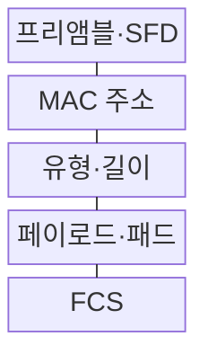
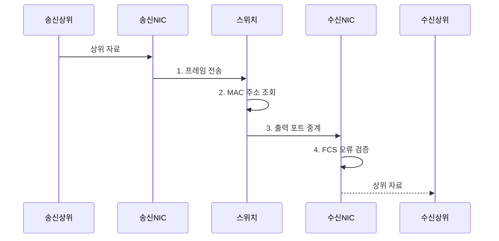

---
sidebar:
  order: 15
  label: "015. 이더넷 프레임 구조·IEEE 802.3 (Ethernet Frame)"
  badge:
    text: "기출 · 50%"
    variant: note
title: "이더넷 프레임 구조·IEEE 802.3 (Ethernet Frame)"
date: "2026-07-31T11:11:16+09:00"
tags:
  - "notes-network"
weight: 15
extra:
  question_no: "015"
  source_status: "기출"
  source_history: "128회, 129회"
  priority: 50
  priority_note: "설명형: 129회 IEEE 802.3 Frame 서술"
---

## Ⅰ. 개요

핵심 용어

- **이더넷 프레임**: 주소·상위 데이터·검사값을 묶어 전달하는 데이터링크 계층 전송 단위이다.

- 정의/개념: **이더넷 프레임**은 송수신 MAC 주소•상위 데이터•오류 검사값을 정해진 형식으로 캡슐화한 **데이터링크 계층 전송 단위**
- 배경/필요성: 연속 비트 신호의 **경계·수신자·오류 식별 불가**

#### 한줄 요약

- 연속된 신호에 시작·주소·내용·검사표를 붙여 하나의 운송 봉투로 구분한다

## Ⅱ. 특징

핵심 용어

- **프리앰블·SFD**: 수신 클록을 맞추는 반복 비트와 프레임 시작을 표시하는 비트 패턴이다.
- **MAC 주소·FCS**: 같은 링크의 인터페이스를 식별하는 주소와 프레임 비트 오류를 검출하는 검사값이다.

- 프리앰블·SFD의 **클록 동기·프레임 경계**
- 목적지 MAC의 **링크 수신 인터페이스 식별**
- FCS의 **비트 오류 검출·정정 불가**

#### 한줄 요약

- 검사값이 틀린 프레임은 버리고 재전송은 필요한 상위 계층이 맡는다

## Ⅲ. 구조 및 구성요소

핵심 용어

- **EtherType·LLC**: 상위 프로토콜을 값으로 표시하는 필드와 IEEE 802.3 길이 필드 뒤에서 서비스를 구분하는 기능이다.
- **CRC-32**: 32비트 순환 중복 검사값으로 FCS의 오류 검출에 쓰이는 기법이다.

| 구성요소 | 책임 |
|:---|:---|
| 프리앰블·SFD | **클록 동기·프레임 시작** 표시 |
| MAC 주소 | **수신·송신 인터페이스** 식별 |
| 유형·길이 | **상위 프로토콜·자료 길이** 표시 |
| 페이로드·패드 | **상위 자료·최소 길이** 보충 |
| FCS | **CRC-32**로 비트 오류 검출 |

#### 한줄 요약

- 앞의 주소와 내용 종류로 전달·해석하고 뒤의 검사표로 운송 중 손상됐는지 확인한다

## Ⅳ. 흐름도

핵심 용어

- **NIC**: 프레임을 직렬화·송수신하고 목적지 주소와 FCS를 검사하는 네트워크 인터페이스 장치이다.

**동작 원리**

1. **프레임 전송**: 주소·유형·자료·FCS 직렬화
2. **MAC 주소 조회**: 목적지 주소로 출력 포트 결정
3. **출력 포트 중계**: 목적지 인터페이스로 프레임 전달
4. **FCS 오류 검증**: CRC 불일치 프레임 폐기

#### 한줄 요약

- 봉투 시작을 찾고 주소로 포트를 선택한 뒤 오류 검사를 통과한 내용만 담당 프로토콜에 넘긴다

## Ⅴ. 종류 및 비교

핵심 용어

- **Ethernet II·IEEE 802.3 LLC**: 공통 필드를 상위 프로토콜 유형으로 읽는 형식과 데이터 길이로 읽는 형식이다.

| 이더넷 프레임 형식 | 이더넷 II | IEEE 802.3 LLC |
|:---|:---|:---|
| 적용 기준 | 일반 **IP 기반 이더넷 통신** | IEEE 802 계열 **LLC 서비스** |
| 핵심 특징 | 이더타입의 **상위 프로토콜 표시** | 길이 뒤 LLC의 **상위 서비스 표시** |
| 한계 | 이더타입 **오해석·비호환** | 길이·LLC **헤더 오해석** |

> 요약: 유형·길이 필드값으로 프레임 형식 판별

#### 한줄 요약

- 같은 칸을 내용 종류로 읽으면 이더넷 II, 길이로 읽으면 IEEE 802.3이다

## Ⅵ. 실무 고려사항 및 대책

핵심 용어

- **MTU·점보 프레임**: 링크가 운반할 수 있는 최대 상위 데이터 크기와 표준 MTU보다 큰 페이로드를 지원하는 프레임이다.
- **VLAN 태그**: IEEE 802.1Q가 프레임에 추가하는 VLAN 식별·우선순위 정보이다.

| 문제 | 대책 | 효과 |
|:---|:---|:---|
| 경로 **MTU 불일치** | 전체 장비의 허용 크기 대조 | **중간 프레임 폐기** 방지 |
| **FCS 오류** 증가 | 케이블·광모듈·포트 통계 점검 | **물리 결함** 신속 탐지 |
| **이더타입 오해석** | 프레임 형식·상위 값 확인 | **프로토콜 전달 정확성** 확보 |
| **브로드캐스트 폭주** | VLAN·루프 방지·비율 제한 | **링크 가용성** 보호 |

#### 한줄 요약

- 큰 프레임을 쓰는 모든 장비의 통과 크기가 같아야 중간 장비에서 프레임이 버려지지 않는다

## Ⅶ. 결론

핵심 용어

- **경로 MTU 일치**: 송수신 전 구간이 같은 최대 프레임 크기를 지원하도록 맞추는 조건이다.

- 전 구간 **점보 MTU** 지원 시 점보, 불일치 시 **표준 프레임** 선택

#### 한줄 요약

- 수신 주소와 자료 종류, 검사값을 확인하면 프레임 전달 장애 지점을 찾을 수 있다.
