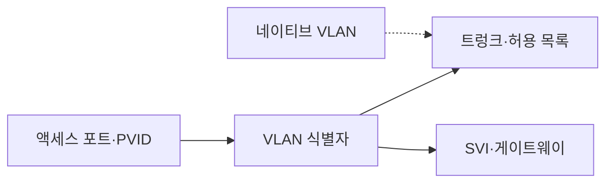
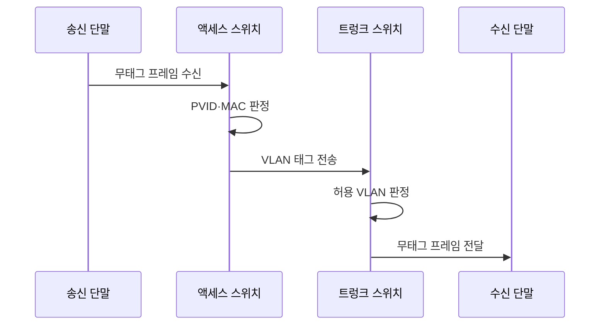

---
sidebar:
  order: 16
  label: "016. VLAN·트렁크·액세스 포트 (VLAN Trunk Access Port)"
  badge:
    text: "기출 · 70%"
    variant: note
title: "VLAN·트렁크·액세스 포트 (VLAN Trunk Access Port)"
date: "2026-07-27T23:59:59+09:00"
tags:
  - "notes-network"
weight: 16
extra:
  question_no: "016"
  source_status: "기출"
  source_history: "138회"
  priority: 70
  priority_note: "설계형: 138회 VLAN·Trunk 설계 직접 출제"
---

## 미리 알고가기

- **가상 근거리 통신망(Virtual Local Area Network, VLAN)**: ‘브이랜’으로 읽고 영문 머리글자를 딴 약어이며, 하나의 물리 스위치망을 여러 논리 브로드캐스트 영역으로 분리함
- **브로드캐스트 영역(Broadcast Domain)**: 한 장치가 보낸 브로드캐스트 프레임이 직접 도달하는 데이터링크 범위
- **액세스 포트(Access Port)**: 일반 단말의 무태그 프레임을 하나의 VLAN에 소속시키는 스위치 포트
- **트렁크 포트(Trunk Port)**: IEEE 802.1Q 태그로 여러 VLAN 프레임을 한 링크에 전달하는 스위치 포트
- **IEEE 802.1Q 태그**: '아이 트리플 이 팔공이 점 일 큐'로 읽고 802 계열의 브리지 VLAN 규격임을 번호와 문자로 표시하며 프레임에 12비트 식별자와 우선순위를 추가
- **포트 VLAN 식별자(Port VLAN Identifier, PVID)**: ‘피브이아이디’로 읽고 영문 머리글자를 딴 약어이며, 액세스 포트의 무태그 프레임에 부여할 VLAN 식별자
- **허용 VLAN 목록(Allowed VLAN List)**: 트렁크 링크에서 전달을 허용하는 VLAN 식별자 집합
- **네이티브 VLAN(Native VLAN)**: 트렁크 포트에서 태그 없는 프레임을 소속시키는 VLAN
- **스위치 가상 인터페이스(Switched Virtual Interface, SVI)**: ‘에스브이아이’로 읽고 영문 머리글자를 딴 약어이며, VLAN에 IP 주소와 다른 VLAN으로 가는 게이트웨이 기능을 제공함
- **VLAN별 MAC 주소표**: VLAN마다 MAC 주소와 출력 포트를 연결해 보관하는 스위치 전달 표

## Ⅰ. 개요

- 정의/개념: 스위치망을 **VLAN별 브로드캐스트 영역으로 분리**
- 기존 한계: 물리망 단일 영역의 **과다 방송·논리 격리 불가**

### 쉽게 이해하기 (학습용)
- 같은 스위치의 단말도 구역 번호가 다르면 분리하고 공용 링크에서는 프레임에 구역표를 붙여 함께 운반한다

## Ⅱ. 특징

- VLAN 식별자의 **방송·MAC 학습 범위 분리**
- 액세스 PVID의 **무태그 VLAN 귀속**
- 트렁크 802.1Q 태그의 **다중 VLAN 구분**

### 쉽게 이해하기 (학습용)

- 같은 스위치라도 VLAN 간 통신은 라우터 관문을 거침

## Ⅲ. 아키텍처 및 구성요소

| 설계 요소 | 설명 |
|:---|:---|
| 액세스 포트·PVID | 무태그 프레임을 한 VLAN에 분류 |
| VLAN 식별자 | 브로드캐스트·MAC 학습 범위를 구분 |
| 트렁크·허용 목록 | 허용된 여러 VLAN 태그만 전달 |
| 네이티브 VLAN | 트렁크의 무태그 프레임을 분류 |
| SVI·게이트웨이 | VLAN 사이의 네트워크 계층 경로 제공 |

> 요약: PVID와 트렁크 태그로 VLAN 경로 구성

### 쉽게 이해하기 (학습용)

- 액세스 포트가 VLAN을 정하고 트렁크는 허용한 VLAN 태그만 운반한다

## Ⅳ. 원리 및 절차 흐름도

| 절차 | 설명 |
|:---|:---|
| 무태그 프레임 수신 | 액세스 포트로 단말 프레임 수신 |
| PVID·MAC 판정 | VLAN 결정 후 해당 주소표 조회 |
| VLAN 태그 전송 | 태그를 붙여 트렁크 링크로 전달 |
| 허용 VLAN 판정 | 식별자가 허용 목록에 있는지 확인 |
| 무태그 프레임 전달 | 목적 액세스에서 태그 제거 후 전송 |

> 요약: PVID로 분류하고 트렁크에서 태그 운반

### 쉽게 이해하기 (학습용)

- 입구 스위치가 구역표를 붙이고 목적 액세스 포트가 떼어 단말에 보낸다

## Ⅴ. 종류 및 비교

| VLAN 포트 방식 | 액세스 포트 | 트렁크 포트 |
|:---|:---|:---|
| 적용 기준 | 일반 단말·**단일 VLAN 연결** | 스위치 간 **다중 VLAN 전달** |
| 핵심 특징 | PVID로 **무태그 프레임 귀속** | 802.1Q 태그로 **VLAN 구분** |
| 한계 | PVID 오류의 **VLAN 오분류** | 허용·네이티브 **VLAN 불일치** |

> 요약: 액세스는 단일 VLAN, 트렁크는 다수 VLAN 처리

### 쉽게 이해하기 (학습용)

- 액세스 포트는 한 구역 단말을 받고 트렁크 포트는 여러 구역 프레임을 함께 나른다

## Ⅵ. 실무 사례

1. 스위치 간 트렁크는 허용·네이티브 VLAN을 일치

### 쉽게 이해하기 (학습용)

- 공용 링크 양쪽의 허용 구역과 무태그 구역이 다르면 특정 VLAN 프레임만 사라지거나 엉뚱한 구역으로 들어간다

## Ⅶ. 결론

- 하나의 물리망에서 논리적 브로드캐스트 영역을 분리하기 위해 단말 소속·PVID·태그 방식·트렁크 허용 범위를 검토하여, 액세스와 트렁크 포트의 VLAN 정책을 일치시켜야 한다.

### 쉽게 이해하기 (학습용)

- 단말 입구의 PVID와 공용 링크의 허용 VLAN이 목적지까지 이어져야 통신된다
