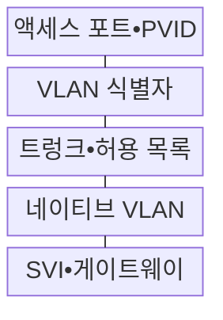
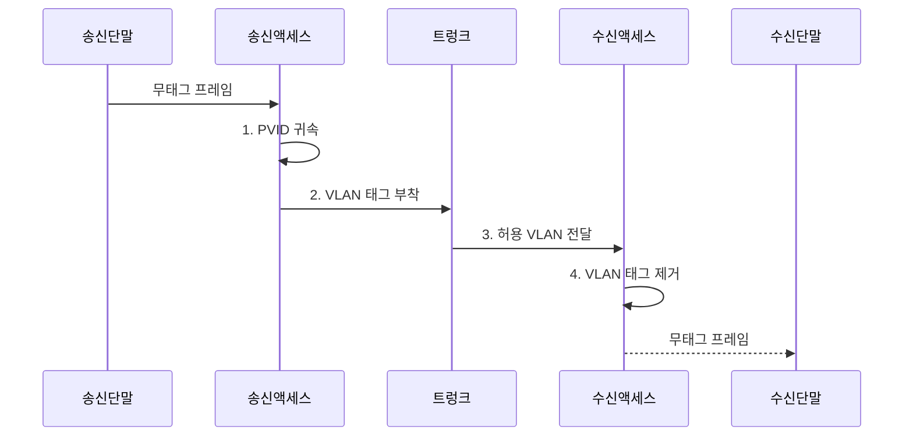

---
sidebar:
  order: 16
  label: "016. VLAN•트렁크•액세스 포트 (VLAN Trunk Access Port)"
  badge:
    text: "기출 • 70%"
    variant: note
title: "VLAN•트렁크•액세스 포트 (VLAN Trunk Access Port)"
date: "2026-08-03T08:48:47+09:00"
tags:
  - "notes-network"
weight: 16
extra:
  question_no: "016"
  source_status: "기출"
  source_history: "138회"
  priority: 70
  priority_note: "설계형: 138회 VLAN•Trunk 설계 직접 출제"
---

## Ⅰ. 개요

핵심 용어

- **가상 근거리 통신망•브로드캐스트 영역(Virtual Local Area Network/Broadcast Domain, VLAN•브로드캐스트 영역)**: 하나의 물리 스위치망을 나눈 논리 구역과 브로드캐스트 프레임이 직접 도달하는 범위이다.

- 정의/개념: **VLAN•액세스•트렁크 포트** — 스위치망을 논리적 브로드캐스트 영역으로 나누고 단일 VLAN의 무태그 프레임과 여러 VLAN의 태그 프레임을 각각 전달하는 **2계층 분할 방식**
- 배경/필요성: 물리망 단일 영역의 **브로드캐스트 과다•논리 격리 불가**

#### 한줄 요약

- 같은 스위치의 단말도 구역 번호가 다르면 분리하고 공용 링크에서는 프레임에 구역표를 붙여 함께 운반한다

## Ⅱ. 특징

핵심 용어

- **액세스 포트•포트 VLAN 식별자(Access Port/Port VLAN Identifier, 액세스 포트•PVID)**: 일반 단말의 무태그 프레임을 하나의 VLAN 식별자로 분류하는 포트와 설정값이다.
- **트렁크•IEEE 802.1Q(Trunk/Institute of Electrical and Electronics Engineers 802.1Q)**: 여러 VLAN 프레임에 태그를 붙여 한 링크로 전달하는 포트 방식과 표준이다.
- **가상 근거리 통신망(Virtual Local Area Network, VLAN)**: 하나의 스위치망을 논리적인 브로드캐스트 영역으로 분리한 네트워크이다.
- **매체 접근 제어 주소(Media Access Control Address, MAC 주소)**: VLAN별로 학습되어 링크 인터페이스를 식별하는 주소이다.

- VLAN 식별자의 **방송•MAC 학습 범위 분리**
- 액세스 PVID의 **무태그 VLAN 귀속**
- 트렁크 802.1Q 태그의 **다중 VLAN 구분**

#### 한줄 요약

- 같은 스위치라도 VLAN 간 통신은 라우터 관문을 거침

## Ⅲ. 구조 및 구성요소

핵심 용어

- **허용 가상 근거리 통신망 목록•네이티브 VLAN(Allowed Virtual Local Area Network List/Native VLAN)**: 트렁크에서 전달할 VLAN 집합과 태그 없는 프레임을 소속시킬 VLAN이다.
- **스위치 가상 인터페이스(Switched Virtual Interface, SVI)**: VLAN에 IP 주소와 다른 VLAN으로 가는 게이트웨이 기능을 제공하는 가상 인터페이스이다.
- **포트 VLAN 식별자(Port VLAN Identifier, PVID)**: 액세스 포트로 들어온 무태그 프레임을 소속 VLAN에 귀속시키는 값이다.
- **인터넷 프로토콜(Internet Protocol, IP)**: SVI가 VLAN 사이의 네트워크 계층 전달에 사용하는 프로토콜이다.
- **매체 접근 제어 주소(Media Access Control Address, MAC 주소)**: VLAN별 링크 인터페이스를 식별하고 스위치의 출력 포트 선택에 쓰이는 주소이다.

| 구성요소 | 책임 |
|:---|:---|
| 액세스 포트•PVID | 무태그 프레임을 **단일 VLAN** 에 분류 |
| VLAN 식별자 | **브로드캐스트•MAC 학습** 범위 구분 |
| 트렁크•허용 목록 | 허용된 **다중 VLAN 태그** 만 전달 |
| 네이티브 VLAN | 트렁크의 **무태그 프레임** 분류 |
| SVI•게이트웨이 | VLAN 사이의 **네트워크 계층 경로** 제공 |

#### 한줄 요약

- 액세스 포트가 VLAN을 정하고 트렁크는 허용한 VLAN 태그만 운반한다

## Ⅳ. 흐름도

핵심 용어

- **VLAN 태그 부착•제거(Virtual Local Area Network Tag Insertion•Removal)**: 액세스에서 분류한 VLAN을 트렁크 프레임에 표시하고 목적 액세스에서 없애는 동작이다.
- **포트 VLAN 식별자(Port VLAN Identifier, PVID)**: 무태그 프레임을 액세스 포트에 설정된 VLAN으로 분류하는 값이다.

**동작 원리**

1. **PVID 귀속**: 무태그 프레임을 포트 VLAN에 분류
2. **VLAN 태그 부착**: 식별자를 붙여 트렁크로 전달
3. **허용 VLAN 전달**: 허용 목록 확인 후 목적 포트 중계
4. **VLAN 태그 제거**: 목적 액세스에서 태그 제거

#### 한줄 요약

- 입구 스위치가 구역표를 붙이고 목적 액세스 포트가 떼어 단말에 보낸다

## Ⅴ. 종류 및 비교

핵심 용어

- **액세스•트렁크 포트(Access/Trunk Port)**: 단일 VLAN의 무태그 프레임과 다중 VLAN의 태그 프레임을 각각 처리하는 포트이다.
- **가상 근거리 통신망(Virtual Local Area Network, VLAN)**: 포트별 또는 태그별로 브로드캐스트 영역을 논리적으로 분리한 네트워크이다.
- **포트 VLAN 식별자(Port VLAN Identifier, PVID)**: 액세스 포트의 무태그 프레임을 특정 VLAN에 귀속시키는 값이다.
- **전기전자공학자협회 802.1Q(Institute of Electrical and Electronics Engineers 802.1Q, IEEE 802.1Q)**: 트렁크 프레임에 VLAN 식별 정보를 삽입하는 표준이다.

| VLAN 포트 방식 | 액세스 포트 | 트렁크 포트 |
|:---|:---|:---|
| 적용 기준 | 일반 단말•**단일 VLAN 연결** | 스위치 간 **다중 VLAN 전달** |
| 핵심 특징 | PVID로 **무태그 프레임 귀속** | 802.1Q 태그로 **VLAN 구분** |
| 한계 | PVID 오류의 **VLAN 오분류** | 허용•네이티브 **VLAN 불일치** |

> 요약: 액세스는 단일 VLAN, 트렁크는 다수 VLAN 처리

#### 한줄 요약

- 액세스 포트는 한 구역 단말을 받고 트렁크 포트는 여러 구역 프레임을 함께 나른다

## Ⅵ. 실무 고려사항 및 대책

핵심 용어

- **네이티브 VLAN 불일치(Native Virtual Local Area Network Mismatch)**: 트렁크 양단의 무태그 프레임 소속 VLAN이 달라 프레임이 섞이는 상태이다.
- **스위치 가상 인터페이스 접근 제어 목록(Switched Virtual Interface Access Control List, SVI ACL)**: VLAN 간 네트워크 계층 경로에 적용해 비인가 통신을 제한하는 규칙이다.
- **포트 VLAN 식별자(Port VLAN Identifier, PVID)**: 트렁크의 무태그 프레임을 소속 VLAN에 귀속시키는 설정값이다.

| 문제 | 대책 | 효과 |
|:---|:---|:---|
| **네이티브 VLAN 불일치** | 양단 PVID•태그 정책 대조 | **VLAN 혼입** 방지 |
| 트렁크의 **전체 VLAN 허용** | 필요 VLAN만 허용 목록 등록 | **공격 노출 범위** 축소 |
| 액세스 포트의 **태그 수용** | 포트 유형•태그 처리 고정 | **비인가 VLAN 접속** 차단 |
| SVI에서 비인가 VLAN 간 경로 허용 | **SVI ACL•경로 정책** 적용 | **논리 격리** 유지 |

#### 한줄 요약

- 공용 링크 양쪽의 허용 구역과 무태그 구역이 다르면 특정 VLAN 프레임만 사라지거나 엉뚱한 구역으로 들어간다

## Ⅶ. 결론

핵심 용어

- **최소 가상 근거리 통신망 허용(Minimum Virtual Local Area Network Allowance, 최소 VLAN 허용)**: 트렁크에 업무상 필요한 VLAN만 등록해 공격•오분류 범위를 줄이는 원칙이다.

- 단말 연결은 **액세스**, 다중 VLAN 링크는 **트렁크** 선택

#### 한줄 요약

- 액세스 포트는 한 구역, 트렁크는 허용된 여러 구역을 태그로 구분해 운반한다.
