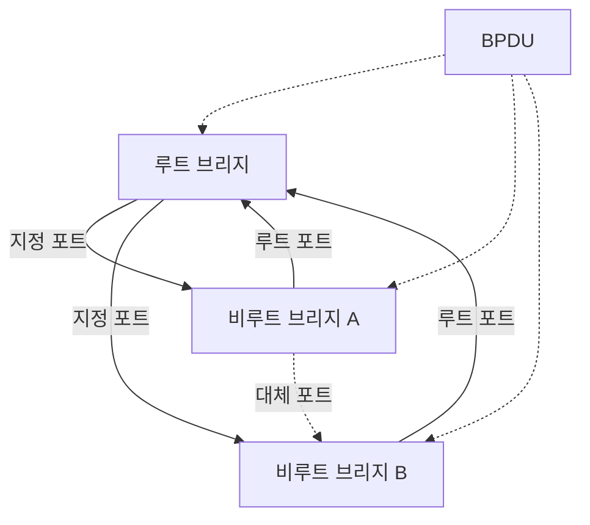
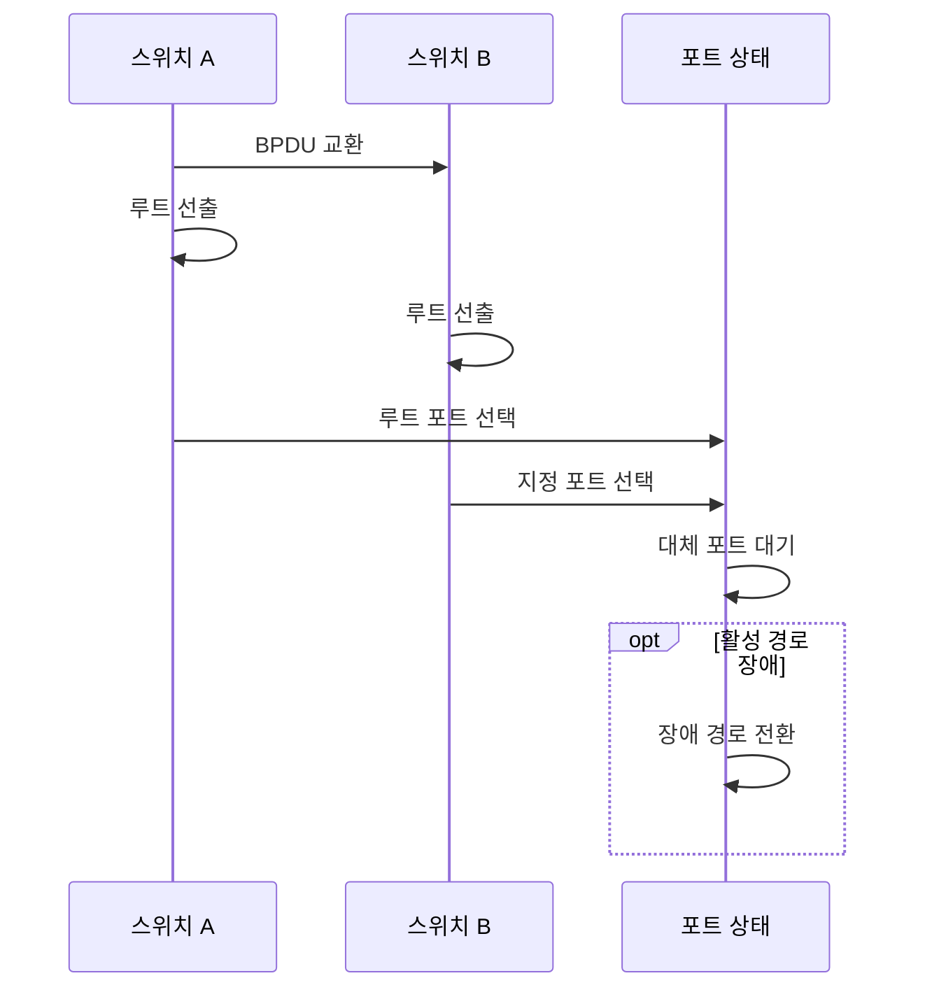

---
sidebar:
  order: 17
  label: "017. STP·RSTP·PVST+ 루프 방지 (STP RSTP Loop Prevention)"
  badge:
    text: "기출 · 70%"
    variant: note
title: "STP·RSTP·PVST+ 루프 방지 (STP RSTP Loop Prevention)"
date: "2026-07-27T23:59:59+09:00"
tags:
  - "notes-network"
weight: 17
extra:
  question_no: "017"
  source_status: "기출"
  source_history: "138회"
  priority: 70
  priority_note: "설계·문제대책형: 138회 STP Loop 방지"
---

## 미리 알고가기

- **스패닝 트리 프로토콜(Spanning Tree Protocol, STP)**: ‘에스티피’로 읽고 영문 머리글자를 딴 약어이며, 중복 링크 일부를 비전달 상태로 두어 루프 없는 활성 트리를 만듦
- **고속 스패닝 트리 프로토콜(Rapid Spanning Tree Protocol, RSTP)**: ‘알에스티피’로 읽고 영문 머리글자를 딴 약어이며, 포트 역할과 제안·동의로 장애 후 경로를 빠르게 전환함
- **VLAN별 스패닝 트리 플러스(Per-VLAN Spanning Tree Plus, PVST+)**: '피브이에스티 플러스'로 읽고 기존 방식에 기능을 더했다는 `+` 표기로 VLAN마다 독립된 스패닝 트리를 계산하는 방식을 구분
- **브리지 프로토콜 데이터 단위(Bridge Protocol Data Unit, BPDU)**: ‘비피디유’로 읽고 영문 머리글자를 딴 약어이며, 스위치가 루트 식별자·경로 비용·포트 정보를 교환하는 제어 메시지
- **브리지 식별자(Bridge ID)**: 우선순위와 MAC 주소를 결합해 스위치를 비교하는 값이며 가장 낮은 장비가 루트가 됨
- **루트 브리지(Root Bridge)**: 스패닝 트리의 기준점으로 선출되는 스위치
- **루트 포트(Root Port)**: 비루트 스위치에서 루트 브리지까지 비용이 가장 낮은 포트
- **지정 포트(Designated Port)**: 각 링크 구간에서 루트까지 비용이 가장 낮아 프레임을 전달하는 포트
- **대체 포트(Alternate Port)**: 현재 루트 포트의 예비 경로로 대기하다 장애 시 전환되는 포트
- **경로 비용(Path Cost)**: 링크 속도를 기준으로 루트까지 누적해 포트 역할을 비교하는 값
- **루트 가드(Root Guard)**: 지정 포트에서 더 우수한 BPDU를 받아도 외부 스위치를 루트로 선출하지 않게 제한하는 기능
- **포트패스트(PortFast)**: 단말 연결 포트를 즉시 전달 상태로 전환하는 기능
- **BPDU 가드(BPDU Guard)**: 포트패스트 포트에서 BPDU를 받으면 포트를 차단해 임의 스위치 연결을 제한하는 기능

## Ⅰ. 개요

- 정의/개념: 루트·포트 역할 선출로 **무루프 활성 트리 구성**
- 기존 한계: 중복 링크의 **프레임 무한 순환·MAC 표 변동**

### 쉽게 이해하기 (학습용)

- 예비 다리는 남겨 두되 평소 한 길만 열어 차량이 원을 돌지 않게 하고 장애 때 예비길을 연다

## Ⅱ. 특징

- 최저 브리지 ID의 **루트 브리지 선출**
- 누적 경로 비용의 **포트 역할 결정**
- RSTP 제안·동의의 **고속 경로 전환**

### 쉽게 이해하기 (학습용)

- 중심 교차로를 정하고 각 구간에서 중심까지의 대표 길 하나만 열며 나머지는 예비길로 대기시킨다

## Ⅲ. 아키텍처 및 구성요소

| 설계 요소 | 설명 |
|:---|:---|
| 루트 브리지 | 트리 구성의 기준 장비 |
| 비루트 브리지 A | 루트 포트와 구간 지정 포트를 결정 |
| 비루트 브리지 B | 루트 포트와 대체 포트를 결정 |
| BPDU | 트리 정보를 통제하는 메시지 |

> 요약: 루트 기준 최소 비용 포트만 활성화

### 쉽게 이해하기 (학습용)

- 대표 길은 열고 중복 길은 닫아 예비로 둔다

## Ⅳ. 원리 및 절차 흐름도

| 절차 | 설명 |
|:---|:---|
| BPDU 교환 | 루트 식별자·비용·포트 정보를 교환 |
| 루트 선출 | 가장 낮은 브리지 식별자를 선택 |
| 루트 포트 선택 | 비루트 장비의 최소 비용 포트 결정 |
| 지정 포트 선택 | 링크별 최소 비용 전달 포트 결정 |
| 대체 포트 대기 | 중복 포트를 비전달 상태로 유지 |
| 장애 경로 전환 | 활성 경로 실패 시 대체 포트 전환 |

> 요약: BPDU 비교로 루트·전달·대기 포트 결정

### 쉽게 이해하기 (학습용)

- 받은 BPDU의 루트·비용을 비교해 전달 포트와 대기 포트를 나눈다

## Ⅴ. 종류 및 비교

| 스패닝 트리 방식 | STP | RSTP | PVST+ |
|:---|:---|:---|:---|
| 적용 기준 | 기존 장비·**단일 트리 호환** | 빠른 **장애 경로 전환** | VLAN별 **활성 경로 분산** |
| 핵심 특징 | 타이머 기반 **포트 상태 전이** | 제안·동의 기반 **고속 수렴** | VLAN별 **독립 트리 계산** |
| 한계 | 장애 **수렴 시간 지연** | 비호환 시 **STP 동작 전환** | VLAN별 **설정·루트 불일치** |

> 요약: STP 호환, RSTP 고속 전환, PVST+ VLAN별 트리

### 쉽게 이해하기 (학습용)

- STP는 타이머로 기다리고 RSTP는 이웃과 합의하며 PVST+는 VLAN마다 트리를 만든다

## Ⅵ. 실무 사례

1. 중심 스위치는 우선순위를 고정하고 루트 가드 적용
2. 사용자 포트는 포트패스트·BPDU 가드를 함께 적용

### 쉽게 이해하기 (학습용)

- 중심 스위치 우선순위를 낮게 고정해 예기치 않은 장비가 루트가 되는 일을 방지한다
- 사용자 포트는 단말을 즉시 연결하되 BPDU가 들어오면 포트를 차단해 임의 스위치의 루프를 제한한다

## Ⅶ. 결론

- 루트 위치·전환 시간·VLAN 범위로 STP 방식 결정

### 쉽게 이해하기 (학습용)

- 중심 스위치와 활성·대기 포트를 미리 정해 루프 없이 예비 경로를 둔다
