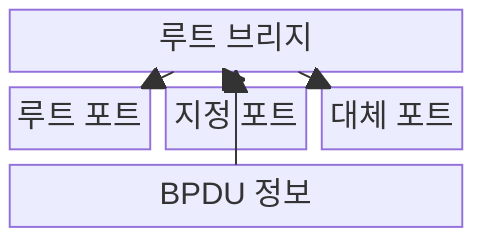
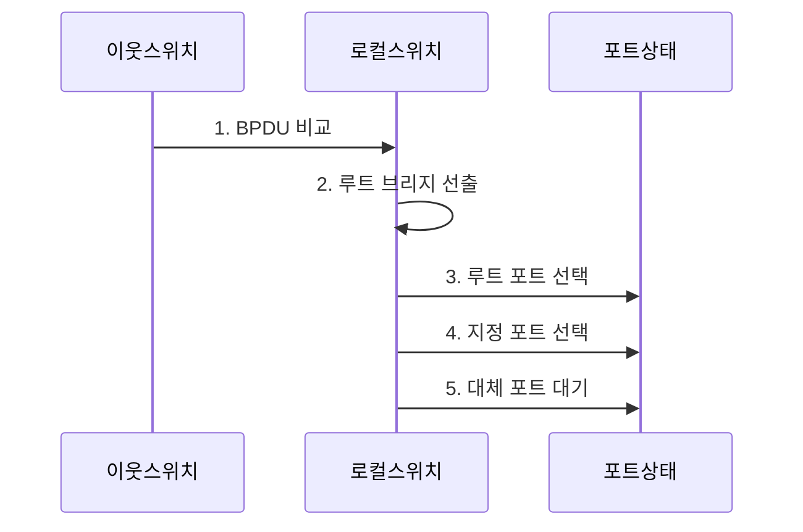

---
sidebar:
  order: 17
  label: "017. STP·RSTP·PVST+ 루프 방지 (STP RSTP Loop Prevention)"
  badge:
    text: "기출 · 70%"
    variant: note
title: "STP·RSTP·PVST+ 루프 방지 (STP RSTP Loop Prevention)"
date: "2026-07-31T11:13:28+09:00"
tags:
  - "notes-network"
weight: 17
extra:
  question_no: "017"
  source_status: "기출"
  source_history: "138회"
  priority: 70
  priority_note: "설계·문제대책형: 138회 STP Loop 방지"
---

## Ⅰ. 개요

핵심 용어

- **STP**: 중복 링크 일부를 비전달 상태로 두어 루프 없는 활성 트리를 만드는 프로토콜이다.

- 정의/개념: **STP•RSTP**는 중복 링크의 루트와 포트 역할을 선출하고 일부 경로를 비전달 상태로 두어 활성 토폴로지를 루프 없는 트리로 만드는 **2계층 경로 제어 프로토콜**
- 배경/필요성: 중복 링크의 **프레임 무한 순환·MAC 표 변동**

### 쉽게 이해하기 (학습용)

- 예비 다리는 남겨 두되 평소 한 길만 열어 차량이 원을 돌지 않게 하고 장애 때 예비길을 연다

## Ⅱ. 특징

핵심 용어

- **브리지 ID·경로 비용**: 루트 스위치를 선출하고 루트까지의 최적 포트를 고르는 비교값이다.
- **RSTP**: 포트 역할과 제안·동의로 장애 후 경로를 빠르게 전환하는 프로토콜이다.

- 최저 브리지 ID의 **루트 브리지 선출**
- 누적 경로 비용의 **포트 역할 결정**
- RSTP 제안·동의의 **고속 경로 전환**

### 쉽게 이해하기 (학습용)

- 루트 브리지를 기준으로 비용이 가장 낮은 전달 경로만 열고 중복 경로는 차단 상태로 유지한다

## Ⅲ. 구조 및 구성요소

핵심 용어

- **루트·지정·대체 포트**: 루트까지의 최저 비용 포트, 링크별 전달 포트, 장애 시 쓸 예비 포트이다.
- **BPDU**: 루트 식별자·경로 비용·포트 정보를 교환하는 제어 메시지이다.

| 구성요소 | 책임 |
|:---|:---|
| 루트 브리지 | **활성 트리의 기준점** 제공 |
| 루트 포트 | 비루트 장비의 **최소 비용 경로** 제공 |
| 지정 포트 | 링크 구간의 **프레임 전달** 담당 |
| 대체 포트 | 루트 포트 장애 시 **예비 경로** 제공 |
| BPDU | **루트 식별자·경로 비용** 교환 |

### 쉽게 이해하기 (학습용)

- 대표 길은 열고 중복 길은 닫아 예비로 둔다

## Ⅳ. 흐름도

핵심 용어

- **루트 브리지**: 가장 낮은 브리지 ID로 선출되어 스패닝 트리의 기준점이 되는 스위치이다.

**동작 원리**

1. **BPDU 비교**: 루트 식별자·비용·포트 정보 비교
2. **루트 브리지 선출**: 가장 낮은 브리지 식별자 선택
3. **루트 포트 선택**: 비루트 장비의 최소 비용 포트 결정
4. **지정 포트 선택**: 링크별 최소 비용 전달 포트 결정
5. **대체 포트 대기**: 중복 포트를 비전달 상태로 유지

### 쉽게 이해하기 (학습용)

- 받은 BPDU의 루트·비용을 비교해 전달 포트와 대기 포트를 나눈다

## Ⅴ. 종류 및 비교

핵심 용어

- **STP·RSTP·PVST+**: 타이머 기반 트리, 고속 수렴 트리, VLAN별 독립 트리를 제공하는 방식이다.

| 스패닝 트리 방식 | STP | RSTP | PVST+ |
|:---|:---|:---|:---|
| 적용 기준 | 기존 장비·**단일 트리 호환** | 빠른 **장애 경로 전환** | VLAN별 **활성 경로 분산** |
| 핵심 특징 | 타이머 기반 **포트 상태 전이** | 제안·동의 기반 **고속 수렴** | VLAN별 **독립 트리 계산** |
| 한계 | **장애 후 수렴 지연** | 비호환 이웃에서는 **STP 방식으로 전환** | VLAN별 **설정·루트 불일치** |

> 요약: STP 호환, RSTP 고속 전환, PVST+ VLAN별 트리

### 쉽게 이해하기 (학습용)

- STP는 타이머로 기다리고 RSTP는 이웃과 합의하며 PVST+는 VLAN마다 트리를 만든다

## Ⅵ. 실무 고려사항 및 대책

핵심 용어

- **루트 가드**: 더 우수한 외부 BPDU가 들어와도 지정 포트의 루트 변경을 막는 기능이다.
- **PortFast·BPDU Guard**: 단말 포트를 즉시 전달하되 BPDU 수신 시 차단하는 기능이다.

| 문제 | 대책 | 효과 |
|:---|:---|:---|
| **루트 브리지 임의 변경** | 우선순위·루트 가드 적용 | **트리 기준** 안정화 |
| 단말 포트의 **BPDU 유입** | BPDU 가드·포트패스트 설정 | **비인가 루트** 차단 |
| **단방향 링크 장애** | 루프 가드·UDLD 적용 | 차단 포트의 **비정상 전달 전환** 방지 |
| **대규모 2계층 영역** | VLAN·라우팅 경계로 분할 | **수렴 범위** 축소 |

### 쉽게 이해하기 (학습용)

- 사용자 포트는 단말을 즉시 연결하되 BPDU가 들어오면 포트를 차단해 임의 스위치의 루프를 제한한다

## Ⅶ. 결론

핵심 용어

- **무루프 이중화**: 평소 하나의 활성 경로만 전달하고 장애 때 대체 포트를 여는 구조이다.

- 고속 수렴은 **RSTP**, VLAN별 경로 분산은 **PVST+** 선택

### 쉽게 이해하기 (학습용)

- 중복 링크는 남겨 두되 평소 한 경로만 전달하고 장애 때 대체 포트를 연다.
