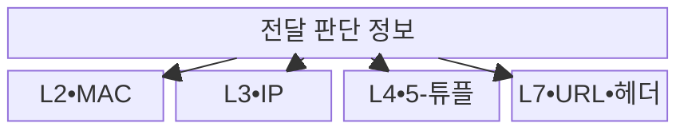

---
sidebar:
  order: 18
  label: "018. 스위칭 계층 : L2•L3•L4•L7 스위치 (Network Switches)"
  badge:
    text: "기출 • 30%"
    variant: note
title: "스위칭 계층 : L2•L3•L4•L7 스위치 (Network Switches)"
date: "2026-08-03T08:48:47+09:00"
tags:
  - "notes-network"
weight: 18
extra:
  question_no: "018"
  source_status: "기출"
  source_history: "129회"
  priority: 30
  priority_note: "비교형: 129회 L4•L7 Switch 문항 기반"
---

## Ⅰ. 개요

핵심 용어

- **스위칭 계층**: 장비가 전달 대상을 정할 때 읽는 링크•네트워크•전송•응용 계층 정보의 구분이다.
- **2•3•4•7계층 스위치(Layer 2/Layer 3/Layer 4/Layer 7 Switch, L2•L3•L4•L7 스위치)**: 링크 주소부터 응용 요청까지 서로 다른 계층 정보를 기준으로 전달 대상을 고르는 장비이다.

- 정의/개념: **L2•L3•L4•L7 스위치** — 각각 링크•네트워크•전송•응용 계층 정보를 기준으로 출력 경로나 대상 서버를 선택하는 **네트워크 전달 장비**
- 배경/필요성: 주소 전달만으로는 **연결 분산•콘텐츠 분기 불가**

#### 한줄 요약

- 봉투 겉면의 장치•네트워크 주소만 볼지 포트와 내용까지 열어 볼지에 따라 스위치 역할이 달라진다

## Ⅱ. 특징

핵심 용어

- **2•3•4•7계층 스위치(Layer 2/Layer 3/Layer 4/Layer 7 Switch, L2•L3•L4•L7 스위치)**: MAC, IP, 5-튜플, URL•헤더를 각각 기준으로 전달 대상을 고르는 장비이다.
- **매체 접근 제어•인터넷 프로토콜•통합 자원 식별자(Media Access Control/Internet Protocol/Uniform Resource Locator, MAC•IP•URL)**: 링크 주소, 네트워크 주소, 웹 자원의 위치를 나타내는 식별 정보이다.

- L2•L3의 **MAC•IP 기반 경로 전달**
- L4의 **5-튜플•연결 상태 분산**
- L7의 **URL•헤더 기반 서비스 분기**

#### 한줄 요약

- 더 높은 계층은 더 자세히 나눠 보낼 수 있지만 읽고 저장해야 할 정보가 많아진다

## Ⅲ. 구조 및 구성요소

핵심 용어

- **매체 접근 제어 주소•전달 정보 기반(Media Access Control Address/Forwarding Information Base, MAC 주소•FIB)**: 같은 링크의 인터페이스를 식별하는 주소와 프리픽스별 다음 홉을 저장한 전달 표이다.
- **5-튜플•통합 자원 식별자(Five-Tuple/Uniform Resource Locator, 5-튜플•URL)**: 연결을 식별하는 프로토콜•양쪽 주소•포트 묶음과 웹 자원의 위치•접근 방법이다.
- **인터넷 프로토콜(Internet Protocol, IP)**: 네트워크 주소를 기반으로 서로 다른 서브넷 사이의 패킷 경로를 정하는 프로토콜이다.

| 구성요소 | 책임 |
|:---|:---|
| L2 스위치 | **MAC 주소표** 로 출력 포트 결정 |
| L3 스위치 | **FIB** 로 다음 홉 결정 |
| L4 스위치 | **5-튜플•연결 상태** 로 서버 결정 |
| L7 스위치 | **요청 내용•정책**으로 서비스 결정 |

#### 한줄 요약

- L2•L3는 주소로 경로를 정하고 L4•L7은 연결•요청 내용으로 서버를 선택한다

## Ⅳ. 흐름도

핵심 용어

- **전달 정책 조회(Forwarding Policy Lookup)**: 담당 계층의 주소•포트•요청 내용으로 포트•다음 홉•서버•서비스를 결정하는 동작이다.
- **매체 접근 제어•인터넷 프로토콜(Media Access Control/Internet Protocol, MAC•IP)**: 링크 인터페이스와 네트워크 목적지를 식별하는 주소 정보이다.

**동작 원리**

1. **계층 필드 추출**: MAC•IP•5-튜플•요청 내용 식별
2. **전달 정책 조회**: 담당 계층의 표•규칙 검색
3. **출력 대상 선택**: 포트•다음 홉•서버•서비스 결정

#### 한줄 요약

- 장비는 담당 계층의 주소•포트•요청 내용만 읽어 전달 대상을 정한다

## Ⅴ. 종류 및 비교

핵심 용어

- **전송 계층 보안 종료(Transport Layer Security Termination, TLS 종료)**: 암호화 세션을 장비에서 끝내 응용 요청을 해석하는 처리로, 가시성과 연산 부하가 함께 증가한다.
- **매체 접근 제어•인터넷 프로토콜•통합 자원 식별자(Media Access Control/Internet Protocol/Uniform Resource Locator, MAC•IP•URL)**: 계층별 전달과 콘텐츠 분기에 사용하는 주소•요청 식별 정보이다.

| 스위칭 계층 | L2•L3 스위치 | L4 스위치 | L7 스위치 |
|:---|:---|:---|:---|
| 적용 기준 | 링크•서브넷의 **경로 전달** | 연결 단위 **서버 부하 분산** | 콘텐츠 기반 **응용 서비스 분기** |
| 핵심 특징 | MAC•IP 표의 **출력 경로 결정** | 5-튜플•상태의 **서버 선택** | URL•헤더의 **서비스 선택** |
| 한계 | 주소표•경로표 **오류 영향** | 연결•서버 상태 **불일치** | 해석 비용•**TLS 종료 부하** |

> 요약: 링크•경로•연결•콘텐츠 요구로 계층 선택

#### 한줄 요약

- MAC 주소만 필요하면 L2, 콘텐츠까지 봐야 하면 L7처럼 필요한 최소 계층을 선택한다

## Ⅵ. 실무 고려사항 및 대책

핵심 용어

- **상태 확인•상태 동기화(Health Check/State Synchronization)**: 서버 가용성을 판정하고 이중화 장비 간 연결•정책 상태를 맞추는 기능이다.
- **4•7계층 스위치(Layer 4/Layer 7 Switch, L4•L7 스위치)**: 연결 상태 또는 응용 요청을 기준으로 대상 서버와 서비스를 선택하는 장비이다.

| 문제 | 대책 | 효과 |
|:---|:---|:---|
| 필요한 계층 정보의 **가시성 부족** | **암호화 여부•가시성** 사전 확인 | **분기 실패** 예방 |
| L4의 **연결 상태 고갈** | **세션 한도•만료시간** 조정 | **처리 가용성** 확보 |
| L7의 **규칙 복잡도 증가** | **경로•헤더 규칙** 표준화 | **정책 오류** 감소 |
| **상태 확인 오류•단일 장애** | **이중화•상태 동기화** 구성 | **서비스 연속성** 확보 |

#### 한줄 요약

- 같은 구역 안은 장치 주소로 보내고 다른 구역으로 갈 때는 네트워크 경로를 조회한다

## Ⅶ. 결론

핵심 용어

- **최소 계층 선택(Minimum Required Layer Selection)**: 필요한 분기 정보를 제공하면서 검사•상태 비용이 가장 작은 계층을 고르는 원칙이다.

- 필요한 **분기 정보•상태 비용** 을 충족하는 최소 스위칭 계층 선택

#### 한줄 요약

- 높은 계층의 스위치는 더 세밀하게 분기하지만 검사 정보와 상태 관리 비용도 커진다.
