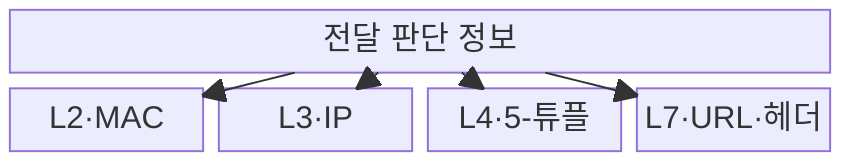
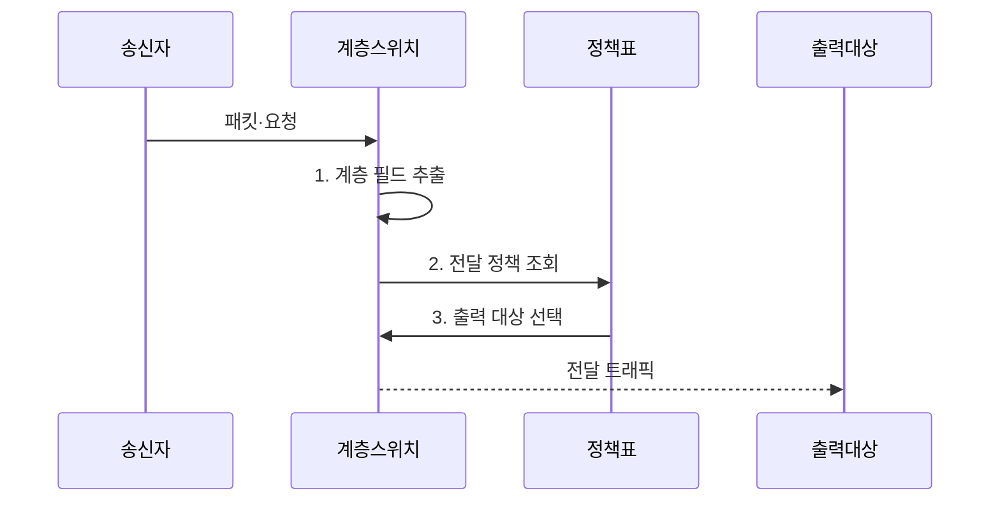

---
sidebar:
  order: 18
  label: "018. 스위칭 계층 : L2·L3·L4·L7 스위치 (Network Switches)"
  badge:
    text: "기출 · 30%"
    variant: note
title: "스위칭 계층 : L2·L3·L4·L7 스위치 (Network Switches)"
date: "2026-07-31T11:14:32+09:00"
tags:
  - "notes-network"
weight: 18
extra:
  question_no: "018"
  source_status: "기출"
  source_history: "129회"
  priority: 30
  priority_note: "비교형: 129회 L4·L7 Switch 문항 기반"
---

## 미리 알고가기

- **2계층 스위치(Layer 2 Switch, L2 스위치)**: ‘엘투 스위치’로 읽고 계층 번호를 L 뒤에 붙인 표기이며, 목적지 MAC 주소와 주소표로 출력 포트를 결정함
- **인터넷 프로토콜(Internet Protocol, IP)**: 목적지 주소와 경로표로 패킷을 네트워크 사이에 전달하는 프로토콜
- **3계층 스위치(Layer 3 Switch, L3 스위치)**: ‘엘쓰리 스위치’로 읽고 계층 번호를 L 뒤에 붙인 표기이며, 목적지 IP 주소와 경로표로 다음 홉을 결정함
- **4계층 스위치(Layer 4 Switch, L4 스위치)**: ‘엘포 스위치’로 읽고 전송 계층 번호를 표시하며, 주소·포트·연결 상태로 서버를 선택함
- **7계층 스위치(Layer 7 Switch, L7 스위치)**: ‘엘세븐 스위치’로 읽고 응용 계층 번호를 표시하며, URL·헤더·쿠키로 서비스를 선택함
- **매체 접근 제어 주소(Media Access Control Address, MAC 주소)**: 같은 링크에서 프레임의 출발지·목적지 인터페이스를 식별하는 주소
- **포워딩 정보 베이스(Forwarding Information Base, FIB)**: 목적지 프리픽스별 다음 홉과 출력 인터페이스를 저장한 전달 표
- **5-튜플(Five-Tuple)**: '파이브 튜플'로 읽고 다섯 필드의 묶음임을 숫자로 표시하며 전송 프로토콜·양쪽 주소·포트로 연결을 식별
- **통합 자원 위치 지정자(Uniform Resource Locator, URL)**: 웹 자원의 위치와 접근 방법을 나타내는 주소
- **쿠키·헤더(Cookie·Header)**: 웹 클라이언트 상태와 요청·응답의 제어 정보를 전달하는 필드
- **상태 확인(Health Check)**: 서버에 주기적으로 요청해 새 트래픽을 받을 수 있는지 판정하는 검사
- **전송 계층 보안(Transport Layer Security, TLS)**: 응용 데이터를 암호화하고 통신 상대와 무결성을 검증하는 보안 프로토콜

## Ⅰ. 개요

- 정의/개념: 참조 계층별 **전달 판단 정보·처리 역할 구분**
- 배경/필요성: 주소 전달만으로는 **연결 분산·콘텐츠 분기 불가**

### 쉽게 이해하기 (학습용)

- 봉투 겉면의 장치·네트워크 주소만 볼지 포트와 내용까지 열어 볼지에 따라 스위치 역할이 달라진다

## Ⅱ. 특징

- L2·L3의 **MAC·IP 기반 경로 전달**
- L4의 **5-튜플·연결 상태 분산**
- L7의 **URL·헤더 기반 서비스 분기**

### 쉽게 이해하기 (학습용)

- 더 높은 계층은 더 자세히 나눠 보낼 수 있지만 읽고 저장해야 할 정보가 많아진다

## Ⅲ. 구조 및 구성요소

| 구성요소 | 책임 |
|:---|:---|
| L2 스위치 | **MAC 주소표**로 출력 포트 결정 |
| L3 스위치 | **FIB**로 다음 홉 결정 |
| L4 스위치 | **5-튜플·연결 상태**로 서버 결정 |
| L7 스위치 | **요청 내용·정책**으로 서비스 결정 |

### 쉽게 이해하기 (학습용)

- L2·L3는 주소로 경로를 정하고 L4·L7은 연결·요청 내용으로 서버를 선택한다

## Ⅳ. 흐름도

**동작 원리**

1. **계층 필드 추출**: MAC·IP·5-튜플·요청 내용 식별
2. **전달 정책 조회**: 담당 계층의 표·규칙 검색
3. **출력 대상 선택**: 포트·다음 홉·서버·서비스 결정

### 쉽게 이해하기 (학습용)

- 장비는 담당 계층의 주소·포트·요청 내용만 읽어 전달 대상을 정한다

## Ⅴ. 종류 및 비교

| 스위칭 계층 | L2·L3 스위치 | L4 스위치 | L7 스위치 |
|:---|:---|:---|:---|
| 적용 기준 | 링크·서브넷의 **경로 전달** | 연결 단위 **서버 부하 분산** | 콘텐츠 기반 **응용 서비스 분기** |
| 핵심 특징 | MAC·IP 표의 **출력 경로 결정** | 5-튜플·상태의 **서버 선택** | URL·헤더의 **서비스 선택** |
| 한계 | 주소표·경로표 **오류 영향** | 연결·서버 상태 **불일치** | 해석 비용·**TLS 종료 부하** |

> 요약: 링크·경로·연결·콘텐츠 요구로 계층 선택

### 쉽게 이해하기 (학습용)

- MAC 주소만 필요하면 L2, 콘텐츠까지 봐야 하면 L7처럼 필요한 최소 계층을 선택한다

## Ⅵ. 실무 고려사항 및 대책

| 고려사항 | 대책 | 효과 |
|:---|:---|:---|
| 필요한 계층 정보의 **가시성 부족** | **암호화 여부·가시성** 사전 확인 | **분기 실패** 예방 |
| L4의 **연결 상태 고갈** | **세션 한도·만료시간** 조정 | **처리 가용성** 확보 |
| L7의 **규칙 복잡도 증가** | **경로·헤더 규칙** 표준화 | **정책 오류** 감소 |
| **상태 확인 오류·단일 장애** | **이중화·상태 동기화** 구성 | **서비스 연속성** 확보 |

### 쉽게 이해하기 (학습용)

- 같은 구역 안은 장치 주소로 보내고 다른 구역으로 갈 때는 네트워크 경로를 조회한다

## Ⅶ. 결론

- 필요한 **분기 정보·상태 비용**을 충족하는 최소 스위칭 계층 선택

### 쉽게 이해하기 (학습용)

- 높은 계층의 스위치는 더 세밀하게 분기하지만 검사 정보와 상태 관리 비용도 커진다.
