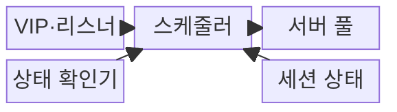
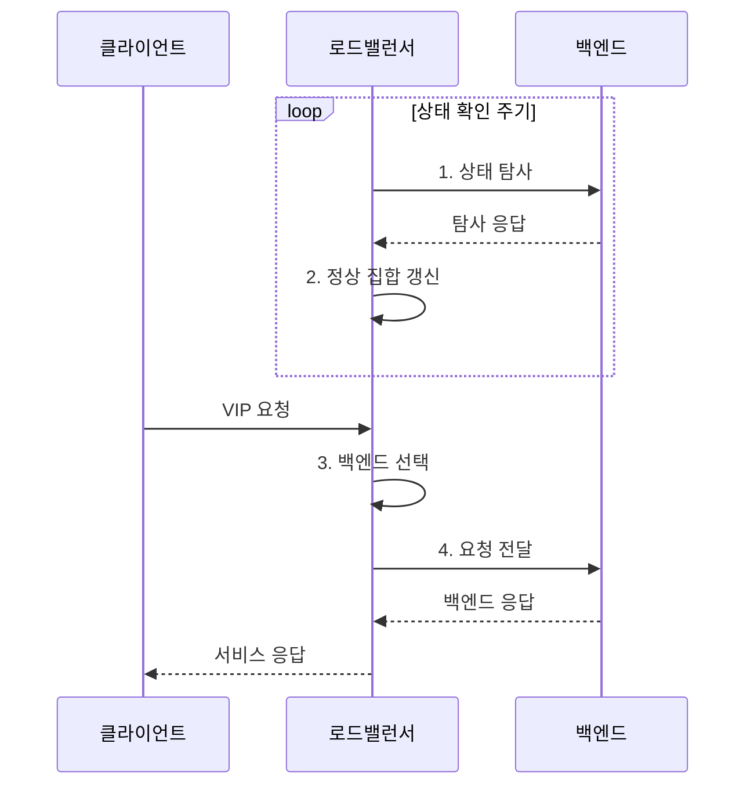

---
sidebar:
  order: 19
  label: "019. 로드 밸런서 L4·L7 (Load Balancer L4 L7)"
  badge:
    text: "기출 · 50%"
    variant: note
title: "로드 밸런서 L4·L7 (Load Balancer L4 L7)"
date: "2026-07-31T11:15:38+09:00"
tags:
  - "notes-network"
weight: 19
extra:
  question_no: "019"
  source_status: "기출"
  source_history: "129회"
  priority: 50
  priority_note: "설계·비교형: 부하분산 계층·장애 전환 활용"
---

## Ⅰ. 개요

핵심 용어

- **로드 밸런서·가상 인터넷 프로토콜 주소(Load Balancer/Virtual Internet Protocol Address, 로드 밸런서·VIP)**: 하나의 대표 서비스 주소로 받은 연결·요청을 여러 정상 백엔드에 분산하는 장비와 주소이다.

- 정의/개념: **로드 밸런서** — VIP로 받은 연결과 요청을 상태 확인 결과와 분산 정책에 따라 여러 정상 백엔드로 전달하는 **트래픽 분산 장비**
- 배경/필요성: 단일 서버의 **처리량·가용성 확장 한계**

#### 한줄 요약

- 대표 창구가 각 담당자의 대기열과 처리 가능 상태를 보고 새 요청을 나눠 준다

## Ⅱ. 특징

핵심 용어

- **4·7계층 로드 밸런서(Layer 4/Layer 7 Load Balancer, L4·L7 로드 밸런서)**: 주소·포트·연결 상태와 URL·헤더·쿠키를 각각 기준으로 백엔드를 선택하는 장비이다.
- **통합 자원 식별자(Uniform Resource Locator, URL)**: 웹 자원의 위치와 접근 방법을 나타내는 요청 정보이다.
- **가상 인터넷 프로토콜 주소(Virtual Internet Protocol Address, VIP)**: 클라이언트가 접속하는 대표 서비스 주소이다.

- VIP의 **클라이언트·백엔드 주소 분리**
- 상태 확인의 **비정상 백엔드 제외**
- L4 연결·L7 요청의 **분산 기준 차이**

#### 한줄 요약

- 서버 수가 많아도 준비되지 않은 서버를 포함하면 실패가 늘므로 처리 가능한 서버 집합부터 정확히 유지한다

## Ⅲ. 구조 및 구성요소

핵심 용어

- **리스너·서버 풀·스케줄러(Listener/Server Pool/Scheduler)**: 서비스 요청을 받는 입구, 같은 기능의 백엔드 집합, 그중 대상을 고르는 기능이다.
- **세션 고정**: 같은 사용자나 세션의 요청을 일정 기간 같은 백엔드로 보내는 기능이다.
- **가상 인터넷 프로토콜 주소(Virtual Internet Protocol Address, VIP)**: 리스너가 연결과 요청을 받는 대표 서비스 주소이다.

| 구성요소 | 책임 |
|:---|:---|
| VIP·리스너 | **서비스 주소·포트·프로토콜** 정의 |
| 스케줄러 | **정상 집합·분산 정책**으로 백엔드 선택 |
| 서버 풀 | 같은 기능의 **백엔드 서버 집합** 구성 |
| 상태 확인기 | 연결·응용 응답으로 **정상 집합** 갱신 |
| 세션 상태 | **연결 추적·세션 고정** 관계 저장 |

#### 한줄 요약

- 상태 확인기가 일할 수 있는 창구 목록을 만들면 스케줄러가 요청과 기존 세션에 맞는 창구를 정한다

## Ⅳ. 흐름도

핵심 용어

- **상태 확인(Health Check)**: 백엔드의 포트 연결이나 실제 응용 응답을 검사해 분산 대상 포함 여부를 정하는 기능이다.
- **가상 인터넷 프로토콜 주소(Virtual Internet Protocol Address, VIP)**: 정상 백엔드 집합 앞에서 클라이언트 요청을 받는 대표 주소이다.

**동작 원리**

1. **상태 탐사**: 포트 연결이나 응용 경로를 검사
2. **정상 집합 갱신**: 탐사 성공 기준을 통과한 서버만 포함
3. **백엔드 선택**: 계층 정보·정책·세션으로 서버 결정
4. **요청 전달**: 선택 서버로 연결·요청 중계

#### 한줄 요약

- 정상 서버 목록을 먼저 갱신하고 새 연결·요청을 정책에 맞는 서버로 보낸다

## Ⅴ. 종류 및 비교

핵심 용어

- **5-튜플·역방향 프록시(Five-Tuple/Reverse Proxy)**: 연결을 식별하는 다섯 필드 묶음과 요청 내용을 해석해 백엔드에 새 요청을 보내는 중계 방식이다.
- **4·7계층 로드 밸런서(Layer 4/Layer 7 Load Balancer, L4·L7 로드 밸런서)**: 연결 정보 또는 응용 요청 내용을 기준으로 백엔드를 선택하는 장비이다.
- **통합 자원 식별자·전송 계층 보안(Uniform Resource Locator/Transport Layer Security, URL·TLS)**: 콘텐츠 분기 정보와 암호화 세션 보호 기술이다.

| 부하 분산 계층 | L4 로드 밸런서 | L7 로드 밸런서 |
|:---|:---|:---|
| 적용 기준 | 대량 연결의 **고속 세션 분산** | URL·헤더의 **콘텐츠 분기** |
| 핵심 특징 | 5-튜플·상태의 **백엔드 선택** | 역방향 프록시의 **요청 내용 해석** |
| 한계 | 포트 정상의 **응용 장애 미탐지** | 해석 비용·**TLS 종료 부하** |

> 요약: L4는 연결, L7은 내용 기반 선택

#### 한줄 요약

- 포트와 연결만 보고 나누면 L4, 웹 요청의 의미까지 보면 L7이다

## Ⅵ. 실무 고려사항 및 대책

핵심 용어

- **상태 외부화**: 사용자 상태를 백엔드 로컬 메모리 밖의 공용 저장소에 두어 세션 고정 의존을 줄이는 방식이다.
- **다중 영역**: 로드 밸런서와 백엔드를 서로 다른 장애 구역에 배치해 단일 장애를 줄이는 구성이다.
- **7계층 검사(Layer 7 Inspection, L7 검사)**: 응용 요청의 경로와 헤더를 해석해 분산 정책을 적용하는 처리이다.

| 문제 | 대책 | 효과 |
|:---|:---|:---|
| 포트 연결만 확인해 **응용 장애 미탐지** | 핵심 의존성을 포함한 **응용 경로 검사** | **실패 서버** 제외 |
| **세션 고정 불균형** | **상태 외부화·고정 만료** 설정 | **백엔드 부하 편중** 완화 |
| **L7 검사 지연** | 필요한 경로만 해석하고 **용량 시험** | **응답 시간** 보호 |
| 로드 밸런서의 **단일 장애** | **다중 영역·상태 동기화** 구성 | **서비스 연속성** 확보 |

#### 한줄 요약

- 웹 서버의 포트가 열려도 응용이 준비되지 않을 수 있어 실제 `/service` 응답까지 확인한다

## Ⅶ. 결론

핵심 용어

- **정상 집합(Healthy Backend Set)**: 상태 검사를 통과해 새 연결·요청을 받을 수 있다고 판정된 백엔드 목록이다.
- **4·7계층 로드 밸런서(Layer 4/Layer 7 Load Balancer, L4·L7 로드 밸런서)**: 연결 처리량과 콘텐츠 분기 요구에 따라 선택하는 부하 분산 장비이다.

- 연결 처리량 우선은 **L4**, 콘텐츠 분기 필요는 **L7** 선택

#### 한줄 요약

- 서버 수보다 실제 요청을 처리할 수 있는 정상 서버 집합을 정확히 유지하는 것이 중요하다.
