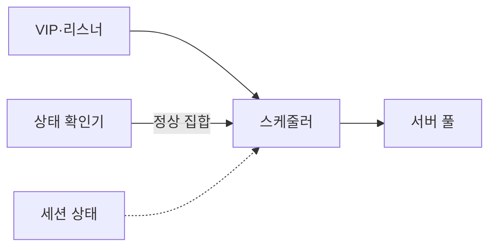
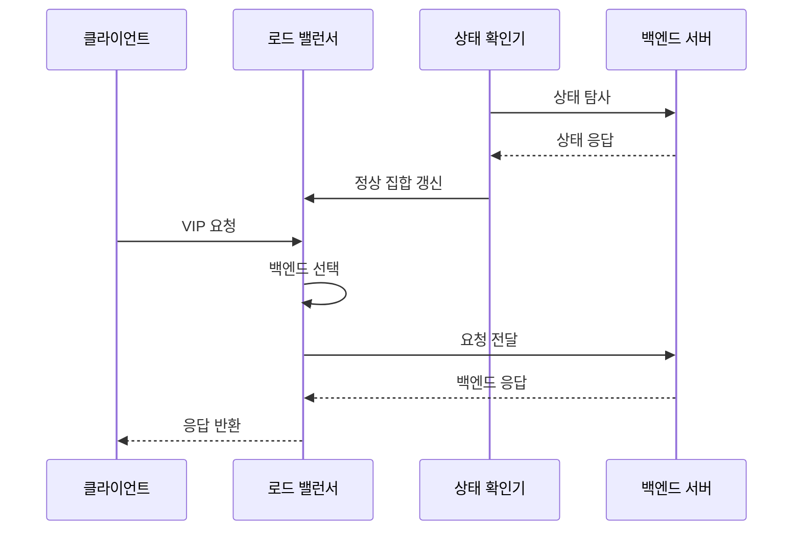

---
sidebar:
  order: 19
  label: "019. 로드 밸런서 L4·L7 (Load Balancer L4 L7)"
  badge:
    text: "기출 · 50%"
    variant: note
title: "로드 밸런서 L4·L7 (Load Balancer L4 L7)"
date: "2026-07-25T00:50:00+09:00"
tags:
  - "notes-network"
weight: 19
extra:
  question_no: "019"
  source_status: "기출"
  source_history: "129회"
  priority: 50
  priority_note: "설계·비교형: 부하분산 계층·장애 전환 활용"
---

## 미리 알고가기

- **로드 밸런서(Load Balancer)**: 하나의 서비스 주소로 받은 연결·요청을 여러 정상 서버에 분산하는 장비나 소프트웨어
- **가상 인터넷 프로토콜 주소(Virtual Internet Protocol Address, VIP)**: 여러 백엔드 서버 앞에서 클라이언트가 접속하는 대표 서비스 주소
- **4계층 로드 밸런서(Layer 4 Load Balancer, L4 로드 밸런서)**: 주소·포트·전송 프로토콜·연결 상태로 백엔드 서버를 선택하는 방식
- **7계층 로드 밸런서(Layer 7 Load Balancer, L7 로드 밸런서)**: 웹 주소·호스트·헤더·쿠키 같은 응용 요청 내용으로 백엔드 서비스를 선택하는 방식
- **백엔드 서버(Backend Server)**: 로드 밸런서가 전달한 실제 업무 요청을 처리하는 서버
- **리스너(Listener)**: VIP의 포트·프로토콜에서 새 연결이나 요청을 받아들이는 입구 설정
- **서버 풀(Server Pool)**: 같은 서비스 요청을 처리할 수 있는 백엔드 서버의 집합
- **스케줄러(Scheduler)**: 연결 수·가중치·순서 같은 정책으로 서버 풀에서 대상을 선택하는 기능
- **상태 확인(Health Check)**: 백엔드의 포트 연결이나 응용 응답을 검사해 분산 대상 포함 여부를 정하는 기능
- **세션 고정(Session Stickiness)**: 같은 사용자나 세션의 요청을 일정 기간 같은 백엔드 서버로 보내는 기능
- **역방향 프록시(Reverse Proxy)**: 요청을 대신 받아 응용 내용을 해석하고 백엔드에 새 요청을 전달하는 중계 기능
- **전송 계층 보안(Transport Layer Security, TLS)**: 응용 데이터를 암호화하고 통신 상대와 무결성을 검증하는 보안 프로토콜
- **URL·호스트·헤더·쿠키**: 웹 자원 위치, 대상 서비스 이름, 요청 제어 정보, 사용자 상태를 나타내는 응용 정보
- **5-튜플(Five-Tuple)**: '파이브 튜플'로 읽고 다섯 필드의 묶음임을 숫자로 표시하며 전송 프로토콜·양쪽 주소·포트로 연결을 식별
- **`/service` 경로**: '슬래시 서비스'로 읽고 슬래시로 웹 주소의 경로 시작을 표시해 L7 로드 밸런서가 분기할 서비스를 구분

## Ⅰ. 개요

- **정의/개념**: VIP 연결·요청을 정상 백엔드에 분산하는 계층
- **배경/필요성**: 백엔드 장애 격리와 트래픽 분산

### 쉽게 이해하기 (학습용)
- 대표 창구가 각 담당자의 대기열과 처리 가능 상태를 보고 새 요청을 나눠 준다

## Ⅱ. 특징

- VIP가 클라이언트와 백엔드 주소를 분리한다.
- 상태 확인이 요청을 받을 수 없는 서버를 제외한다.
- 연결·요청 문맥에 따라 서버 선택 범위가 달라진다.
- 세션 고정은 연속성을 높이지만 서버별 부하를 편중한다.

### 쉽게 이해하기 (학습용)

- 서버 수가 많아도 준비되지 않은 서버를 포함하면 실패가 늘므로 처리 가능한 서버 집합부터 정확히 유지한다

## Ⅲ. 아키텍처 및 구성요소

| 설계 요소 | 설명 |
|:---|:---|
| VIP·리스너 | 서비스 주소·포트·프로토콜을 정의 |
| 스케줄러 | 정상 집합과 정책으로 백엔드를 선택 |
| 서버 풀 | 같은 기능의 백엔드 서버를 묶음 |
| 상태 확인기 | 연결·응용 응답으로 정상 집합을 갱신 |
| 세션 상태 | 연결 추적·세션 고정 관계를 저장 |

> 요약: 정상 집합·분산 정책·세션 상태로 서버 선택

### 쉽게 이해하기 (학습용)
- 상태 확인기가 일할 수 있는 창구 목록을 만들면 스케줄러가 요청과 기존 세션에 맞는 창구를 정한다

## Ⅳ. 원리 및 절차 흐름도

| 절차 | 설명 |
|:---|:---|
| 상태 탐사 | 포트 연결이나 응용 경로를 검사 |
| 상태 응답 | 처리 가능 상태와 응답 코드를 반환 |
| 정상 집합 갱신 | 성공 기준을 통과한 서버만 포함 |
| VIP 요청 | 대표 주소로 연결·응용 요청 수신 |
| 백엔드 선택 | 계층 정보·정책·세션으로 서버 결정 |
| 요청 전달 | 선택 서버로 연결·요청을 중계 |
| 백엔드 응답 | 처리 결과를 로드 밸런서에 반환 |
| 응답 반환 | 처리 결과를 클라이언트에 전달 |

### 쉽게 이해하기 (학습용)

- 정상 서버 목록을 먼저 갱신하고 새 연결·요청을 정책에 맞는 서버로 보낸다

## Ⅴ. 종류 및 비교

| 판단 기준 | L4 로드 밸런서 | L7 로드 밸런서 |
|:---|:---|:---|
| 핵심 특징 | 5-튜플·연결 상태로 서버 선택 | 역방향 프록시가 요청 내용으로 분기 |
| 적용 기준 | 대량 연결의 세션 분산이 중요할 때 | URL·헤더 기반 요청 분기가 필요할 때 |
| 주요 위험 | 포트 정상만으로 응용 장애 미탐지 | 해석 비용·TLS 종료 부하 |

> 요약: L4는 연결, L7은 내용 기반 선택

### 쉽게 이해하기 (학습용)

- 포트와 연결만 보고 나누면 L4, 웹 요청의 의미까지 보면 L7이다

## Ⅵ. 실무 사례

1. 데이터베이스 연결은 L4와 활성 연결 수로 분산
2. 웹 `/service` 요청은 L7과 응용 상태 확인으로 분기

### 쉽게 이해하기 (학습용)

- 데이터베이스처럼 요청 내용을 나눌 필요가 없으면 연결 수가 적은 정상 서버로 보낸다
- 웹 서버의 포트가 열려도 응용이 준비되지 않을 수 있어 실제 `/service` 응답까지 확인한다

## Ⅶ. 결론

- 분기 문맥·장애 깊이로 L4·L7과 상태 확인 선택

### 쉽게 이해하기 (학습용)

- 무엇을 보고 나눌지와 어느 깊이의 장애까지 제외할지를 함께 정해야 실패 요청을 줄일 수 있다
