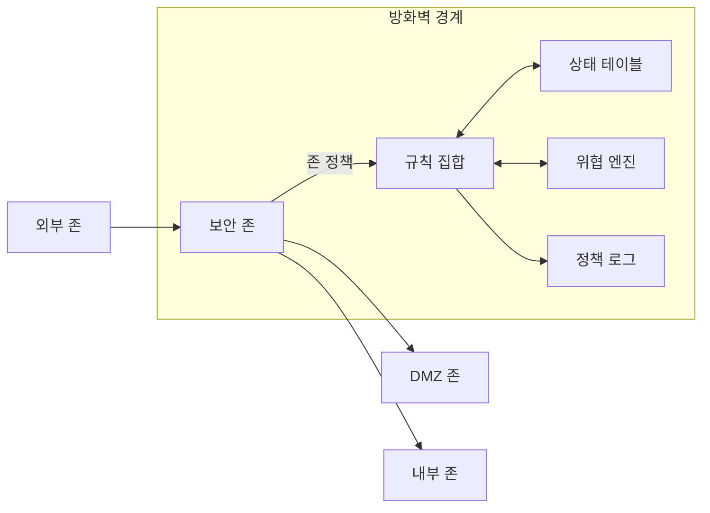
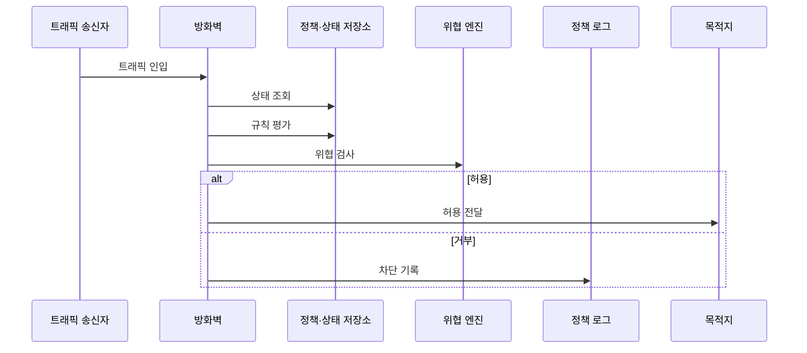

---
sidebar:
  order: 20
  label: "020. 방화벽 — 패킷 필터·상태기반·NGFW (Firewall Types)"
  badge:
    text: "기출 · 70%"
    variant: note
title: "방화벽 — 패킷 필터·상태기반·NGFW (Firewall Types)"
date: "2026-07-27T23:59:59+09:00"
tags:
  - "notes-network"
weight: 20
extra:
  question_no: "020"
  source_status: "기출"
  source_history: "129회, 137회"
  priority: 70
  priority_note: "비교·보안형: 129·137회 방화벽 계층 반복"
---

## 미리 알고가기

- **방화벽(Firewall)**: 서로 다른 신뢰 구간 사이의 트래픽을 보안 규칙에 따라 허용하거나 차단하는 통제 장비
- **패킷 필터(Packet Filter)**: 패킷별 주소·프로토콜·포트를 독립적으로 비교해 통과 여부를 정하는 방화벽
- **상태 기반 방화벽(Stateful Firewall)**: 연결 생성·진행·종료 상태를 추적해 패킷이 허용된 연결에 속하는지 판정하는 방화벽
- **차세대 방화벽(Next-Generation Firewall, NGFW)**: ‘엔지에프더블유’로 읽고 영문 머리글자를 딴 약어이며, 응용·사용자·패킷 내용·위협 정보를 식별해 정책을 적용함
- **접근 제어 목록(Access Control List, ACL)**: ‘에이시엘’로 읽고 영문 머리글자를 딴 약어이며, 주소·포트·프로토콜·방향별 허용·차단 조건을 순서대로 기록함
- **상태 테이블(State Table)**: 허용된 연결의 양방향 주소·포트와 진행 상태·만료 시간을 저장한 표
- **심층 패킷 검사(Deep Packet Inspection, DPI)**: ‘디피아이’로 읽고 영문 머리글자를 딴 약어이며, 전송 계층을 넘어 응용 데이터와 위협 패턴까지 해석함
- **보안 존(Security Zone)**: 같은 신뢰 수준과 정책 방향을 적용할 인터페이스·네트워크의 논리 그룹
- **비무장 지대(Demilitarized Zone, DMZ)**: 외부 공개 서버를 내부망과 분리해 배치하는 중간 보안 구간
- **기본 차단(Default Deny)**: 명시적으로 허용하지 않은 모든 트래픽을 기본적으로 거부하는 정책
- **위협 엔진(Threat Engine)**: 악성 코드·공격 패턴·응용 행위를 분석해 허용·차단 판단을 보완하는 기능
- **정책 로그(Policy Log)**: 적용 규칙·트래픽·판정 결과를 시간순으로 기록한 데이터

## Ⅰ. 개요

- 정의/개념: 신뢰 구간 간 트래픽을 **보안 정책으로 허용·차단**
- 기존 한계: 무통제 경계의 **비인가 접근·공격 확산**

### 쉽게 이해하기 (학습용)
- 방화벽은 출발지와 목적지뿐 아니라 연결 상태와 요청 내용까지 확인해 구간 사이 통행을 결정한다

## Ⅱ. 특징

- 기본 차단의 **명시 허용 외 통신 거부**
- 상태 추적의 **허용 연결 응답 판별**
- DPI의 **응용·위협 내용 식별**

### 쉽게 이해하기 (학습용)

- 검사 정보가 많아질수록 우회 통제는 정밀해지지만 정책과 처리 비용도 커진다

## Ⅲ. 아키텍처 및 구성요소

| 설계 요소 | 설명 |
|:---|:---|
| 보안 존 | 출발·목적 구간과 정책 방향을 정의 |
| 규칙 집합 | 허용·차단 조건과 평가 순서를 규정 |
| 상태 테이블 | 허용 연결의 양방향 튜플·상태 저장 |
| 위협 엔진 | 응용·공격 패턴을 식별 |
| 정책 로그 | 적용 규칙과 판정 결과를 기록 |

> 요약: 보안 존과 정책으로 허용 결정

### 쉽게 이해하기 (학습용)

- 외부·공개 서버·내부 구간을 나누고 규칙과 연결 상태와 위협 검사를 차례로 적용한다

## Ⅳ. 원리 및 절차 흐름도

| 절차 | 설명 |
|:---|:---|
| 트래픽 인입 | 입력·출력 인터페이스의 보안 존 결정 |
| 상태 조회 | 기존 허용 연결과의 연관성 확인 |
| 규칙 평가 | 첫 일치 ACL의 허용·차단 적용 |
| 위협 검사 | 응용 데이터와 공격 패턴 분석 |
| 허용 전달 | 검사 통과 트래픽을 목적지로 전달 |
| 차단 기록 | 거부 규칙·원인·트래픽을 기록 |

### 쉽게 이해하기 (학습용)

- 구간과 연결 상태를 확인한 뒤 정책과 위협 검사를 통과한 트래픽만 전달한다

## Ⅴ. 종류 및 비교

| 방화벽 방식 | 패킷 필터 | 상태 기반 | NGFW |
|:---|:---|:---|:---|
| 적용 기준 | 단순·고속 **주소·포트 통제** | 연결 요청·응답의 **상태 통제** | 응용·사용자·**위협별 통제** |
| 핵심 특징 | 패킷별 **주소·포트 독립 검사** | 연결 테이블의 **양방향 상태 추적** | DPI의 **응용·위협 내용 분석** |
| 한계 | 위조·우회 **문맥 미식별** | 상태 테이블 **자원 고갈** | 내용 검사 **처리량 병목** |

> 요약: 패킷·연결·응용 문맥에 따라 방화벽 선택

### 쉽게 이해하기 (학습용)

- 패킷 필드는 명단을 보고 상태 기반은 연결 흐름을 보며 NGFW는 응용 내용까지 검사한다

## Ⅵ. 실무 사례

1. 외부에서 DMZ 웹 포트만 허용하고 내부망은 차단

### 쉽게 이해하기 (학습용)

- 외부 사용자는 공개 웹 서버까지만 들어오게 하고 그 연결이 내부 서버로 직접 이어지지 않게 구간을 나눈다

## Ⅶ. 결론

- 신뢰 경계 간 불필요한 통신과 공격을 차단하기 위해 구역·흐름 방향·세션 상태·응용 문맥·성능을 검토하여, 필요한 검사 깊이의 방화벽을 최소 허용 정책으로 배치해야 한다.

### 쉽게 이해하기 (학습용)

- 어느 구간에서 어떤 통신을 왜 허용할지 정한 뒤 필요한 만큼만 상태와 내용을 검사한다
