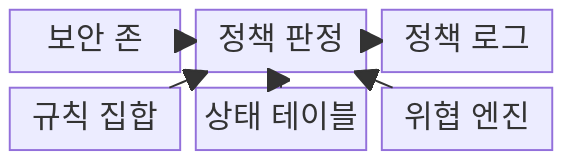
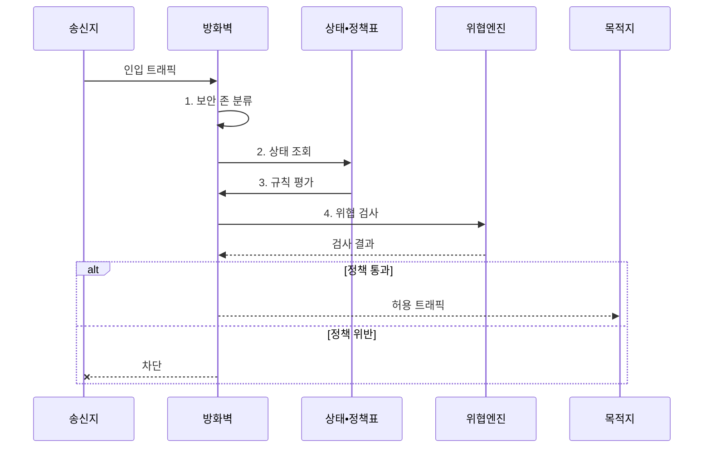

---
sidebar:
  order: 20
  label: "020. 방화벽 : 패킷 필터•상태기반•NGFW (Firewall Types)"
  badge:
    text: "기출 • 70%"
    variant: note
title: "방화벽 : 패킷 필터•상태기반•NGFW (Firewall Types)"
date: "2026-08-03T08:48:47+09:00"
tags:
  - "notes-network"
weight: 20
extra:
  question_no: "020"
  source_status: "기출"
  source_history: "129회, 137회"
  priority: 70
  priority_note: "비교•보안형: 129•137회 방화벽 계층 반복"
---

## Ⅰ. 개요

핵심 용어

- **방화벽**: 서로 다른 신뢰 구간 사이의 트래픽을 보안 규칙에 따라 허용하거나 차단하는 통제 장비이다.

- 정의/개념: **방화벽** — 서로 다른 신뢰 구간 사이의 트래픽을 주소•연결 상태•응용 내용과 보안 정책에 따라 허용하거나 차단하는 **네트워크 보안 통제 장비**
- 배경/필요성: 무통제 경계의 **비인가 접근•공격 확산**

#### 한줄 요약

- 방화벽은 출발지와 목적지뿐 아니라 연결 상태와 요청 내용까지 확인해 구간 사이 통행을 결정한다

## Ⅱ. 특징

핵심 용어

- **기본 차단•상태 추적•심층 패킷 검사(Default Deny/Stateful Inspection/Deep Packet Inspection, 기본 차단•상태 추적•DPI)**: 명시적 허용 외 통신을 거부하고 연결 상태와 응용 내용을 검사하는 기능이다.

- 기본 차단의 **명시 허용 외 통신 거부**
- 상태 추적의 **허용 연결 응답 판별**
- DPI의 **응용•위협 내용 식별**

#### 한줄 요약

- 검사 정보가 많아질수록 응용별 통제는 정밀해지지만 정책과 처리 비용도 커진다

## Ⅲ. 구조 및 구성요소

핵심 용어

- **보안 존•접근 제어 목록•상태 테이블(Security Zone/Access Control List/State Table, 보안 존•ACL•상태 테이블)**: 정책 방향을 적용할 구간, 순서화된 허용•차단 규칙, 허용 연결 상태를 저장한 표이다.
- **위협 엔진•정책 로그**: 공격 패턴을 분석하는 기능과 적용 규칙•판정 결과를 기록한 데이터이다.

| 구성요소 | 책임 |
|:---|:---|
| 보안 존 | **출발•목적 구간•정책 방향** 정의 |
| 규칙 집합 | **허용•차단 조건•평가 순서** 규정 |
| 상태 테이블 | 허용 연결의 **양방향 튜플•상태** 저장 |
| 위협 엔진 | **응용•공격 패턴** 식별 |
| 정책 로그 | **적용 규칙•판정 결과** 기록 |

#### 한줄 요약

- 외부•공개 서버•내부 구간을 나누고 규칙과 연결 상태와 위협 검사를 차례로 적용한다

## Ⅳ. 흐름도

핵심 용어

- **정책 판정(Policy Decision)**: 보안 존•연결 상태•첫 일치 규칙•위협 검사 결과를 결합해 허용 여부를 결정하는 과정이다.
- **접근 제어 목록(Access Control List, ACL)**: 위에서부터 평가해 처음 일치한 허용•차단 동작을 적용하는 규칙 목록이다.

**동작 원리**

1. **보안 존 분류**: 입력•출력 인터페이스의 신뢰 구간 결정
2. **상태 조회**: 기존 허용 연결과의 연관성 확인
3. **규칙 평가**: 첫 일치 ACL의 허용•차단 적용
4. **위협 검사**: 응용 데이터와 공격 패턴 분석

#### 한줄 요약

- 구간과 연결 상태를 확인한 뒤 정책과 위협 검사를 통과한 트래픽만 전달한다

## Ⅴ. 종류 및 비교

핵심 용어

- **패킷 필터•상태 기반•차세대 방화벽(Packet Filter/Stateful Firewall/Next-Generation Firewall, 패킷 필터•상태 기반•NGFW)**: 패킷 필드, 연결 문맥, 응용•사용자•위협 정보를 각각 기준으로 통제하는 방화벽이다.
- **심층 패킷 검사(Deep Packet Inspection, DPI)**: 패킷 페이로드의 응용 정보와 위협 패턴까지 분석하는 검사이다.

| 방화벽 방식 | 패킷 필터 | 상태 기반 | NGFW |
|:---|:---|:---|:---|
| 적용 기준 | 단순•고속 **주소•포트 통제** | 연결 요청•응답의 **상태 통제** | 응용•사용자•**위협별 통제** |
| 핵심 특징 | 패킷별 **주소•포트 독립 검사** | 연결 테이블의 **양방향 상태 추적** | DPI의 **응용•위협 내용 분석** |
| 한계 | **위조 출발지•연결 문맥** 미식별 | 상태 테이블 **자원 고갈** | 내용 검사 **처리량 병목** |

> 요약: 패킷•연결•응용 문맥에 따라 방화벽 선택

#### 한줄 요약

- 패킷 필드는 명단을 보고 상태 기반은 연결 흐름을 보며 NGFW는 응용 내용까지 검사한다

## Ⅵ. 실무 고려사항 및 대책

핵심 용어

- **비무장 지대•규칙 그림자(DeMilitarized Zone/Rule Shadowing, DMZ•규칙 그림자)**: 공개 서버를 내부망과 분리한 구간과 앞선 광범위 규칙 때문에 뒤 규칙이 적용되지 않는 현상이다.
- **복호화 예외**: 암호화 트래픽 검사 시 개인정보•법적 요구•성능을 고려해 검사하지 않을 범위를 정한 정책이다.

| 문제 | 대책 | 효과 |
|:---|:---|:---|
| **과도한 광범위 허용** | **출발•목적•서비스** 최소화 | **공격 표면** 축소 |
| 공개 서버와 **내부망 혼재** | **DMZ** 로 공개 서버 분리 | **침해 확산** 방지 |
| **규칙 순서 충돌** | **그림자•중복 규칙** 자동 분석 | **정책 오판** 방지 |
| 암호화 트래픽의 **가시성 부족** | **복호화 범위•예외 기준** 설정 | **위협 탐지** 향상 |
| **로그 과다•누락** | 중요 규칙별 **보존•경보 차등** | **사고 추적성** 확보 |

#### 한줄 요약

- 외부 사용자는 공개 웹 서버까지만 들어오게 하고 그 연결이 내부 서버로 직접 이어지지 않게 구간을 나눈다

## Ⅶ. 결론

핵심 용어

- **검사 범위 최소화(Minimum Inspection Scope)**: 필요한 주소•연결•응용 문맥까지만 검사해 통제 정밀도와 처리 비용을 균형화하는 원칙이다.
- **차세대 방화벽(Next-Generation Firewall, NGFW)**: 응용•사용자•위협 정보까지 식별해 세밀한 보안 정책을 적용하는 방화벽이다.

- 연결 상태 통제는 **상태 기반**, 응용 위협 식별은 **NGFW** 선택

#### 한줄 요약

- 주소와 포트뿐 아니라 연결 상태와 필요한 응용 정보까지 검사 범위를 정해야 한다.
