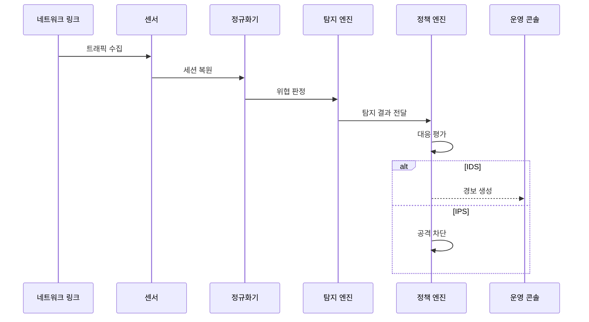

---
sidebar:
  order: 21
  label: "021. IDS·IPS (IDS IPS)"
  badge:
    text: "기출 · 50%"
    variant: note
title: "IDS·IPS (IDS IPS)"
date: "2026-07-25T00:50:00+09:00"
tags:
  - "notes-network"
weight: 21
extra:
  question_no: "021"
  source_status: "기출"
  source_history: "129회, 134회"
  priority: 50
  priority_note: "비교·보안형: 134회 WAF·IDS·IPS 직접 비교"
---

## 미리 알고가기

- **침입 탐지 시스템(Intrusion Detection System, IDS)**: 서비스 경로 밖에서 복제 트래픽을 분석해 침입 징후를 탐지·경보하는 시스템
- **침입 방지 시스템(Intrusion Prevention System, IPS)**: 서비스 경로 안에서 트래픽을 분석해 공격 연결·패킷을 즉시 차단하는 시스템
- **웹 응용 방화벽(Web Application Firewall, WAF)**: 웹 요청의 주소·헤더·본문을 해석해 응용 공격을 차단하는 방화벽
- **시험 접근점(Test Access Point, TAP)**: 원본 통신에 영향을 주지 않고 링크 트래픽을 복제해 IDS 센서에 전달하는 장치
- **인라인·경로 외 배치(Inline·Out-of-Band)**: 장비가 실제 통신 경로를 통과시키는 배치와 복제본만 받는 배치
- **시그니처 탐지(Signature Detection)**: 알려진 공격의 바이트·규칙 패턴과 트래픽을 비교하는 탐지
- **이상 탐지(Anomaly Detection)**: 정상 행위 기준에서 벗어난 통계·행동 편차를 의심 징후로 찾는 탐지
- **오탐·미탐(False Positive·False Negative)**: 정상 트래픽을 공격으로 잘못 판정하는 오류와 실제 공격을 놓치는 오류
- **세션 정규화·복원**: 조각·중복·순서 차이를 표준 형태로 바꾸고 양방향 통신 흐름을 재구성하는 작업
- **바이패스(Bypass)**: IPS 장애나 정책 조건에서 트래픽이 검사 기능을 우회해 계속 흐르도록 하는 경로
- **장애 시 허용·차단(Fail-Open·Fail-Close)**: IPS 고장 때 서비스를 계속 통과시키는 방식과 보안을 위해 통신을 중단하는 방식

## Ⅰ. 개요

- **정의/개념**: IDS는 침입 경보, IPS는 인라인 공격 차단
- **배경/필요성**: 허용 서비스 안의 취약점 악용·변칙 행위 식별

### 쉽게 이해하기 (학습용)

- IDS는 감시 카메라처럼 알리고 IPS는 통로 차단기처럼 공격 연결을 끊는다

## Ⅱ. 특징

- IDS는 복제 트래픽을 분석해 서비스 장애와 분리한다.
- IPS는 즉시 차단하나 오탐이 서비스를 중단시킨다.
- 시그니처는 알려진 공격, 이상 탐지는 변칙 행위를 식별한다.
- 세션 정규화가 조각·순서 차이를 이용한 우회를 억제한다.

### 쉽게 이해하기 (학습용)

- 탐지 규칙이 같아도 경로 밖 IDS와 인라인 IPS는 서비스에 미치는 영향이 다르다

## Ⅲ. 아키텍처 및 구성요소

| 설계 요소 | 설명 |
|:---|:---|
| 센서 | 복제 또는 인라인 트래픽을 수집 |
| 정규화기 | 패킷 조각·중복·세션을 복원 |
| 탐지 엔진 | 시그니처·이상 행위를 분석 |
| 정책 엔진 | 신뢰도·자산·예외로 대응을 결정 |
| 이벤트 저장소 | 경보·패킷·판정 근거를 보존 |

> 요약: 정규화된 세션을 탐지하고 정책으로 대응 결정

### 쉽게 이해하기 (학습용)

- 조각난 통신을 원래 흐름으로 복원한 뒤 공격 패턴과 비교해 탐지 우회를 줄인다

## Ⅳ. 원리 및 절차 흐름도

| 절차 | 설명 |
|:---|:---|
| 트래픽 수집 | IDS는 복제, IPS는 인라인 수집 |
| 세션 복원 | 조각·순서 차이를 정규화 |
| 위협 판정 | 시그니처·행위 편차를 분석 |
| 탐지 결과 전달 | 공격 유형·신뢰도를 정책에 전달 |
| 대응 평가 | 탐지 신뢰도·자산·예외를 반영 |
| 경보 생성 | IDS가 사건과 판정 근거를 기록 |
| 공격 차단 | IPS가 패킷 폐기·연결 종료를 집행 |

> 요약: 세션 복원·위협 판정 후 경보·차단 선택

### 쉽게 이해하기 (학습용)

- 탐지 결과에 자산 중요도와 예외를 더해 경보만 낼지 통신을 끊을지 정한다

## Ⅴ. 종류 및 비교

| 판단 기준 | IDS | IPS |
|:---|:---|:---|
| 핵심 특징 | 경로 밖 복제 분석·경보 | 인라인 분석·즉시 차단 |
| 적용 기준 | 가시성 확보·탐지 규칙 검증 | 고신뢰 공격의 실시간 차단 |
| 주요 위험 | 공격 지속·대응 지연 | 오탐 차단·장비 장애 영향 |

> 요약: IDS는 경보, IPS는 인라인 차단

### 쉽게 이해하기 (학습용)

- IDS는 먼저 알리고 IPS는 즉시 끊으므로 IPS에는 오탐·장애 대책이 필요하다

## Ⅵ. 실무 사례

1. 새 규칙은 IDS 관찰 후 고신뢰 항목만 IPS 차단
2. 결제 경로는 장애 영향으로 허용·차단 방식을 결정

### 쉽게 이해하기 (학습용)

- 새 탐지 규칙을 먼저 경보로 관찰하면 정상 요청을 공격으로 오인하는 범위를 줄인 뒤 차단할 수 있다
- 결제 서비스는 IPS 고장 때 거래를 계속할지 중단할지 업무 위험을 비교해 장애 방식을 정한다

## Ⅶ. 결론

- 탐지 신뢰도·서비스 영향으로 IDS·IPS 대응 결정

### 쉽게 이해하기 (학습용)

- 확신이 낮은 규칙은 경보로 검증하고 오탐 영향보다 공격 위험이 큰 규칙만 차단한다
