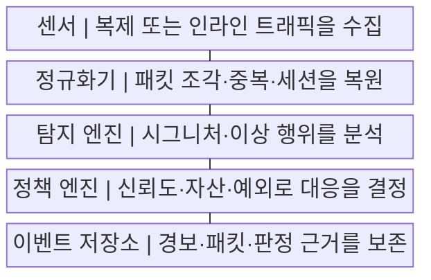
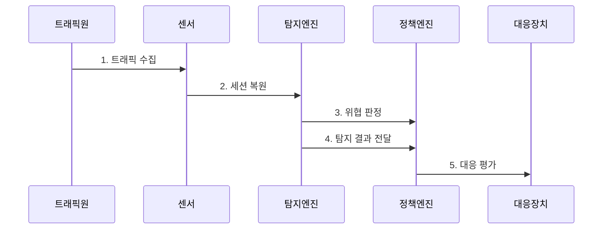

---
sidebar:
  order: 21
  label: "021. IDS·IPS (IDS IPS)"
  badge:
    text: "기출 · 50%"
    variant: note
title: "IDS·IPS (IDS IPS)"
date: "2026-07-29T21:30:00+09:00"
tags:
  - "notes-network"
weight: 21
extra:
  question_no: "021"
  source_status: "기출"
  source_history: "129회, 134회"
  priority: 50
  priority_note: "비교·보안형: 134회 WAF·IDS·IPS 직접 비교"
---

## 미리 알고가기

- **침입 탐지 시스템(Intrusion Detection System, IDS)**: ‘아이디에스’로 읽고 영문 머리글자를 딴 약어이며, 경로 밖의 복제 트래픽에서 침입 징후를 탐지·경보함
- **침입 방지 시스템(Intrusion Prevention System, IPS)**: ‘아이피에스’로 읽고 영문 머리글자를 딴 약어이며, 인라인 트래픽에서 공격 연결·패킷을 즉시 차단함
- **웹 응용 방화벽(Web Application Firewall, WAF)**: ‘와프’로 읽고 영문 머리글자를 딴 약어이며, 웹 요청의 URL·헤더·본문을 해석해 응용 공격을 차단함
- **시험 접근점(Test Access Point, TAP)**: ‘탭’으로 읽고 영문 머리글자를 딴 약어이며, 원본 통신에 영향을 주지 않고 링크 트래픽을 IDS 센서에 복제함
- **인라인·경로 외 배치(Inline·Out-of-Band)**: 장비가 실제 통신 경로를 통과시키는 배치와 복제본만 받는 배치
- **시그니처 탐지(Signature Detection)**: 알려진 공격의 바이트·규칙 패턴과 트래픽을 비교하는 탐지
- **이상 탐지(Anomaly Detection)**: 정상 행위 기준에서 벗어난 통계·행동 편차를 의심 징후로 찾는 탐지
- **오탐·미탐(False Positive·False Negative)**: 정상 트래픽을 공격으로 잘못 판정하는 오류와 실제 공격을 놓치는 오류
- **세션 정규화·복원**: 조각·중복·순서 차이를 표준 형태로 바꾸고 양방향 통신 흐름을 재구성하는 작업
- **바이패스(Bypass)**: IPS 장애나 정책 조건에서 트래픽이 검사 기능을 우회해 계속 흐르도록 하는 경로
- **장애 시 허용·차단(Fail-Open·Fail-Close)**: IPS 고장 때 서비스를 계속 통과시키는 방식과 보안을 위해 통신을 중단하는 방식

## Ⅰ. 개요

- 정의/개념: IDS는 **침입 탐지·경보**, IPS는 **인라인 공격 차단**
- 배경/필요성: 접근 허용 트래픽의 **취약점 악용·변칙 공격 미식별**

### 쉽게 이해하기 (학습용)

- IDS는 감시 카메라처럼 알리고 IPS는 통로 차단기처럼 공격 연결을 끊는다

## Ⅱ. 특징

- IDS의 **경로 외 복제 분석·경보**
- IPS의 **인라인 분석·즉시 차단**
- 시그니처·이상 탐지의 **공격 식별 상호 보완**

### 쉽게 이해하기 (학습용)

- 탐지 규칙이 같아도 경로 밖 IDS와 인라인 IPS는 서비스에 미치는 영향이 다르다

## Ⅲ. 구조 및 구성요소

| 구성요소 | 책임 |
|:---|:---|
| 센서 | 복제 또는 인라인 트래픽을 수집 |
| 정규화기 | 패킷 조각·중복·세션을 복원 |
| 탐지 엔진 | 시그니처·이상 행위를 분석 |
| 정책 엔진 | 신뢰도·자산·예외로 대응을 결정 |
| 이벤트 저장소 | 경보·패킷·판정 근거를 보존 |

### 쉽게 이해하기 (학습용)

- 조각난 통신을 원래 흐름으로 복원한 뒤 공격 패턴과 비교해 탐지 우회를 줄인다

## Ⅳ. 흐름도

**동작 원리**

1. **트래픽 수집**: IDS는 복제, IPS는 인라인 수집
2. **세션 복원**: 조각·순서 차이를 정규화
3. **위협 판정**: 시그니처·행위 편차를 분석
4. **탐지 결과 전달**: 공격 유형·신뢰도를 정책에 전달
5. **대응 평가**: 탐지 신뢰도·자산·예외를 반영

### 쉽게 이해하기 (학습용)

- 탐지 결과에 자산 중요도와 예외를 더해 경보만 낼지 통신을 끊을지 정한다

## Ⅴ. 종류 및 비교

| 침입 대응 방식 | IDS | IPS |
|:---|:---|:---|
| 적용 기준 | 가시성 확보·**탐지 규칙 검증** | 고신뢰 공격의 **실시간 차단** |
| 핵심 특징 | 경로 밖 **복제 분석·경보** | 인라인 **분석·즉시 차단** |
| 한계 | 공격 지속·**대응 지연** | 오탐 차단·**장비 장애 영향** |

> 요약: IDS는 경보, IPS는 인라인 차단

### 쉽게 이해하기 (학습용)

- IDS는 먼저 알리고 IPS는 즉시 끊으므로 IPS에는 오탐·장애 대책이 필요하다

## Ⅵ. 실무 고려사항 및 대책

| 고려사항 | 대책 | 효과 |
|:---|:---|:---|
| 오탐 기반 정상 차단 | 탐지 신뢰도·자산 중요도 결합 | 서비스 피해 감소 |
| 암호화 공격 미탐 | 복호화 지점·메타정보 연계 | 탐지 가시성 확보 |
| 우회 조각·인코딩 | 세션 복원·입력 정규화 | 탐지 일관성 향상 |
| IPS 장애의 통신 단절 | 우회 모드·용량·장애 시험 | 인라인 가용성 확보 |

### 쉽게 이해하기 (학습용)

- 새 탐지 규칙을 먼저 경보로 관찰하면 정상 요청을 공격으로 오인하는 범위를 줄인 뒤 차단할 수 있다

## Ⅶ. 결론

- **탐지 신뢰도와 서비스 영향을 분리한 IDS·IPS 대응**

### 쉽게 이해하기 (학습용)

- 같은 탐지 규칙이라도 경로 밖 IDS와 인라인 IPS는 서비스 영향이 다르다.
