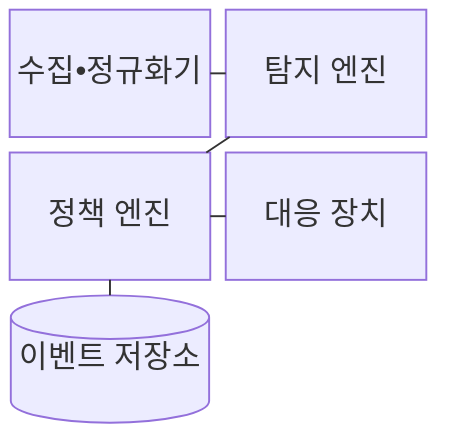
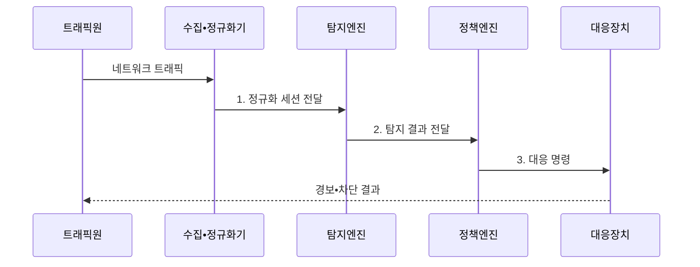

---
sidebar:
  order: 21
  label: "021. IDS•IPS (IDS IPS)"
  badge:
    text: "기출 • 50%"
    variant: note
title: "IDS•IPS (IDS IPS)"
date: "2026-08-04T15:24:00+09:00"
tags:
  - "notes-network"
weight: 21
extra:
  question_no: "021"
  source_status: "기출"
  source_history: "129회, 134회"
  priority: 50
  priority_note: "비교•보안형: 134회 WAF•IDS•IPS 직접 비교"
---

## Ⅰ. 개요

핵심 용어

- **IDS(Intrusion Detection System)**: 복제 트래픽에서 침입을 탐지하고 경보하는 시스템이다.
- **IPS(Intrusion Prevention System)**: 인라인에서 침입을 탐지하고 공격 트래픽을 차단하는 시스템이다.

- 정의/개념: **IDS•IPS** — 네트워크•호스트 활동에서 침입 징후를 분석하되 IDS는 탐지•경보하고 IPS는 인라인에서 악성 트래픽을 차단하는 **보안 시스템**
- 배경/필요성: 방화벽이 허용한 트래픽에 숨은 **취약점 악용** 공격 식별 한계

#### 한줄 요약

- 감시 카메라가 수상한 사람을 알리듯 IDS는 경보하고, 통로 차단기가 문을 닫듯 IPS는 공격 연결을 끊는다

## Ⅱ. 특징

핵심 용어

- **시그니처 탐지(Signature Detection)**: 알려진 공격 패턴과 일치하는 트래픽을 찾는 방식이다.
- **이상 탐지(Anomaly Detection)**: 정상 기준에서 벗어난 행위와 트래픽을 찾는 방식이다.

- IDS의 **경로 외 복제 분석•경보**
- IPS의 **인라인 분석•즉시 차단**
- 시그니처•이상 탐지의 **공격 식별 상호 보완**

#### 한줄 요약

- 복제 영상을 보는 경비원은 통행을 건드리지 않지만 출입문 경비원은 즉시 막듯, IDS와 IPS는 배치 위치에 따라 대응 영향이 갈린다

## Ⅲ. 구조 및 구성요소

핵심 용어

- **세션 정규화(Session Normalization)**: 조각•인코딩•순서 차이를 표준 형태로 바꾸는 작업이다.
- **세션 복원(Session Reconstruction)**: 패킷을 양방향 통신 흐름으로 재구성하는 작업이다.

| 구성요소 | 책임 |
|:---|:---|
| 수집•정규화기 | 복제•인라인 트래픽의 **세션 복원** |
| 탐지 엔진 | **시그니처•이상 행위** 분석 |
| 정책 엔진 | **탐지 신뢰도**•자산 중요도로 대응 결정 |
| 대응 장치 | **경보•연결 차단** 집행 |
| 이벤트 저장소 | 경보•패킷•**판정 근거** 보존 |

#### 한줄 요약

- 우편 분류대가 찢어진 봉투를 맞춘 뒤 검사대에 넘기듯, 정규화기가 세션을 복원하면 탐지 엔진과 정책 엔진이 대응을 정한다

## Ⅳ. 흐름도

핵심 용어

- **인라인 배치(Inline Deployment)**: 실제 통신 경로에서 트래픽을 검사하는 방식이다.
- **경로 외 배치(Out-of-band Deployment)**: 복제한 트래픽만 통신 경로 밖에서 검사하는 방식이다.

**동작 원리**

1. **정규화 세션 전달**: 조각•중복•순서 차이를 제거한 통신 흐름 제공
2. **탐지 결과 전달**: **시그니처•이상 탐지** 로 공격 유형과 신뢰도 산출
3. **대응 명령**: **IDS 경보•IPS 차단** 중 정책에 맞는 조치 선택

#### 한줄 요약

- 검사대가 의심 물품과 위험 등급을 관제실에 넘기면 관제실이 경보와 출입 차단 중 하나를 지시하듯 탐지 결과가 대응을 결정한다

## Ⅴ. 종류 및 비교

핵심 용어

- **오탐(False Positive)**: 정상 트래픽을 공격으로 잘못 판단하는 오류이다.
- **미탐(False Negative)**: 실제 공격을 정상으로 판단하여 놓치는 오류이다.

| 침입 대응 방식 | IDS | IPS |
|:---|:---|:---|
| 적용 기준 | 가시성 확보•**탐지 규칙 검증** | 고신뢰 공격의 **실시간 차단** |
| 핵심 특징 | 경로 밖 **복제 분석•경보** | 인라인 **분석•즉시 차단** |
| 한계 | 공격 지속•**대응 지연** | 오탐 차단•**장비 장애 영향** |

> 요약: IDS는 경보, IPS는 인라인 차단

#### 한줄 요약

- IDS는 먼저 알리고 IPS는 즉시 끊으므로 IPS에는 오탐•장애 대책이 필요하다

## Ⅵ. 실무 고려사항 및 대책

핵심 용어

- **Fail-Open**: IPS 장애 때 검사 없이 통신을 허용하는 방식이다.
- **Fail-Close**: IPS 장애 때 통신을 차단하는 방식이다.

| 문제 | 대책 | 효과 |
|:---|:---|:---|
| **오탐** 이 높으면 정상 서비스 차단 | **탐지 신뢰도**•자산 중요도 결합 | 정상 연결의 **오차단** 감소 |
| 암호화 구간은 **공격 페이로드** 미탐 | 복호화 지점과 **메타정보** 연계 | 암호화 트래픽의 **탐지 가시성** 확보 |
| 조각•인코딩 차이로 **시그니처 우회** | **세션 복원•입력 정규화** 적용 | 변형 공격의 **탐지 일관성** 향상 |
| IPS 장애 시 **통신 단절** | **바이패스** 와 Fail-Open•Fail-Close 정책 시험 | 인라인 경로의 **가용성** 유지 |

#### 한줄 요약

- 새 출입 규칙을 먼저 경보 전용으로 시험하듯 탐지 신뢰도와 장애 우회 경로를 확인한 뒤 IPS 차단을 켜면 정상 통신 피해를 줄일 수 있다

## Ⅶ. 결론

핵심 용어

- **바이패스(Bypass)**: 장애나 정책 조건에서 트래픽이 검사 기능을 우회해 흐르는 경로이다.

- **IDS** 로 탐지 신뢰도를 검증하고 서비스 영향이 허용되면 **IPS** 차단 전환

#### 한줄 요약

- 새 규칙을 감시 카메라 역할의 IDS로 먼저 확인한 뒤 오경보가 줄면 출입문 역할의 IPS 차단으로 전환한다
