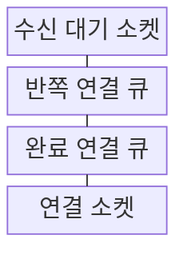
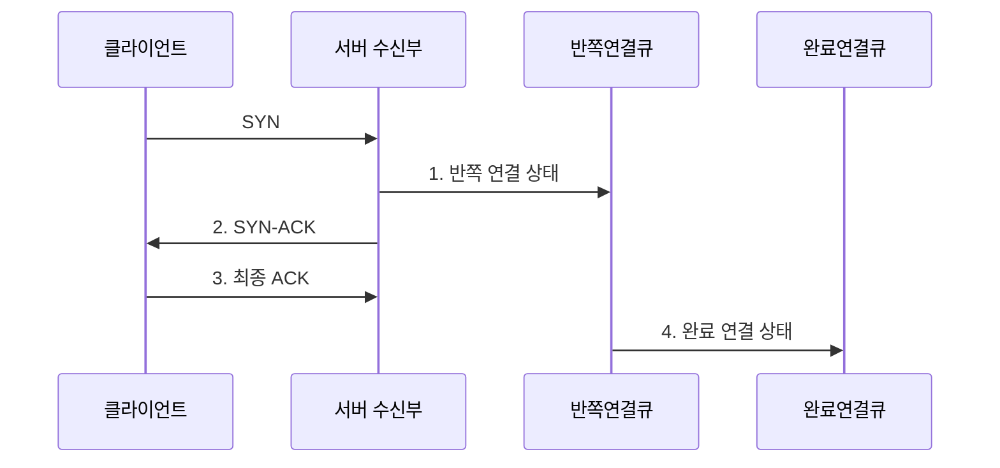

---
sidebar:
  order: 22
  label: "022. TCP 3-way Handshake (TCP 3-way Handshake)"
  badge:
    text: "기출 · 70%"
    variant: note
title: "TCP 3-way Handshake (TCP 3-way Handshake)"
date: "2026-07-31T00:50:01+09:00"
tags:
  - "notes-network"
weight: 22
extra:
  question_no: "022"
  source_status: "기출"
  source_history: "125회, 128회, 129회, 132회"
  priority: 70
  priority_note: "설명·비교형: 125·132회 연결 설정·해제 반복"
---

## 미리 알고가기

- **전송 제어 프로토콜(Transmission Control Protocol, TCP)**: 순서 확인과 재전송으로 신뢰성 있는 바이트 흐름을 제공하는 전송 프로토콜
- **동기화 플래그(Synchronize Flag, SYN)**: 연결 설정을 시작하고 초기 순서 번호를 알리는 TCP 제어 비트
- **확인 응답 플래그(Acknowledgment Flag, ACK)**: 상대 순서 번호를 확인하고 다음 수신 번호를 알리는 TCP 제어 비트
- **초기 순서 번호(Initial Sequence Number, ISN)**: 각 방향에서 전송할 바이트의 시작 번호
- **최대 세그먼트 크기(Maximum Segment Size, MSS)**: TCP 헤더를 제외하고 한 세그먼트에 담을 수 있다고 종단이 알리는 최대 데이터 크기
- **윈도 크기 배율(Window Scale)**: 수신 윈도 필드에 배율을 적용해 큰 전송 가능량을 표현하는 TCP 옵션
- **소켓(Socket)**: 인터넷 프로토콜 주소·포트·전송 프로토콜로 통신 끝점을 식별하는 운영체제 객체
- **수신 대기 소켓(Listening Socket)**: 서버가 특정 포트에서 새 연결 설정 요청을 기다리는 소켓
- **반쪽 연결 큐(SYN Queue)**: 서버가 SYN을 받고 최종 ACK를 기다리는 연결 상태를 보관하는 큐
- **완료 연결 큐(Accept Queue)**: 3단계 확인을 마쳐 응용이 받아 갈 수 있는 연결을 보관하는 큐
- **SYN 플러드(SYN Flood)**: 최종 ACK를 보내지 않는 다수 SYN으로 서버의 반쪽 연결 자원을 고갈시키는 공격
- **SYN 쿠키(SYN Cookie)**: 서버 상태를 즉시 저장하지 않고 검증 가능한 값을 순서 번호에 넣어 최종 ACK 때 연결을 복원하는 방어 기법
- **종료 플래그(Finish Flag, FIN)**: 한 방향에서 더 보낼 데이터가 없음을 알려 TCP 연결 종료를 시작하는 제어 비트
- **최대 전송 단위(Maximum Transmission Unit, MTU)**: 한 링크가 단편화 없이 전달할 수 있는 최대 패킷 크기
- **경로 MTU 블랙홀(Path MTU Black Hole)**: 경로보다 큰 패킷이 폐기되지만 크기 조정 신호가 돌아오지 않아 통신이 멈추는 현상

## Ⅰ. 개요

- 정의/개념: **SYN·SYN-ACK·ACK**로 양방향 **ISN·옵션**을 확인하는 TCP 연결 설정 절차
- 배경/필요성: 연결 전에는 상대 도달성과 **양방향 순서 기준** 확인 불가

### 쉽게 이해하기 (학습용)

- 두 사람이 각자 책의 첫 쪽 번호를 알려 주고 되받아 확인하듯, 양쪽 TCP는 세 메시지로 도달성과 시작 번호를 맞춘다

## Ⅱ. 특징

- 독립 ISN 교환의 **양방향 순서 기준 설정**
- SYN 옵션의 **MSS·윈도 배율 협상**
- 반쪽 연결 큐의 **SYN 플러드 노출**

### 쉽게 이해하기 (학습용)

- 두 창고가 상자 최대 크기와 송장 시작 번호를 먼저 맞추듯, SYN 옵션과 ISN 협상이 이후 데이터 순서와 전송량의 기준이 된다

## Ⅲ. 구조 및 구성요소

| 구성요소 | 책임 |
|:---|:---|
| 수신 대기 소켓 | 서버 포트에서 새 **SYN** 수신 |
| 반쪽 연결 큐 | SYN 수신 후 **최종 ACK 대기 상태** 저장 |
| 완료 연결 큐 | 설정 완료 연결을 **응용 인수**까지 저장 |
| 연결 소켓 | 종단 주소·**ISN·TCP 상태** 관리 |

### 쉽게 이해하기 (학습용)

- 접수대가 답장을 기다리는 신청서를 대기함에 두었다가 최종 확인이 오면 완료함으로 옮기듯 서버가 연결 상태를 두 큐로 나눈다

## Ⅳ. 흐름도

**동작 원리**

1. **반쪽 연결 상태**: 클라이언트 **ISN·옵션**과 최종 ACK 대기 상태 저장
2. **SYN-ACK**: 클라이언트 ISN 확인과 **서버 ISN** 제안
3. **최종 ACK**: 서버 ISN 수신 확인으로 **양방향 도달성** 검증
4. **완료 연결 상태**: 반쪽 연결을 **연결 설정 완료** 상태로 전환

### 쉽게 이해하기 (학습용)

- 두 사람이 서로 보낸 등기번호를 확인해야 거래를 시작하듯 클라이언트와 서버는 ISN을 한 번씩 확인한 뒤 연결을 완료한다

## Ⅴ. 종류 및 비교

| TCP 연결 절차 | 3단계 연결 설정 | 4단계 연결 종료 |
|:---|:---|:---|
| 적용 기준 | 데이터 전송 전 **연결 상태 생성** | 양방향 송신 후 **연결 상태 해제** |
| 핵심 특징 | SYN·ACK의 **양방향 ISN 확인** | FIN·ACK의 **방향별 독립 종료** |
| 한계 | SYN 플러드·**설정 지연** | 종료 누락·**대기 상태 누적** |

> 요약: 설정은 3단계, 방향별 종료는 4단계

### 쉽게 이해하기 (학습용)

- 연결 시작은 한쪽 요청에 양쪽 확인을 묶을 수 있지만 종료는 각 방향의 남은 데이터가 달라 따로 닫는다

## Ⅵ. 실무 고려사항 및 대책

| 고려사항 | 대책 | 효과 |
|:---|:---|:---|
| **SYN 플러드**로 반쪽 연결 큐 고갈 | **SYN 쿠키**·요청률 제한 | 신규 연결의 **가용성** 유지 |
| MSS가 경로 **MTU**보다 크면 패킷 폐기 | 경로 MTU에 맞춰 **MSS 조정** | **경로 MTU 블랙홀** 방지 |
| 최종 ACK 누락으로 **반쪽 연결** 장기 점유 | **재전송 횟수·대기시간** 제한 | 연결 상태 **메모리 회수** |
| 중간장비가 **SYN 옵션**을 변경 | 양단 패킷 캡처로 **옵션 대조** | 처리량 저하의 **협상 원인** 식별 |

### 쉽게 이해하기 (학습용)

- 대기함이 넘치면 답장을 기다리지 않고 검증 번호를 건네는 SYN 쿠키를 쓰고, 상자가 경로보다 크면 MSS를 줄여 연결 자원을 지킨다

## Ⅶ. 결론

- 양방향 **ISN·옵션** 확인 후 연결하고 큐 압력 시 **SYN 쿠키** 적용

### 쉽게 이해하기 (학습용)

- 양쪽이 시작 번호와 상자 크기를 확인한 뒤 연결하되 대기함이 넘치려 하면 SYN 쿠키로 미완료 신청서 저장을 늦춘다
