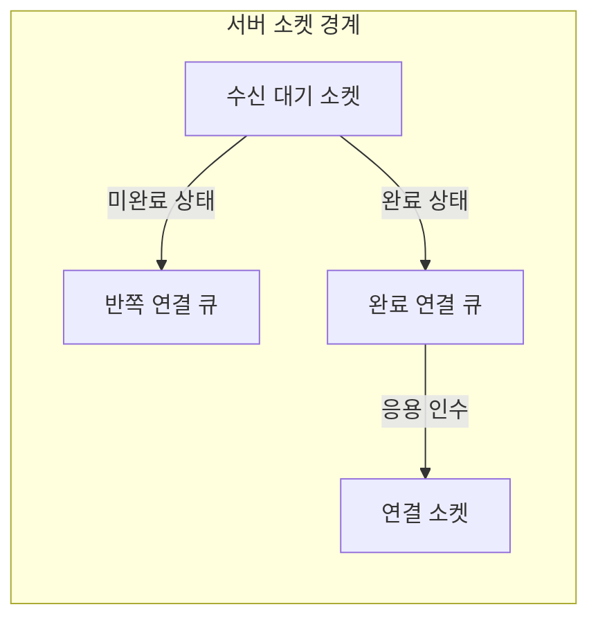
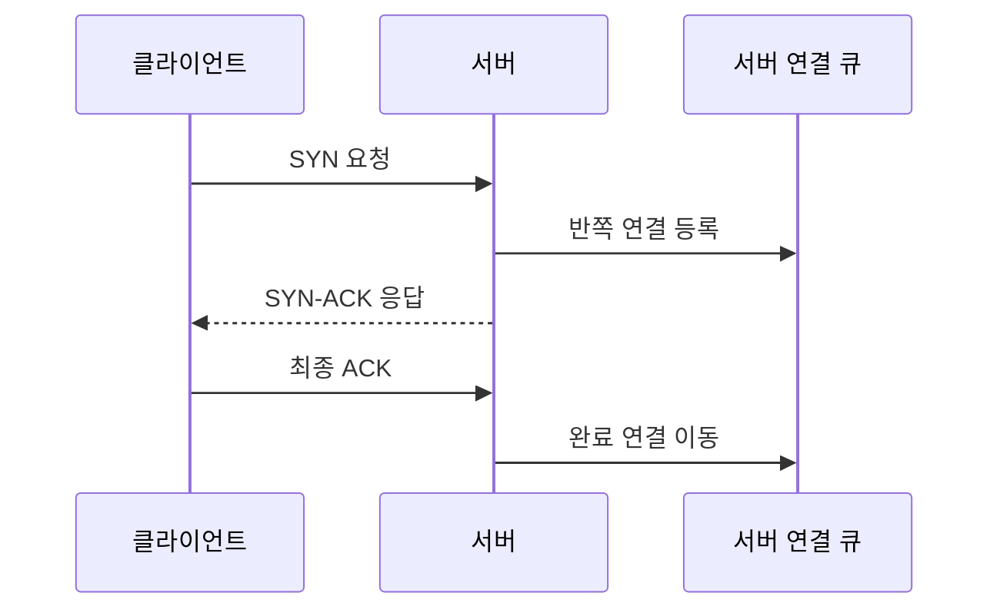

---
sidebar:
  order: 22
  label: "022. TCP 3-way Handshake (TCP 3-way Handshake)"
  badge:
    text: "기출 · 70%"
    variant: note
title: "TCP 3-way Handshake (TCP 3-way Handshake)"
date: "2026-07-27T23:59:59+09:00"
tags:
  - "notes-network"
weight: 22
extra:
  question_no: "022"
  source_status: "기출"
  source_history: "125회, 128회, 129회, 132회"
  priority: 70
  priority_note: "설명·비교형: 125·132회 연결 설정·해제 반복"
---

## 미리 알고가기

- **전송 제어 프로토콜(Transmission Control Protocol, TCP)**: ‘티시피’로 읽고 영문 머리글자를 딴 약어이며, 순서·확인·재전송으로 신뢰성 있는 바이트 흐름을 제공함
- **동기화 플래그(Synchronize Flag, SYN)**: ‘신’으로 읽고 영문 핵심 글자를 딴 표기이며, 연결 설정을 시작하고 초기 순서 번호를 알림
- **확인 응답 플래그(Acknowledgment Flag, ACK)**: ‘액’으로 읽고 영문 핵심 글자를 딴 표기이며, 상대 순서 번호를 확인하고 다음 수신 번호를 알림
- **초기 순서 번호(Initial Sequence Number, ISN)**: ‘아이에스엔’으로 읽고 영문 머리글자를 딴 약어이며, 각 방향 바이트의 시작 번호를 정함
- **최대 세그먼트 크기(Maximum Segment Size, MSS)**: TCP 헤더를 제외하고 한 세그먼트에 담을 수 있다고 종단이 알리는 최대 데이터 크기
- **윈도 크기 배율(Window Scale)**: 수신 윈도 필드에 배율을 적용해 큰 전송 가능량을 표현하는 TCP 옵션
- **왕복 시간(Round-Trip Time, RTT)**: 한 종단의 메시지가 상대에게 도달하고 응답이 돌아오기까지 걸린 시간
- **소켓(Socket)**: 인터넷 프로토콜 주소·포트·전송 프로토콜로 통신 끝점을 식별하는 운영체제 객체
- **수신 대기 소켓(Listening Socket)**: 서버가 특정 포트에서 새 연결 설정 요청을 기다리는 소켓
- **반쪽 연결 큐(SYN Queue)**: 서버가 SYN을 받고 최종 ACK를 기다리는 연결 상태를 보관하는 큐
- **완료 연결 큐(Accept Queue)**: 3단계 확인을 마쳐 응용이 받아 갈 수 있는 연결을 보관하는 큐
- **SYN 플러드(SYN Flood)**: 최종 ACK를 보내지 않는 다수 SYN으로 서버의 반쪽 연결 자원을 고갈시키는 공격
- **SYN 쿠키(SYN Cookie)**: 서버 상태를 즉시 저장하지 않고 검증 가능한 값을 순서 번호에 넣어 최종 ACK 때 연결을 복원하는 방어 기법
- **종료 플래그(Finish Flag, FIN)**: 한 방향에서 더 보낼 데이터가 없음을 알려 TCP 연결 종료를 시작하는 제어 비트

## Ⅰ. 개요

- 정의/개념: SYN·SYN-ACK·ACK로 **양방향 ISN·옵션 동기화**
- 기존 한계: 무상태 전송의 **상대 도달성·순서 기준 미확인**

### 쉽게 이해하기 (학습용)

- 양쪽이 서로의 시작 번호를 받고 답할 수 있음을 세 번의 메시지로 확인한 뒤 데이터를 보낸다

## Ⅱ. 특징

- 독립 ISN 교환의 **양방향 순서 기준 설정**
- SYN 옵션의 **MSS·윈도 배율 협상**
- 반쪽 연결 큐의 **SYN 플러드 노출**

### 쉽게 이해하기 (학습용)

- 서로 받을 수 있는 데이터 크기와 시작 번호를 처음에 맞춰야 이후 데이터의 순서와 재전송 범위를 판단할 수 있다

## Ⅲ. 아키텍처 및 구성요소

| 설계 요소 | 설명 |
|:---|:---|
| 수신 대기 소켓 | 서버 포트에서 새 SYN을 수신 |
| 반쪽 연결 큐 | SYN 수신 후 최종 ACK 대기 상태 저장 |
| 완료 연결 큐 | 설정 완료 연결을 응용 인수까지 저장 |
| 연결 소켓 | 종단 주소·ISN·옵션·TCP 상태를 관리 |

> 요약: 수신 대기 소켓이 미완료·완료 큐를 분리

### 쉽게 이해하기 (학습용)

- 서버는 미완료 연결을 반쪽 큐에 두고 최종 ACK가 오면 완료 큐로 옮긴다

## Ⅳ. 원리 및 절차 흐름도

| 절차 | 설명 |
|:---|:---|
| SYN 요청 | 클라이언트 ISN·옵션을 제안 |
| 반쪽 연결 등록 | 서버가 최종 ACK 대기 상태를 저장 |
| SYN-ACK 응답 | 클라이언트 ISN 확인·서버 ISN 제안 |
| 최종 ACK | 클라이언트가 서버 ISN을 확인 |
| 완료 연결 이동 | 설정 완료 상태를 완료 큐로 전환 |

> 요약: SYN·SYN-ACK·ACK로 양방향 ISN 확인

### 쉽게 이해하기 (학습용)

- 클라이언트와 서버가 서로의 시작 번호를 한 번씩 확인해야 양방향 데이터 전송 준비가 끝난다

## Ⅴ. 종류 및 비교

| TCP 연결 절차 | 3단계 연결 설정 | 4단계 연결 종료 |
|:---|:---|:---|
| 적용 기준 | 데이터 전송 전 **연결 상태 생성** | 양방향 송신 후 **연결 상태 해제** |
| 핵심 특징 | SYN·ACK의 **양방향 ISN 확인** | FIN·ACK의 **방향별 독립 종료** |
| 한계 | SYN 플러드·**설정 지연** | 종료 누락·**대기 상태 누적** |

> 요약: 설정은 3단계, 방향별 종료는 4단계

### 쉽게 이해하기 (학습용)

- 연결 시작은 한쪽 요청에 양쪽 확인을 묶을 수 있지만 종료는 각 방향의 남은 데이터가 달라 따로 닫는다

## Ⅵ. 실무 사례

1. 접속 장애는 SYN·SYN-ACK·ACK 손실 구간을 식별

### 쉽게 이해하기 (학습용)

- 서버의 SYN 수신, 클라이언트의 SYN-ACK 수신, 서버의 최종 ACK 수신을 차례로 확인한다

## Ⅶ. 결론

- 신뢰성 있는 바이트 전송 전 양방향 통신 상태를 합의하기 위해 SYN·SYN-ACK·ACK 도달성·ISN·재전송을 검토하여, TCP 연결 성립과 장애 구간을 판정해야 한다.

### 쉽게 이해하기 (학습용)

- 세 메시지가 모두 오가야 양쪽이 서로의 시작 번호를 알고 데이터를 안전하게 주고받을 수 있다
