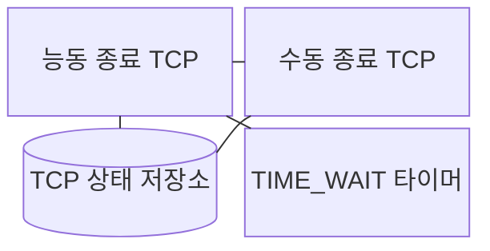
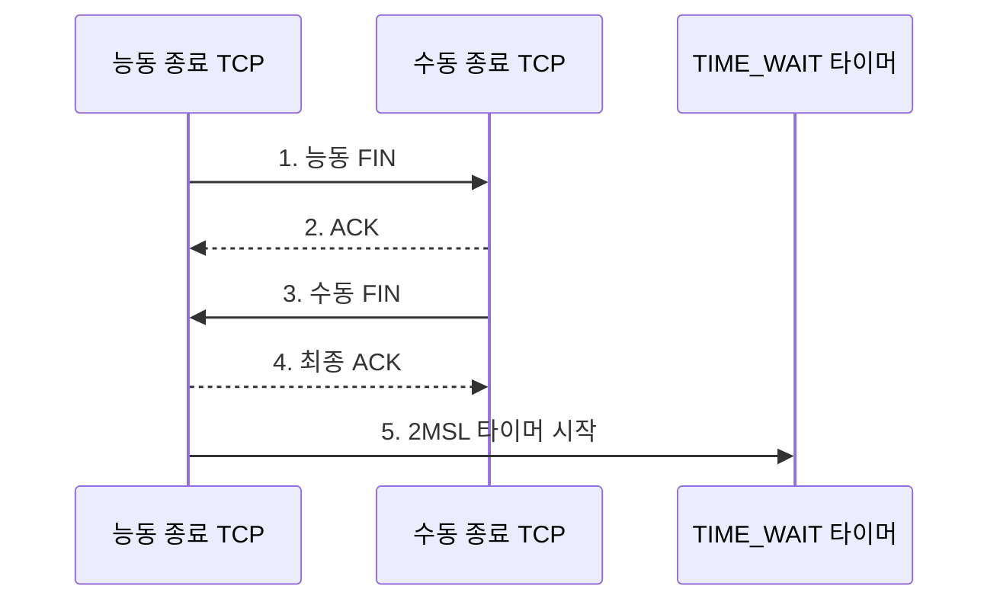

---
sidebar:
  order: 23
  label: "023. TCP 4-way Handshake·연결 해제 (TCP 4-way Handshake)"
  badge:
    text: "기출 · 30%"
    variant: note
title: "TCP 4-way Handshake·연결 해제 (TCP 4-way Handshake)"
date: "2026-07-31T00:50:49+09:00"
tags:
  - "notes-network"
weight: 23
extra:
  question_no: "023"
  source_status: "기출"
  source_history: "132회"
  priority: 30
  priority_note: "설명형: 132회 종료 절차와 TIME_WAIT 연계"
---

## Ⅰ. 개요

핵심 용어

- **전송 제어 프로토콜 4단계 연결 종료(Transmission Control Protocol Four-Way Handshake, TCP 4-way handshake)**: 양방향 송신을 FIN·ACK로 각각 독립 종료하는 절차이다.

- 정의/개념: **TCP 4-way handshake** — 각 종단이 FIN과 ACK를 교환하여 양방향 송신 스트림을 독립적으로 닫는 **연결 종료 절차**
- 배경/필요성: 한 방향만 닫으면 반대 방향 **잔여 데이터** 보존 불가

#### 한줄 요약

- 양방향 도로에서 한 차선이 비어도 반대 차선의 차는 계속 오듯, 한쪽 송신이 끝나도 상대 데이터가 남아 두 방향을 따로 닫는다

## Ⅱ. 특징

핵심 용어

- **능동·수동 종료와 반쪽 종료**: 먼저 FIN을 보내는 측, 이를 받는 측, 한 방향만 닫힌 상태이다.
- **종료·확인 응답(Finish/Acknowledgment, FIN·ACK)**: 송신 종료를 알리고 상대가 보낸 종료 순서 번호를 확인하는 제어 플래그이다.

- FIN 순서 번호의 **손실·재전송 추적**
- 반쪽 종료의 **반대 방향 잔여 전송 허용**
- TIME_WAIT의 **최종 ACK 재전송·지연 격리**

#### 한줄 요약

- 먼저 문을 닫은 쪽은 마지막 확인증이 사라질 때 다시 건넬 수 있도록 기다리고, 상대는 남은 짐을 보낸 뒤 자기 문을 닫는다

## Ⅲ. 구조 및 구성요소

핵심 용어

- **종료 대기·닫기 대기·최종 확인 대기(Finish Wait/Close Wait/Last Acknowledgment, FIN_WAIT·CLOSE_WAIT·LAST_ACK)**: 능동 종료, 응용 종료 대기, 최종 ACK 대기 상태이다.
- **전송 제어 프로토콜(Transmission Control Protocol, TCP)**: 양방향 바이트 스트림의 연결과 종료 상태를 관리하는 프로토콜이다.

| 구성요소 | 책임 |
|:---|:---|
| 능동 종료 TCP | 선행 FIN과 **TIME_WAIT** 상태 관리 |
| 수동 종료 TCP | **CLOSE_WAIT·LAST_ACK** 상태 관리 |
| TCP 상태 저장소 | 방향별 **순서 번호·종료 상태** 보관 |
| TIME_WAIT 타이머 | **최종 ACK 재응답·지연 세그먼트** 격리 |

#### 한줄 요약

- 두 문을 각각 관리하는 경비실과 대기 시계처럼 두 TCP 종단은 방향별 종료 상태를 저장하고 능동 종단은 TIME_WAIT 시간을 잰다

## Ⅳ. 흐름도

핵심 용어

- **종료·확인 응답(Finish/Acknowledgment, FIN·ACK)**: 더 보낼 데이터가 없음을 알리고 상대 종료를 확인하는 제어 비트이다.
- **최대 세그먼트 수명 두 배(Twice the Maximum Segment Lifetime, 2MSL)**: 지연 세그먼트 소멸과 최종 ACK 재전송을 위해 기다리는 시간이다.

**동작 원리**

1. **능동 FIN**: 능동 종단이 자기 방향의 **송신 종료** 통지
2. **ACK**: 수동 종단이 FIN 순서 번호를 확인하고 **반쪽 종료** 진입
3. **수동 FIN**: 수동 종단이 남은 전송 후 자기 방향 종료 통지
4. **최종 ACK**: 능동 측이 상대 FIN을 확인
5. **2MSL 타이머 시작**: **TIME_WAIT** 동안 재전송 FIN과 지연 세그먼트 처리

#### 한줄 요약

- 마지막 영수증이 사라지면 상대가 종료표를 다시 보내듯, 최종 ACK가 유실되면 수동 종단이 FIN을 재전송하고 능동 종단이 다시 확인한다

## Ⅴ. 종류 및 비교

핵심 용어

- **전송 제어 프로토콜(Transmission Control Protocol, TCP)**: 각 송신 방향을 독립적으로 종료하는 연결 지향 전송 프로토콜이다.
- **종료·확인 응답(Finish/Acknowledgment, FIN·ACK)**: 방향별 종료 통지와 그 수신 확인에 사용하는 플래그이다.
- **능동·수동 종료(Active/Passive Close)**: 먼저 FIN을 보낸 종단과 상대 FIN을 먼저 받은 종단의 종료 역할이다.
- **TIME_WAIT·CLOSE_WAIT**: 능동 측이 지연 세그먼트를 정리하는 상태와 수동 측이 응용의 소켓 종료를 기다리는 상태이다.

| 종료 역할 | 핵심 상태 전이 | 운영 위험 |
|:---|:---|:---|
| **능동 종료 측** | **종료(Finish, FIN) 송신·TIME_WAIT 진입** | 임시 포트·TIME_WAIT 누적 |
| **수동 종료 측** | **FIN 수신·응용 종료 대기** | CLOSE_WAIT·소켓 자원 누적 |

> 요약: 능동 종료 측은 TIME_WAIT, 수동 종료 측은 응용 종료 지연을 관리

#### 한줄 요약

- 먼저 닫은 쪽은 늦은 패킷을 정리하고 요청받은 쪽은 응용이 소켓을 닫을 때까지 기다린다

## Ⅵ. 실무 고려사항 및 대책

핵심 용어

- **시간 대기·최대 세그먼트 수명 두 배(Time Wait/Twice the Maximum Segment Lifetime, TIME_WAIT·2MSL)**: 최종 ACK 재전송과 이전 세그먼트 소멸을 위해 능동 종료 측이 기다리는 상태와 기준 시간이다.
- **종료·확인 응답(Finish/Acknowledgment, FIN·ACK)**: 연결 방향의 종료를 통지하고 수신 여부를 확인하는 제어 플래그이다.

| 문제 | 대책 | 효과 |
|:---|:---|:---|
| 응용이 닫지 않으면 **CLOSE_WAIT** 장기 잔류 | 응용의 **소켓 종료 경로** 점검 | 파일 서술자·**소켓 자원** 회수 |
| 짧은 연결 반복으로 **TIME_WAIT** 누적 | 능동 종료 주체·**임시 포트 범위** 조정 | 신규 연결용 **포트 고갈** 완화 |
| 최종 ACK 유실로 **FIN 재전송** | **2MSL** 동안 재전송 FIN에 ACK 응답 | 상대의 **LAST_ACK** 종료 |
| 송신 완료 전 종료로 **잔여 데이터** 폐기 | **반쪽 종료** 후 송신 완료 확인 | 종료 중 **데이터 손실** 방지 |

#### 한줄 요약

- 퇴실 손님이 문을 닫지 않아 대기표가 쌓이면 소켓 종료 경로를 고치고, 짧은 연결이 몰리면 TIME_WAIT을 맡는 쪽과 포트 범위를 조정한다

## Ⅶ. 결론

핵심 용어

- **임시 포트**: 클라이언트가 새 연결을 만들 때 운영체제가 일시 할당하는 출발지 포트이다.
- **확인 응답·시간 대기(Acknowledgment/Time Wait, ACK·TIME_WAIT)**: 마지막 종료 수신을 확인하고 지연 세그먼트가 사라질 때까지 연결 정보를 유지하는 절차이다.

- 반대 방향 데이터가 남으면 **반쪽 종료**, 최종 ACK 후 **TIME_WAIT** 유지

#### 한줄 요약

- 반대 차선에 차가 남아 있으면 한쪽만 먼저 닫고, 마지막 확인증을 보낸 뒤에는 늦은 차가 사라질 때까지 기다린다
