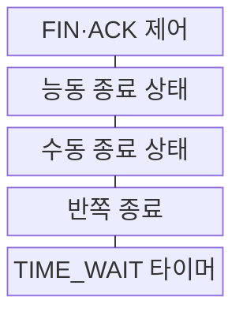
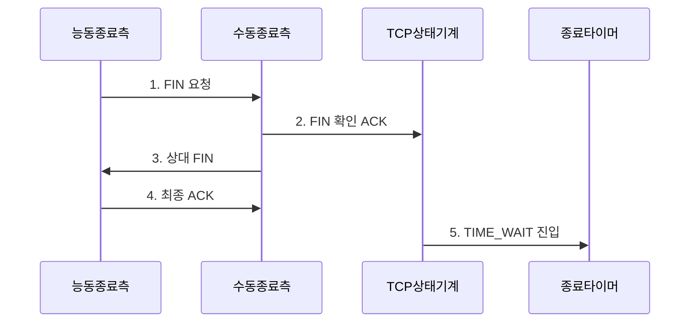

---
sidebar:
  order: 23
  label: "023. TCP 4-way Handshake·연결 해제 (TCP 4-way Handshake)"
  badge:
    text: "기출 · 30%"
    variant: note
title: "TCP 4-way Handshake·연결 해제 (TCP 4-way Handshake)"
date: "2026-07-30T18:00:00+09:00"
tags:
  - "notes-network"
weight: 23
extra:
  question_no: "023"
  source_status: "기출"
  source_history: "132회"
  priority: 30
  priority_note: "설명형: 132회 종료 절차와 TIME_WAIT 연계"
---

## 미리 알고가기

- **전송 제어 프로토콜(Transmission Control Protocol, TCP)**: ‘티시피’로 읽고 영문 머리글자를 딴 약어이며, 양방향 바이트 흐름을 독립적으로 종료할 수 있는 연결형 전송 프로토콜
- **종료 플래그(Finish Flag, FIN)**: ‘핀’으로 읽고 영문 핵심 글자를 딴 표기이며, 해당 방향으로 더 보낼 데이터가 없음을 알림
- **확인 응답 플래그(Acknowledgment Flag, ACK)**: ‘액’으로 읽고 영문 핵심 글자를 딴 표기이며, 상대 FIN 수신과 다음 순서 번호를 확인함
- **능동 종료·수동 종료(Active Close·Passive Close)**: 먼저 FIN을 보내는 종료와 상대 FIN을 받은 뒤 자신의 FIN을 보내는 종료
- **반쪽 종료(Half-Close)**: 한 방향의 송신은 끝났지만 반대 방향의 데이터 수신은 계속 가능한 상태
- **FIN 대기(FIN_WAIT)**: 능동 종료 측이 자신의 FIN 확인과 상대 FIN을 기다리는 상태
- **종료 대기(CLOSE_WAIT)**: 상대 FIN을 확인한 응용이 자신의 소켓을 닫아 FIN을 보낼 때까지 기다리는 상태
- **마지막 확인 대기(LAST_ACK)**: 수동 종료 측이 자신의 FIN에 대한 최종 ACK를 기다리는 상태
- **시간 대기(TIME_WAIT)**: 능동 종료 측이 최종 ACK 재전송과 이전 연결의 지연 세그먼트 소멸을 위해 대기하는 상태
- **최대 세그먼트 수명(Maximum Segment Lifetime, MSL)**: TCP 세그먼트가 네트워크에 남아 있을 수 있다고 가정하는 최대 시간
- **2MSL(투 엠에스엘)**: 숫자 2와 Maximum Segment Lifetime의 약어를 붙여 MSL의 두 배를 뜻하는 표기로 양방향 지연 세그먼트 소멸과 최종 ACK 재전송을 보장하는 TIME_WAIT 기준임
- **임시 포트(Ephemeral Port)**: 클라이언트가 새 연결을 만들 때 운영체제가 일시적으로 할당하는 출발지 포트
- **연결 재사용(Connection Reuse)**: 여러 요청을 이미 설정된 TCP 연결로 보내 새 연결 설정·종료 횟수를 줄이는 방식

## Ⅰ. 개요

- 정의/개념: FIN·ACK로 **양방향 송신을 독립 종료**
- 배경/필요성: 동시 종료 시 **잔여 데이터 손실·지연 세그먼트 혼입**

### 쉽게 이해하기 (학습용)

- 한쪽이 보낼 일을 끝내도 상대는 남은 데이터를 보낼 수 있어 두 방향을 각각 확인하며 닫는다

## Ⅱ. 특징

- FIN 순서 번호의 **손실·재전송 추적**
- 반쪽 종료의 **반대 방향 잔여 전송 허용**
- TIME_WAIT의 **최종 ACK 재전송·지연 격리**

### 쉽게 이해하기 (학습용)

- 먼저 닫은 쪽은 마지막 확인이 사라질 경우에 대비해 기다리고 상대는 남은 일을 마친 뒤 자기 방향을 닫는다

## Ⅲ. 구조 및 구성요소

| 구성요소 | 책임 |
|:---|:---|
| FIN·ACK 제어 | 방향별 종료 요청·확인을 추적 |
| 능동 종료 상태 | FIN_WAIT 후 TIME_WAIT으로 전이 |
| 수동 종료 상태 | CLOSE_WAIT 후 LAST_ACK으로 전이 |
| 반쪽 종료 | 한 방향 송신 종료·반대 수신 유지 |
| TIME_WAIT 타이머 | 최종 ACK 재전송·지연 세그먼트 격리 |

### 쉽게 이해하기 (학습용)

- FIN을 받은 쪽도 남은 데이터를 처리한 뒤 자기 방향의 FIN을 따로 보낸다

## Ⅳ. 흐름도

**동작 원리**

1. **FIN 요청**: 능동 측이 자기 송신 종료를 알림
2. **FIN 확인 ACK**: 수동 측이 FIN 순서 번호를 확인
3. **상대 FIN**: 수동 측이 남은 전송 후 종료를 알림
4. **최종 ACK**: 능동 측이 상대 FIN을 확인
5. **TIME_WAIT 진입**: 최종 ACK 재전송 가능 상태를 유지

### 쉽게 이해하기 (학습용)

- 최종 ACK가 사라지면 상대가 FIN을 다시 보내고 능동 종료 측이 ACK로 재응답한다

## Ⅴ. 종류 및 비교

| TCP 종료 역할 | 능동 종료 측 | 수동 종료 측 |
|:---|:---|:---|
| 적용 기준 | 연결 종료를 **먼저 요청한 종단** | 종료 요청을 **먼저 받은 종단** |
| 핵심 특징 | 선행 FIN 후 **TIME_WAIT 담당** | 상대 FIN 확인 후 **응용 종료 대기** |
| 한계 | TIME_WAIT·**임시 포트 누적** | CLOSE_WAIT·**소켓 자원 누적** |

> 요약: CLOSE_WAIT은 응용의 소켓 종료 지연

### 쉽게 이해하기 (학습용)

- 먼저 닫은 쪽은 늦은 패킷을 정리하고 요청받은 쪽은 응용이 소켓을 닫을 때까지 기다린다

## Ⅵ. 실무 고려사항 및 대책

| 고려사항 | 대책 | 효과 |
|:---|:---|:---|
| CLOSE_WAIT 장기 잔류 | 응용 소켓 종료 경로 점검 | 서버 자원 회수 |
| TIME_WAIT 과다 누적 | 능동 종료 주체·포트 범위 조정 | 신규 연결 확보 |
| 최종 ACK 유실 | 2MSL 동안 재전송 응답 유지 | 정상 종료 보장 |
| 잔여 데이터 조기 폐기 | 반쪽 종료·송신 완료 확인 | 데이터 손실 방지 |

### 쉽게 이해하기 (학습용)

- 상대가 종료했는데 CLOSE_WAIT이 계속 남으면 응용이 작업 뒤 소켓을 닫는 코드 경로를 확인한다

## Ⅶ. 결론

- **방향별 FIN 확인과 TIME_WAIT 격리를 통한 안전한 TCP 종료**

### 쉽게 이해하기 (학습용)

- 한쪽 송신이 끝나도 반대 방향 데이터가 남을 수 있어 두 방향을 따로 닫아야 한다.
