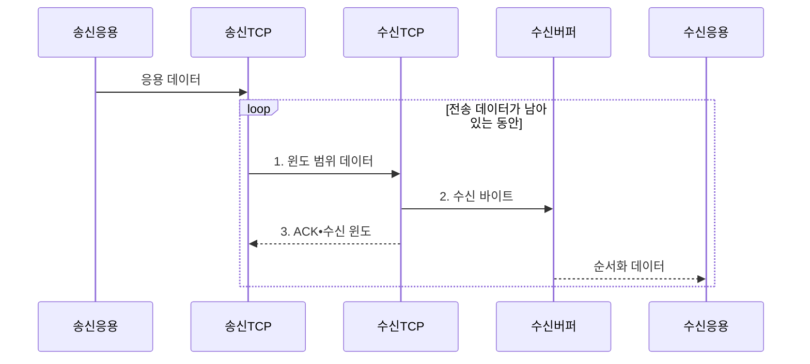

---
sidebar:
  order: 24
  label: "024. TCP 흐름 제어 : 슬라이딩 윈도우 (TCP Flow Control)"
  badge:
    text: "기출 • 30%"
    variant: note
title: "TCP 흐름 제어 : 슬라이딩 윈도우 (TCP Flow Control)"
date: "2026-08-05T01:25:48+09:00"
tags:
  - "notes-network"
weight: 24
extra:
  question_no: "024"
  source_status: "기출"
  source_history: "125회"
  priority: 30
  priority_note: "설명형: 125회 Sliding Window 직접 요구"
---

## Ⅰ. 개요

<details>
<summary>핵심 용어</summary>

- **전송 제어 프로토콜 흐름 제어(Transmission Control Protocol Flow Control, TCP 흐름 제어)**: 송신량이 수신 버퍼의 처리 능력을 넘지 않도록 제한하는 기능이다.
</details>

- 정의/개념: **TCP 흐름 제어** — 수신자가 광고한 윈도 `rwnd`에 맞춰 송신자의 미확인 데이터량을 제한하여 수신 버퍼 초과를 막는 **종단 간 제어 방식**
- 배경/필요성: 빠른 송신 속도로 느린 수신 측의 **버퍼 오버플로** 발생

#### 한줄 요약

- 창고가 빈 선반 수를 계속 알려 주면 트럭이 그 수만큼만 상자를 보내듯 수신 측이 rwnd로 송신량을 제한한다

## Ⅱ. 특징

<details>
<summary>핵심 용어</summary>

- **rwnd(Receive Window)**: 수신 버퍼 여유를 기준으로 미확인 전송량을 제한하는 값이다.
- **cwnd(Congestion Window)**: 경로 혼잡 상태를 기준으로 미확인 전송량을 제한하는 값이다.
- **확인 응답(Acknowledgment, ACK)**: 누적 수신 번호와 현재 수신 윈도를 송신자에게 알리는 응답이다.
</details>

- ACK의 **현재 rwnd•누적 수신 번호 광고**
- 누적 ACK의 **송신 윈도 전진**
- 제로 윈도 탐사의 **윈도 갱신 유실 복구**

#### 한줄 요약

- 창고 빈자리 표시는 rwnd이고 도로 정체 제한은 cwnd이므로 송신자는 두 표지 중 더 작은 범위까지만 보낸다

## Ⅲ. 구조 및 구성요소

<details>
<summary>핵심 용어</summary>

- **슬라이딩 윈도**: 윈도 범위의 데이터를 연속 전송하고 ACK에 따라 범위를 이동하는 방식이다.
</details>

```text
[송신 TCP]---[송신 버퍼]
     |
     +---[수신 TCP]---[수신 버퍼]
     |
[지속 타이머]
```

선의 의미: 송신 TCP는 송신 버퍼, 수신 TCP의 rwnd•ACK 및 지속 타이머와 결속되고, 수신 TCP는 수신 바이트를 보관하는 수신 버퍼와 연결된다.

| 구성요소 | 책임 |
|:---|:---|
| 송신 TCP | **rwnd•cwnd** 중 작은 값으로 송신 범위 제한 |
| 송신 버퍼 | 미확인 바이트를 **재전송**까지 보관 |
| 수신 TCP | 누적 ACK와 현재 **rwnd 광고** |
| 수신 버퍼 | 응용이 읽기 전 **수신 바이트** 보관 |
| 지속 타이머 | **제로 윈도 탐사** 시점 관리 |

#### 한줄 요약

- 송신 창고와 수신 창고 사이에서 송신 TCP가 허용량을 정하고, 제로 윈도가 오래가면 지속 타이머가 작은 탐사 상자를 보내게 한다

## Ⅳ. 흐름도



**동작 원리**

1. **윈도 범위 데이터**: **rwnd•cwnd** 중 작은 범위까지 연속 전송
2. **수신 바이트**: 순서가 맞는 데이터를 **수신 버퍼** 에 저장
3. **ACK•수신 윈도**: 누적 수신 번호와 새 **rwnd** 로 송신 윈도 전진

#### 한줄 요약

- 컨베이어 벨트의 확인표가 도착할 때마다 처리된 상자만큼 빈칸이 앞으로 이동하듯 ACK가 송신 윈도를 전진시킨다

## Ⅴ. 종류 및 비교

<details>
<summary>핵심 용어</summary>

- **정지-대기(Stop-and-wait)**: 데이터 하나를 보낸 뒤 ACK를 기다리는 방식이다.
- **RTT(Round-trip Time)**: 데이터 전송부터 해당 ACK 수신까지 걸리는 왕복 시간이다.
</details>

| 흐름 제어 방식 | 슬라이딩 윈도 | 정지-대기 |
|:---|:---|:---|
| 적용 기준 | RTT 중 **연속 전송•대역폭 활용** | 저속•짧은 **단순 전송** |
| 핵심 특징 | 윈도 안의 **다중 데이터 연속 전송** | 데이터별 **ACK 후 다음 전송** |
| 한계 | 윈도•버퍼 **상태 관리 복잡** | RTT 대기•**대역폭 낭비** |

> 요약: 슬라이딩 윈도는 허용 범위에서 연속 전송

#### 한줄 요약

- 슬라이딩 윈도는 ACK를 기다리는 동안에도 허용 범위 안의 다음 데이터를 계속 보낸다

## Ⅵ. 실무 고려사항 및 대책

<details>
<summary>핵심 용어</summary>

- **제로 윈도(Zero Window)**: 수신 버퍼 여유가 없어 rwnd가 0인 상태이다.
- **지속 타이머(Persist Timer)**: 윈도 갱신 유실을 막도록 탐사 시점을 관리하는 타이머이다.
- **BDP(Bandwidth-delay Product)**: 경로 대역폭과 RTT를 곱한 전송 중 데이터량이다.
</details>

| 문제 | 대책 | 효과 |
|:---|:---|:---|
| 응용 소비가 느리면 **수신 버퍼** 고갈 | 버퍼 점유율•소비율•**rwnd** 함께 관측 | 수신 측 **처리 병목** 식별 |
| 윈도 갱신 ACK 유실로 **제로 윈도** 지속 | **지속 타이머•윈도 탐사** 유지 | 송수신 **영구 대기** 방지 |
| rwnd가 **BDP**보다 작아 링크 유휴 | 버퍼와 **윈도 배율** 조정 | 경로 **대역폭 활용률** 향상 |
| 흐름•혼잡 제어 혼동으로 송신량 오조정 | **rwnd•cwnd** 별도 계측 | 병목 원인별 **윈도 조정** |

#### 한줄 요약

- 긴 도로에 트럭이 몇 대 없으면 길이 비듯, rwnd가 BDP보다 작으면 버퍼와 윈도 배율을 늘려 경로를 채운다

## Ⅶ. 결론

<details>
<summary>핵심 용어</summary>

- **윈도 배율(Window Scale)**: 큰 수신 윈도를 표현하도록 윈도 필드의 배율을 정하는 TCP 옵션이다.
</details>

- 수신 버퍼가 병목이면 **rwnd** 를 조정하고 제로 윈도면 **윈도 탐사** 유지

#### 한줄 요약

- 창고 빈자리가 적으면 송신량을 줄이고 빈자리 안내가 멈추면 작은 탐사 상자를 보내 다시 문이 열렸는지 확인한다
