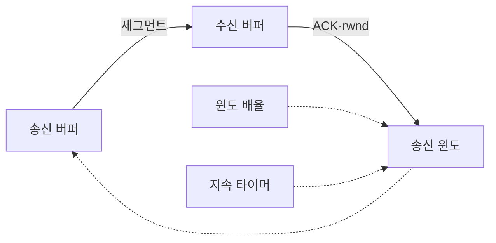
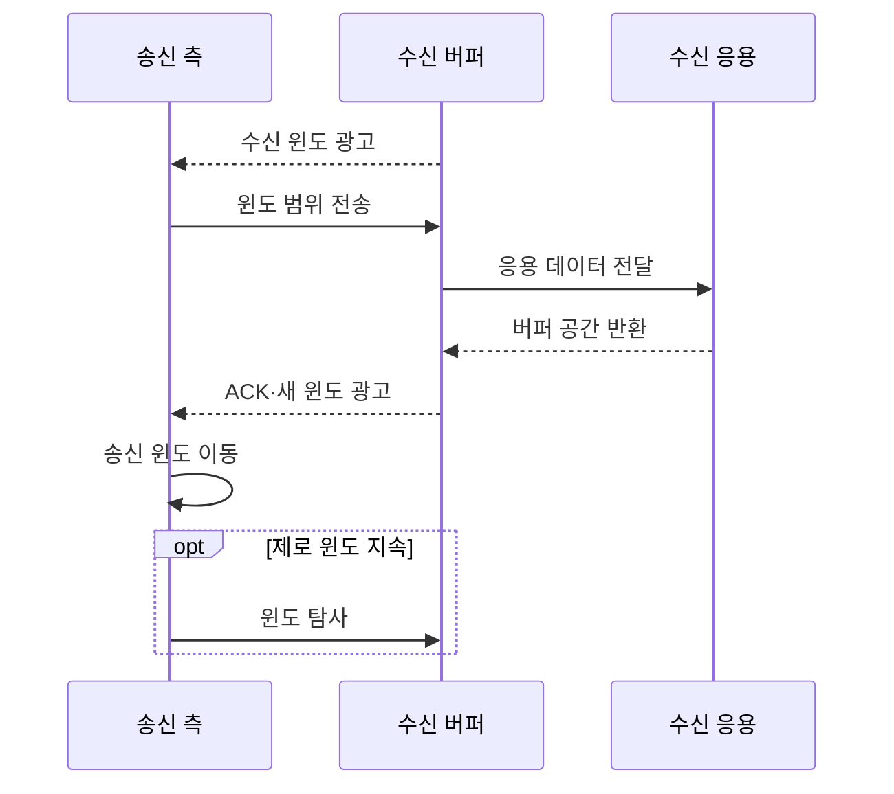

---
sidebar:
  order: 24
  label: "024. TCP 흐름 제어 — 슬라이딩 윈도우 (TCP Flow Control)"
  badge:
    text: "기출 · 30%"
    variant: note
title: "TCP 흐름 제어 — 슬라이딩 윈도우 (TCP Flow Control)"
date: "2026-07-27T23:59:59+09:00"
tags:
  - "notes-network"
weight: 24
extra:
  question_no: "024"
  source_status: "기출"
  source_history: "125회"
  priority: 30
  priority_note: "설명형: 125회 Sliding Window 직접 요구"
---

## 미리 알고가기

- **전송 제어 프로토콜(Transmission Control Protocol, TCP)**: ‘티시피’로 읽고 영문 머리글자를 딴 약어이며, 순서·확인·재전송으로 신뢰성 있는 바이트 흐름을 제공함
- **수신 윈도(Receive Window, rwnd)**: ‘알윈도’로 읽고 receive window를 줄인 필드 표기이며, 수신 버퍼가 더 받을 수 있는 바이트 양을 광고함
- **혼잡 윈도(Congestion Window, cwnd)**: ‘씨윈도’로 읽고 congestion window를 줄인 내부 변수 표기이며, 경로 혼잡을 기준으로 미확인 전송량을 제한함
- **슬라이딩 윈도(Sliding Window)**: 확인되지 않은 데이터를 윈도 범위 안에서 연속 전송하고 ACK에 따라 범위를 앞으로 이동하는 방식
- **확인 응답(Acknowledgment, ACK)**: 연속 수신한 다음 바이트의 순서 번호와 새 rwnd를 송신 측에 알리는 응답
- **제로 윈도(Zero Window)**: 수신 버퍼에 여유가 없어 rwnd를 0으로 광고한 상태
- **윈도 배율(Window Scale)**: TCP 연결 설정 때 합의해 16비트 윈도 필드보다 큰 수신 윈도를 표현하는 옵션
- **지속 타이머(Persist Timer)**: 제로 윈도 뒤 갱신 ACK 유실로 영구 대기하지 않도록 송신 측이 탐사 시점을 정하는 타이머
- **윈도 탐사(Window Probe)**: 제로 윈도 상태에서 수신 버퍼가 다시 열렸는지 확인하는 작은 TCP 세그먼트
- **대역폭-지연 곱(Bandwidth-Delay Product, BDP)**: 링크 대역폭과 왕복 시간을 곱해 경로에 동시에 존재할 수 있는 데이터량을 나타낸 값
- **정지-대기(Stop-and-Wait)**: 데이터 하나를 보내고 ACK를 받은 뒤에야 다음 데이터를 보내는 전송 방식

## Ⅰ. 개요

- **정의/개념**: rwnd 광고로 **미확인 전송량을 수신 능력에 제한**
- **기존 한계**: 송신·수신 속도 차이의 **수신 버퍼 오버플로**

### 쉽게 이해하기 (학습용)

- 받는 쪽이 빈 저장 공간을 계속 알려 주면 보내는 쪽은 넘치지 않는 범위까지만 연속으로 보낸다

## Ⅱ. 특징

- ACK의 **현재 rwnd·누적 수신 번호 광고**
- 누적 ACK의 **송신 윈도 전진**
- 제로 윈도 탐사의 **윈도 갱신 유실 복구**

### 쉽게 이해하기 (학습용)

- rwnd는 수신 버퍼 한계이고 cwnd는 네트워크 혼잡에 따른 송신 한계다

## Ⅲ. 아키텍처 및 구성요소

| 설계 요소 | 설명 |
|:---|:---|
| 송신 버퍼 | 미확인 바이트를 재전송까지 보관 |
| 수신 버퍼 | 응용이 읽기 전 바이트를 보관 |
| 송신 윈도 | 미확인 데이터의 전송 가능 범위를 관리 |
| 윈도 배율 | 큰 rwnd를 표현하도록 배율을 적용 |
| 지속 타이머 | 제로 윈도 탐사 시점을 관리 |

> 요약: 수신 버퍼 여유로 송신 윈도 범위 제한

### 쉽게 이해하기 (학습용)

- 윈도 배율은 연결을 맺을 때 정하고 그 연결이 끝날 때까지 바꾸지 않는다

## Ⅳ. 원리 및 절차 흐름도

| 절차 | 설명 |
|:---|:---|
| 수신 윈도 광고 | 빈 버퍼만큼 rwnd를 알림 |
| 윈도 범위 전송 | rwnd·cwnd 중 작은 범위까지 전송 |
| 응용 데이터 전달 | 순서가 맞는 데이터를 응용에 제공 |
| 버퍼 공간 반환 | 응용이 읽은 만큼 수신 공간 확보 |
| ACK·새 윈도 광고 | 다음 순서 번호와 새 rwnd를 알림 |
| 송신 윈도 이동 | 확인된 바이트만큼 범위를 전진 |
| 윈도 탐사 | 제로 윈도 지속 시 새 여유를 확인 |

> 요약: ACK로 확인된 만큼 송신 윈도를 이동

### 쉽게 이해하기 (학습용)

- ACK가 도착하면 확인된 바이트를 전송 범위에서 빼고 창을 앞으로 옮긴다

## Ⅴ. 종류 및 비교

| 흐름 제어 방식 | 슬라이딩 윈도 | 정지-대기 |
|:---|:---|:---|
| 적용 기준 | RTT 중 **연속 전송·대역폭 활용** | 저속·짧은 **단순 전송** |
| 핵심 특징 | 윈도 안의 **다중 데이터 연속 전송** | 데이터별 **ACK 후 다음 전송** |
| 한계 | 윈도·버퍼 **상태 관리 복잡** | RTT 대기·**대역폭 낭비** |

> 요약: 슬라이딩 윈도는 허용 범위에서 연속 전송

### 쉽게 이해하기 (학습용)

- 슬라이딩 윈도는 ACK를 기다리는 동안에도 허용 범위 안의 다음 데이터를 계속 보낸다

## Ⅵ. 실무 사례

1. 장거리 대용량 전송은 BDP에 맞춰 윈도 배율 설정
2. 제로 윈도 반복은 수신 응용의 버퍼 읽기 지연 점검

### 쉽게 이해하기 (학습용)

- 경로에 머무는 데이터량보다 윈도가 작으면 ACK를 기다리며 링크가 쉬므로 BDP만큼 보낼 수 있게 한다
- 수신 응용이 데이터를 늦게 읽으면 버퍼가 차서 송신이 멈추므로 윈도만 키우기 전에 읽기 지연을 찾는다

## Ⅶ. 결론

- 수신 처리량·BDP로 rwnd·윈도 배율 설정

### 쉽게 이해하기 (학습용)

- 수신 응용이 소비할 수 있는 속도와 경로에 채울 데이터량을 함께 보고 전송 창을 정한다
