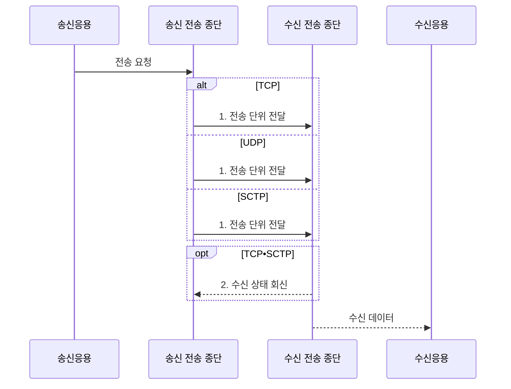

---
sidebar:
  order: 25
  label: "025. TCP•UDP•SCTP 비교 (TCP UDP SCTP Comparison)"
  badge:
    text: "기출 • 50%"
    variant: note
title: "TCP•UDP•SCTP 비교 (TCP UDP SCTP Comparison)"
date: "2026-08-05T01:25:48+09:00"
tags:
  - "notes-network"
weight: 25
extra:
  question_no: "025"
  source_status: "기출"
  source_history: "129회"
  priority: 50
  priority_note: "비교형: 129회 TCP•UDP•SCTP 장문 출제"
---

## Ⅰ. 개요

<details>
<summary>핵심 용어</summary>

- **TCP(Transmission Control Protocol)**: 신뢰성 있는 바이트 스트림을 제공하는 전송 프로토콜이다.
- **UDP(User Datagram Protocol)**: 연결 없이 독립 데이터그램을 전달하는 전송 프로토콜이다.
- **SCTP(Stream Control Transmission Protocol)**: 다중 스트림과 경로를 지원하는 메시지 전송 프로토콜이다.
</details>

- 정의/개념: **TCP•UDP•SCTP 비교** — 연결•신뢰성•메시지 경계•멀티스트리밍•멀티호밍 요구에 따라 세 전송계층 프로토콜을 선택하는 **기준**
- 배경/필요성: 하나의 방식으로 **낮은 지연•신뢰•메시지 경계** 모두 최적화 불가

#### 한줄 요약

- 택배의 속달•분실 보상•상자 구분•우회 노선 중 필요한 조건을 고르듯 전송 요구에 따라 TCP•UDP•SCTP를 선택한다

## Ⅱ. 특징

<details>
<summary>핵심 용어</summary>

- **바이트 스트림(Byte Stream)**: 메시지 경계를 보존하지 않는 연속 바이트 전송 모델이다.
- **데이터그램(Datagram)**: 각 메시지의 독립 경계를 유지하는 전송 단위이다.
</details>

- TCP의 **신뢰성 바이트 스트림**
- UDP의 **무연결 메시지•응용 복구**
- SCTP의 **멀티스트리밍•멀티호밍**

#### 한줄 요약

- 등기 우편 TCP는 누락을 다시 보내고 일반 엽서 UDP는 수신 확인이 없으며 SCTP는 여러 우편함과 우회 노선을 함께 관리한다

## Ⅲ. 구조 및 구성요소

<details>
<summary>핵심 용어</summary>

- **SCTP 연관(SCTP Association)**: 여러 주소와 스트림을 포함하는 두 종단 사이의 통신 상태이다.
</details>

```text
[송신 응용]---[송신 전송 종단]---[수신 전송 종단]---[수신 응용]
```

선의 의미: 각 선은 응용의 바이트•메시지 경계와 선택된 TCP•UDP•SCTP 전송 단위, 수신 측 순서•복구 정책 및 복원 데이터 소비가 서로 대응하는 종단 관계를 나타낸다.

| 구성요소 | 책임 |
|:---|:---|
| 송신 응용 | 전송할 **바이트•메시지 경계** 제공 |
| 송신 전송 종단 | 선택 프로토콜의 **전송 단위** 생성 |
| 수신 전송 종단 | 순서•복구 정책에 따른 **데이터 전달** |
| 수신 응용 | 복원된 바이트 흐름•**메시지** 소비 |

#### 한줄 요약

- 발송 창구와 수신 창구 사이의 운송 규칙만 TCP•UDP•SCTP로 바뀌며 양쪽 응용은 전송 종단을 통해 데이터를 주고받는다

## Ⅳ. 흐름도

<details>
<summary>핵심 용어</summary>

- **확인 응답(Acknowledgment, ACK)**: 수신 범위나 다음 순서 번호를 송신자에게 알리는 응답이다.
</details>



**동작 원리**

1. **전송 단위 전달**: TCP는 바이트, UDP는 데이터그램, SCTP는 스트림 메시지 전송
2. **수신 상태 회신**: **TCP•SCTP** 는 ACK로 손실 복구와 흐름 제어

#### 한줄 요약

- 세 운송 창구가 같은 발송 요청을 받아 TCP는 바이트, UDP는 독립 봉투, SCTP는 스트림별 봉투로 수신 응용에 전달한다

## Ⅴ. 종류 및 비교

<details>
<summary>핵심 용어</summary>

- **멀티호밍(Multihoming)**: 여러 네트워크 경로를 등록하여 장애 시 경로를 전환하는 기능이다.
- **멀티스트리밍(Multistreaming)**: 독립 순서 공간으로 스트림 간 선두 차단을 줄이는 기능이다.
</details>

| 전송 프로토콜 | TCP | UDP | SCTP |
|:---|:---|:---|:---|
| 적용 기준 | 순서•손실 없는 **연속 데이터** | 일부 손실보다 **지연•경계 우선** | 메시지 경계•**경로 전환 필요** |
| 핵심 특징 | 신뢰성 **바이트 스트림** | 무연결 **독립 데이터그램** | 신뢰성 메시지•**다중 스트림** |
| 한계 | 선두 차단•**연결 설정 지연** | 손실•중복•**응용 복구 필요** | 중간 장비•**구현 지원 제약** |

> 요약: 바이트 TCP, 독립 메시지 UDP, 다중 스트림•경로 SCTP

#### 한줄 요약

- TCP는 바이트 흐름, UDP는 독립 메시지, SCTP는 여러 스트림과 경로가 필요할 때 맞는다

## Ⅵ. 실무 고려사항 및 대책

<details>
<summary>핵심 용어</summary>

- **NAT(Network Address Translation)**: 경계 장비가 패킷의 사설 주소와 공인 주소를 변환하는 기능이다.
- **선두 차단(Head-of-line Blocking)**: 앞선 데이터 손실 때문에 뒤 데이터도 전달되지 못하고 기다리는 현상이다.
</details>

| 문제 | 대책 | 효과 |
|:---|:---|:---|
| 손실 허용 트래픽에 **TCP** 를 쓰면 지연 증가 | 손실•순서•**지연 요구** 분리 | 연결 설정•재전송 **지연 감소** |
| UDP에서 손실•중복을 허용하지 못하는 업무 | 응용 **ACK•중복 제거•속도 제어** 설계 | 필요한 범위의 **메시지 신뢰성** 확보 |
| 중간망이 **SCTP•NAT** 처리를 지원하지 않음 | 방화벽•NAT의 **SCTP 경로** 시험 | 배포 전 **연관 설정 실패** 식별 |
| TCP **선두 차단**으로 독립 흐름 지연 | 다중 연결•**SCTP 멀티스트리밍** 선택 | 흐름 간 **지연 전파** 완화 |

#### 한줄 요약

- 장부는 등기 우편 TCP, 실시간 음성은 빠른 엽서 UDP, 독립 제어 흐름과 우회 경로는 여러 우편함의 SCTP를 고른다

## Ⅶ. 결론

<details>
<summary>핵심 용어</summary>

- **전송 프로토콜 선택**: 신뢰성•지연•메시지 경계•다중 경로 요구에 맞춰 종단 방식을 고르는 활동이다.
</details>

- 순서•복구는 **TCP**, 낮은 지연은 **UDP**, 다중 경로는 SCTP 선택

#### 한줄 요약

- 분실 없는 장부에는 TCP, 늦으면 가치가 없는 음성에는 UDP, 여러 우편함과 우회 길이 필요한 제어에는 SCTP를 선택한다
