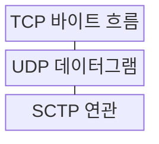
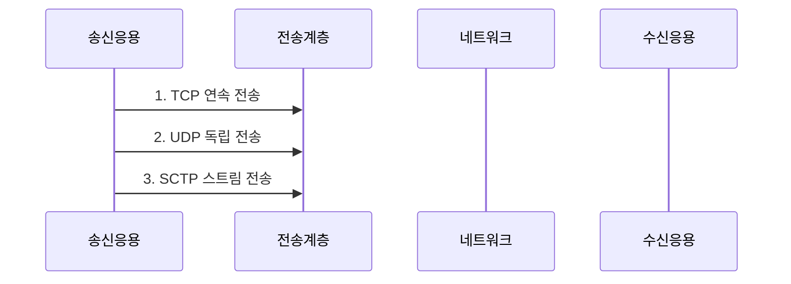

---
sidebar:
  order: 25
  label: "025. TCP·UDP·SCTP 비교 (TCP UDP SCTP Comparison)"
  badge:
    text: "기출 · 50%"
    variant: note
title: "TCP·UDP·SCTP 비교 (TCP UDP SCTP Comparison)"
date: "2026-07-30T18:00:00+09:00"
tags:
  - "notes-network"
weight: 25
extra:
  question_no: "025"
  source_status: "기출"
  source_history: "129회"
  priority: 50
  priority_note: "비교형: 129회 TCP·UDP·SCTP 장문 출제"
---

## 미리 알고가기

- **전송 제어 프로토콜(Transmission Control Protocol, TCP)**: ‘티시피’로 읽고 영문 머리글자를 딴 약어이며, 순서·재전송·흐름 제어의 연결형 바이트 스트림을 제공함
- **사용자 데이터그램 프로토콜(User Datagram Protocol, UDP)**: ‘유디피’로 읽고 영문 머리글자를 딴 약어이며, 연결 설정·재전송 없이 독립 데이터그램을 전달함
- **스트림 제어 전송 프로토콜(Stream Control Transmission Protocol, SCTP)**: ‘에스시티피’로 읽고 영문 머리글자를 딴 약어이며, 메시지 경계·다중 스트림·다중 경로를 지원함
- **확인 응답(Acknowledgment, ACK)**: 수신한 데이터 범위나 다음에 받을 순서 번호를 송신자에게 알리는 응답
- **바이트 스트림(Byte Stream)**: 응용 메시지 경계를 보존하지 않고 데이터를 연속된 바이트 순서로 전달하는 모델
- **데이터그램(Datagram)**: 각 전송 단위가 독립된 메시지 경계와 목적지 정보를 갖는 모델
- **연관(Association)**: SCTP에서 여러 주소·스트림을 포함해 두 종단 사이의 통신 상태를 나타내는 연결
- **멀티호밍(Multi-Homing)**: 한 SCTP 연관의 종단이 여러 인터넷 프로토콜 주소·경로를 등록해 주 경로 장애 때 대체 경로로 전환하는 기능
- **멀티스트리밍(Multi-Streaming)**: 한 SCTP 연관 안에서 순서 번호 공간이 다른 여러 스트림을 독립적으로 전송하는 기능
- **선두 차단(Head-of-Line Blocking)**: 앞 데이터의 손실·지연 때문에 뒤의 정상 데이터까지 응용 전달을 기다리는 현상

## Ⅰ. 개요

- 정의/개념: 전송 단위·신뢰·경로 기능이 다른 **전송 프로토콜**
- 배경/필요성: 단일 전송 방식의 **지연·신뢰·메시지 요구 동시 충족 불가**

### 쉽게 이해하기 (학습용)

- 빠른 도착, 빠짐없는 전달, 메시지 구분, 장애 경로 전환 중 무엇이 필요한지에 따라 운송 방식을 정한다

## Ⅱ. 특징

- TCP의 **신뢰성 바이트 스트림**
- UDP의 **무연결 메시지·응용 복구**
- SCTP의 **멀티스트리밍·멀티호밍**

### 쉽게 이해하기 (학습용)

- UDP는 잃은 메시지를 스스로 다시 보내지 않으므로 필요한 서비스만 응용 규칙으로 복구한다

## Ⅲ. 구조 및 구성요소

| 구성요소 | 책임 |
|:---|:---|
| TCP 바이트 흐름 | 연결별 순서·재전송·흐름을 제어 |
| UDP 데이터그램 | 독립 메시지를 최소 제어로 전달 |
| SCTP 연관 | 메시지 스트림·다중 경로를 관리 |

### 쉽게 이해하기 (학습용)

- TCP·SCTP는 전송 계층이 복구하고 UDP는 필요한 복구를 응용이 직접 맡는다

## Ⅳ. 흐름도

**동작 원리**

1. **TCP 연속 전송**: ACK·재전송·수신 윈도로 바이트 제어
2. **UDP 독립 전송**: 연결 상태 없이 데이터그램 전달
3. **SCTP 스트림 전송**: 스트림별 순서와 대체 경로 관리

### 쉽게 이해하기 (학습용)

- TCP는 빠진 바이트를 채우고 UDP는 응용에 복구를 맡기며 SCTP는 스트림과 경로를 나눠 관리한다

## Ⅴ. 종류 및 비교

| 전송 프로토콜 | TCP | UDP | SCTP |
|:---|:---|:---|:---|
| 적용 기준 | 순서·손실 없는 **연속 데이터** | 일부 손실보다 **지연·경계 우선** | 메시지 경계·**경로 전환 필요** |
| 핵심 특징 | 신뢰성 **바이트 스트림** | 무연결 **독립 데이터그램** | 신뢰성 메시지·**다중 스트림** |
| 한계 | 선두 차단·**연결 설정 지연** | 손실·중복·**응용 복구 필요** | 중간 장비·**구현 지원 제약** |

> 요약: 바이트 TCP, 독립 메시지 UDP, 다중 스트림·경로 SCTP

### 쉽게 이해하기 (학습용)

- TCP는 바이트 흐름, UDP는 독립 메시지, SCTP는 여러 스트림과 경로가 필요할 때 맞는다

## Ⅵ. 실무 고려사항 및 대책

| 고려사항 | 대책 | 효과 |
|:---|:---|:---|
| 신뢰성 요구 과대 적용 | 손실·순서·지연 요구 분리 | 전송 지연 감소 |
| UDP 복구 규칙 누락 | 응용 ACK·중복·속도 제어 설계 | 메시지 신뢰성 확보 |
| SCTP 중간망 비호환 | 방화벽·NAT·경로 지원 시험 | 도입 실패 예방 |
| TCP 머리막기 지연 | 다중 연결·SCTP 스트림 검토 | 독립 흐름 지연 완화 |

### 쉽게 이해하기 (학습용)

- 데이터베이스는 신뢰성, 실시간 음성은 낮은 지연, 제어 신호는 메시지 경계와 다중 경로 요구에 맞는 전송 프로토콜을 선택한다

## Ⅶ. 결론

- **신뢰·지연·메시지 경계·다중 경로 요구에 따른 전송 선택**

### 쉽게 이해하기 (학습용)

- 빠른 도착과 완전한 전달, 메시지 구분, 경로 전환 중 필요한 기능을 먼저 정해야 한다.
