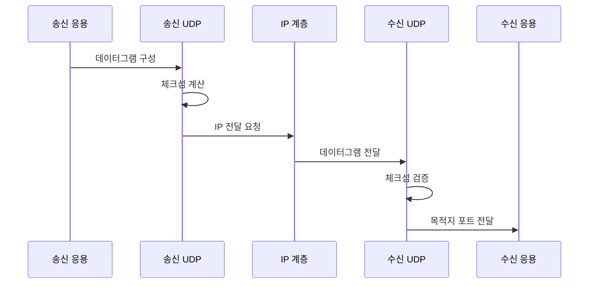

---
sidebar:
  order: 26
  label: "026. UDP 특성·활용 사례 (UDP Characteristics)"
  badge:
    text: "기출 · 30%"
    variant: note
title: "UDP 특성·활용 사례 (UDP Characteristics)"
date: "2026-07-27T23:59:59+09:00"
tags:
  - "notes-network"
weight: 26
extra:
  question_no: "026"
  source_status: "기출"
  source_history: "122회, 129회"
  priority: 30
  priority_note: "설명형: 전송계층 비교의 비연결 전송 기준"
---

## 미리 알고가기

- **사용자 데이터그램 프로토콜(User Datagram Protocol, UDP)**: ‘유디피’로 읽고 영문 머리글자를 딴 약어이며, 연결 설정 없이 메시지 경계를 보존한 데이터그램을 전달함
- **전송 제어 프로토콜(Transmission Control Protocol, TCP)**: ‘티시피’로 읽고 영문 머리글자를 딴 약어이며, 연결 설정 후 순서·확인·재전송을 제공함
- **인터넷 프로토콜(Internet Protocol, IP)**: ‘아이피’로 읽고 영문 머리글자를 딴 약어이며, 목적지 주소로 패킷을 네트워크 사이에 전달함
- **데이터그램(Datagram)**: 각 전송 단위가 독립된 메시지 경계와 목적지 정보를 갖는 모델
- **체크섬(Checksum)**: 헤더·데이터 비트 오류를 검출하도록 송수신 측이 계산·비교하는 값
- **비연결형(Connectionless)**: 상대와 전송 상태를 미리 만들지 않고 각 데이터그램을 독립적으로 보내는 성질
- **최대 전송 단위(Maximum Transmission Unit, MTU)**: 링크가 분할 없이 전달할 수 있는 최대 패킷 크기
- **인터넷 프로토콜 단편화(IP Fragmentation)**: MTU보다 큰 패킷을 여러 조각으로 나눠 전달하고 목적지에서 다시 조립하는 기능
- **반사·증폭 공격(Reflection·Amplification Attack)**: 출발지 주소를 피해자로 위조한 작은 요청으로 큰 UDP 응답을 피해자에게 보내는 공격
- **응용 타임아웃·중복 제거·재시도**: UDP 응답 대기 종료, 같은 메시지 식별, 손실 메시지 재전송을 응용이 구현하는 기능
- **전송률 제한(Rate Limiting)**: 일정 시간에 처리할 요청·응답 수나 크기를 제한하는 기능

## Ⅰ. 개요

- 정의/개념: 최소 헤더로 **메시지 경계의 데이터그램 전달**
- 기존 한계: 연결·재전송 제어의 **설정 지연·상태 비용**

### 쉽게 이해하기 (학습용)
- UDP는 답을 기다리지 않고 쪽지를 보내며 분실·중복·순서 문제가 중요한 서비스만 응용이 따로 처리한다

## Ⅱ. 특징

- 8바이트 헤더의 **무연결·저상태 전송**
- 데이터그램의 **응용 메시지 경계 보존**
- 신뢰·흐름·혼잡 제어의 **응용 위임**

### 쉽게 이해하기 (학습용)

- 기능이 적어 무조건 쉬운 것이 아니라 서비스에 필요한 손실·중복·속도 제어를 응용이 직접 정해야 한다

## Ⅲ. 아키텍처 및 구성요소

| 설계 요소 | 설명 |
|:---|:---|
| 출발지 포트 | 응답을 받을 송신 응용을 식별 |
| 목적지 포트 | 데이터그램을 받을 응용을 식별 |
| 길이 | UDP 헤더와 페이로드의 전체 바이트 수 |
| 체크섬 | 주소·헤더·데이터의 비트 오류를 검출 |
| 페이로드 | 메시지 경계를 유지할 응용 데이터 |

> 요약: 포트·길이·체크섬 뒤에 메시지를 보존

### 쉽게 이해하기 (학습용)
- UDP 봉투에는 보내고 받을 응용 번호, 전체 길이, 오류 검사값과 하나의 메시지가 들어간다

## Ⅳ. 원리 및 절차 흐름도

| 절차 | 설명 |
|:---|:---|
| 데이터그램 구성 | 메시지에 포트·길이 헤더를 결합 |
| 체크섬 계산 | 주소·헤더·데이터 검사값을 생성 |
| IP 전달 요청 | 연결 상태 없이 패킷 전달을 요청 |
| 데이터그램 전달 | IP가 목적지 호스트까지 전달 |
| 체크섬 검증 | 오류 검출 시 데이터그램을 폐기 |
| 목적지 포트 전달 | 포트에 해당하는 응용에 메시지 제공 |

> 요약: 포트·길이·체크섬 구성 후 IP로 전달

### 쉽게 이해하기 (학습용)

- 송신 UDP가 포트·길이·검사값을 붙이면 IP가 전달하고 수신 UDP가 검사 후 한 메시지로 넘긴다

## Ⅴ. 종류 및 비교

| 전송 방식 | UDP | TCP |
|:---|:---|:---|
| 적용 기준 | 일부 손실보다 **지연·메시지 경계 우선** | 순서·손실 없는 **연속 데이터 우선** |
| 핵심 특징 | 비연결 데이터그램·**응용 신뢰 제어** | 연결형 바이트 스트림·**전송 신뢰 제어** |
| 한계 | 손실·중복·**증폭 공격** | 연결 지연·**선두 차단** |

> 요약: 응용이 신뢰 제어하는 무연결 전송

### 쉽게 이해하기 (학습용)

- 손실·순서 복구가 필요 없으면 UDP, 전송 계층이 맡아야 하면 TCP를 선택한다

## Ⅵ. 실무 사례

1. 실시간 음성은 늦은 데이터 재전송을 생략

### 쉽게 이해하기 (학습용)

- 늦게 도착한 음성은 재생할 수 없으므로 잃은 조각을 기다리지 않고 다음 조각을 재생한다

## Ⅶ. 결론

- 손실 허용·지연·응답 크기로 UDP 적용 결정

### 쉽게 이해하기 (학습용)

- 일부 메시지를 잃어도 늦지 않는 편이 중요한지와 공개 응답이 공격에 악용될 크기인지 함께 본다
