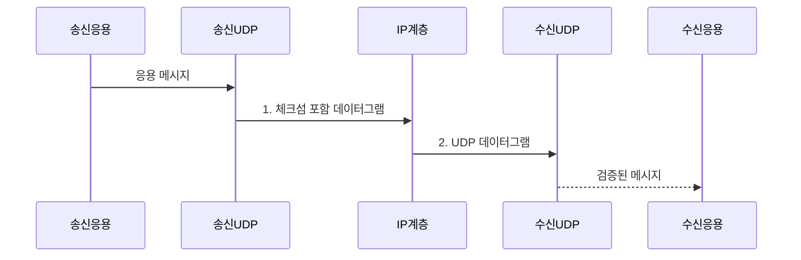

---
sidebar:
  order: 26
  label: "026. UDP 특성•활용 사례 (UDP Characteristics)"
  badge:
    text: "기출 • 30%"
    variant: note
title: "UDP 특성•활용 사례 (UDP Characteristics)"
date: "2026-08-05T01:25:48+09:00"
tags:
  - "notes-network"
weight: 26
extra:
  question_no: "026"
  source_status: "기출"
  source_history: "122회, 129회"
  priority: 30
  priority_note: "설명형: 전송계층 비교의 비연결 전송 기준"
---

## Ⅰ. 개요

<details>
<summary>핵심 용어</summary>

- **사용자 데이터그램 프로토콜(User Datagram Protocol, UDP)**: 연결 설정 없이 메시지 경계를 보존한 데이터그램을 전달하는 프로토콜이다.
</details>

- 정의/개념: **UDP** — 연결 설정과 전송 보장 없이 애플리케이션 메시지 경계를 보존하여 데이터그램을 전달하는 **비연결형 전송계층 프로토콜**
- 배경/필요성: 연결 설정•재전송 제어로 **전송 지연•종단 상태 비용** 증가

#### 한줄 요약

- 답장을 기다리지 않고 쪽지를 보내듯 UDP는 데이터그램을 즉시 보내며 분실•중복 처리가 필요한 응용만 복구 규칙을 둔다

## Ⅱ. 특징

<details>
<summary>핵심 용어</summary>

- **비연결형(Connectionless)**: 연결 상태를 만들지 않고 데이터그램을 독립적으로 전달하는 성질이다.
- **체크섬(Checksum)**: 헤더와 데이터의 비트 오류를 검출하는 값이다.
</details>

- 8바이트 헤더와 **연결 상태 없는 전송**
- 데이터그램의 **응용 메시지 경계 보존**
- 신뢰•흐름•혼잡 제어의 **응용 위임**

#### 한줄 요약

- 배달원이 재배송•순서 정리를 하지 않는 대신 봉투 경계를 지키듯 UDP는 메시지를 보존하고 응용이 필요한 신뢰 제어를 맡는다

## Ⅲ. 구조 및 구성요소

<details>
<summary>핵심 용어</summary>

- **데이터그램(Datagram)**: 독립된 메시지 경계를 갖는 전송 단위이다.
- **페이로드(Payload)**: UDP 헤더 뒤에 담기는 응용 데이터이다.
</details>

```text
UDP 데이터그램
+---[출발지 포트]---+---[목적지 포트]---+
+------[길이]-------+------[체크섬]------+
+----------------[페이로드]-------------+
```

선의 의미: 바깥선은 하나의 UDP 데이터그램 경계이고, 내부선은 응용 식별•전체 바이트 수•오류 검출을 담당하는 헤더 필드와 메시지 경계를 보존하는 페이로드 영역을 구분한다.

| 구성요소 | 책임 |
|:---|:---|
| 출발지 포트 | 응답을 받을 **송신 응용** 식별 |
| 목적지 포트 | 데이터그램을 받을 **수신 응용** 식별 |
| 길이 | UDP 헤더와 **페이로드 전체 바이트 수** |
| 체크섬 | 주소•헤더•데이터의 **비트 오류** 검출 |
| 페이로드 | 메시지 경계를 유지하는 **응용 데이터** |

#### 한줄 요약

- 한 봉투 안의 발신•수신 창구 번호, 전체 길이, 검사 도장과 편지처럼 UDP 데이터그램의 네 헤더 필드가 한 페이로드를 감싼다

## Ⅳ. 흐름도

<details>
<summary>핵심 용어</summary>

- **응용 재시도(Application Retry)**: UDP 손실 시 응용이 메시지를 다시 전송하는 기능이다.
- **중복 제거(Deduplication)**: 같은 메시지를 여러 번 수신해도 한 번만 처리하는 기능이다.
- **IP(Internet Protocol)**: UDP 데이터그램을 네트워크 패킷으로 전달하는 프로토콜이다.
</details>



**동작 원리**

1. **체크섬 포함 데이터그램**: 포트•길이와 주소 기반 **체크섬** 을 메시지에 결합
2. **UDP 데이터그램**: 수신 UDP가 **체크섬 검증** 후 목적지 포트로 전달

#### 한줄 요약

- 우체국이 봉투에 창구 번호와 검사 도장을 붙여 운송하고 도착 우체국이 도장을 확인한 뒤 편지 한 장으로 넘긴다

## Ⅴ. 종류 및 비교

<details>
<summary>핵심 용어</summary>

- **TCP(Transmission Control Protocol)**: 순서와 재전송을 보장하는 연결형 바이트 스트림 프로토콜이다.
</details>

| 전송 방식 | UDP | TCP |
|:---|:---|:---|
| 적용 기준 | 일부 손실보다 **지연•메시지 경계 우선** | 순서•손실 없는 **연속 데이터 우선** |
| 핵심 특징 | 비연결 데이터그램•**응용 신뢰 제어** | 연결형 바이트 스트림•**전송 신뢰 제어** |
| 한계 | 손실•중복•**증폭 공격** | 연결 지연•**선두 차단** |

> 요약: 응용이 신뢰 제어하는 무연결 전송

#### 한줄 요약

- 손실•순서 복구가 필요 없으면 UDP, 전송 계층이 맡아야 하면 TCP를 선택한다

## Ⅵ. 실무 고려사항 및 대책

<details>
<summary>핵심 용어</summary>

- **반사 공격(Reflection Attack)**: 위조한 출발지 주소로 응답을 피해자에게 보내는 공격이다.
- **증폭 공격(Amplification Attack)**: 작은 요청보다 큰 응답을 생성해 공격 트래픽을 키우는 공격이다.
- **MTU(Maximum Transmission Unit)**: 링크가 전달할 수 있는 최대 패킷 크기이다.
</details>

| 문제 | 대책 | 효과 |
|:---|:---|:---|
| 손실•중복이 허용되지 않는 **UDP 메시지** | 응용 **순서 번호•만료•재시도** 설계 | 메시지 **중복•누락** 통제 |
| 무제한 송신률로 **경로 혼잡** 가중 | 응용 혼잡 제어•**전송률 제한** | 네트워크 **패킷 손실** 완화 |
| 데이터그램이 경로 **MTU** 를 초과 | 경로 MTU 이하로 **메시지 분할** | IP 단편 손실의 **전체 메시지 폐기** 감소 |
| 출발지 위조 요청으로 **반사•증폭 공격** | 응답 크기 제한•**쿠키 검증** | 피해자 대상 **증폭 트래픽** 완화 |

#### 한줄 요약

- 생방송 음성은 늦은 조각을 기다리지 않고 넘기되 장부 메시지는 번호와 만료 시간을 붙여 누락•중복을 응용에서 처리한다

## Ⅶ. 결론

<details>
<summary>핵심 용어</summary>

- **IP 단편화(IP Fragmentation)**: MTU를 넘는 IP 패킷을 여러 조각으로 나누는 기능이다.
</details>

- 손실 허용•낮은 지연이면 **UDP**, 신뢰가 필요하면 **응용 복구** 구현

#### 한줄 요약

- 늦으면 쓸모없는 음성은 UDP로 바로 보내고, 빠짐없는 장부는 응용이 번호표와 재배송 규칙을 추가한다
