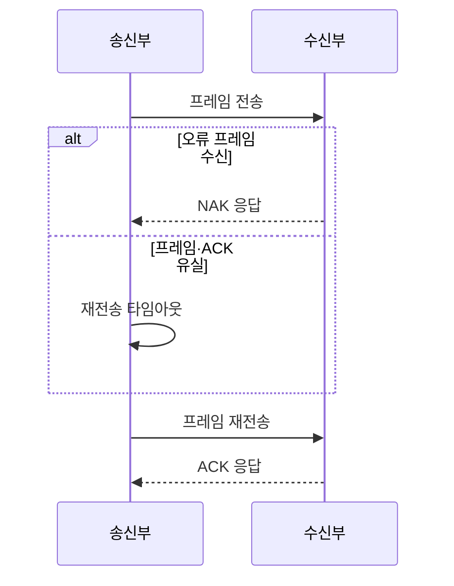

---
sidebar:
  order: 27
  label: "027. 오류 제어 — ARQ·Go-Back-N·SR (ARQ Error Control)"
  badge:
    text: "기출 · 30%"
    variant: note
title: "오류 제어 — ARQ·Go-Back-N·SR (ARQ Error Control)"
date: "2026-07-25T00:50:00+09:00"
tags:
  - "notes-network"
weight: 27
extra:
  question_no: "027"
  source_status: "기출"
  source_history: "128회"
  priority: 30
  priority_note: "비교형: 125·128회 ARQ 오류 제어 반복"
---

## 미리 알고가기

- **프레임**: 데이터 링크 계층에서 헤더와 오류 검사용 값을 붙여 전송하는 데이터 단위
- **자동 재전송 요구(Automatic Repeat reQuest, ARQ)**: 확인 응답과 시간 제한으로 유실되거나 오류가 난 프레임을 다시 보내는 오류 제어 방식
- **긍정 확인 응답(Acknowledgment, ACK)**: 프레임이 정상적으로 도착했음을 송신 측에 알리는 응답
- **부정 확인 응답(Negative Acknowledgment, NAK)**: 프레임이 손상됐음을 송신 측에 알리는 응답
- **순서 번호**: 새 프레임과 재전송 프레임의 순서·중복을 구별하기 위해 붙이는 번호
- **송신 윈도우**: ACK를 기다리지 않고 연속해서 보낼 수 있는 순서 번호의 범위
- **왕복 시간(Round-Trip Time, RTT)**: 프레임을 보낸 뒤 응답을 받을 때까지 걸리는 왕복 시간
- **순방향 오류 정정(Forward Error Correction, FEC)**: 추가 오류 정정 정보를 보내 수신 측이 일부 오류를 직접 복구하는 방식
- **혼합 자동 재전송 요구(Hybrid Automatic Repeat reQuest, HARQ)**: FEC로 먼저 복구하고 부족할 때 재전송하는 방식
- **Go-Back-N 자동 재전송 요구(Go-Back-N ARQ)**: 누락된 프레임부터 뒤의 미확인 프레임을 모두 다시 보내는 방식
- **선택 재전송 자동 재전송 요구(Selective Repeat ARQ, SR ARQ)**: 수신 버퍼에 정상 프레임을 보관하고 누락 프레임만 다시 보내는 방식
- **정지-대기 자동 재전송 요구(Stop-and-Wait ARQ)**: 프레임 하나의 ACK를 받은 뒤 다음 프레임을 보내는 방식

## Ⅰ. 개요

- **정의/개념**: ACK·NAK·타임아웃으로 오류 프레임을 재전송
- **배경/필요성**: 오류 링크에서 프레임 신뢰성을 복구

### 쉽게 이해하기 (학습용)
- 택배 상자가 빠지거나 훼손되면 수령 확인과 대기 시간을 보고 필요한 상자를 다시 보낸다

## Ⅱ. 특징

- 순서 번호로 새 프레임과 재전송 프레임을 구분한다.
- ACK·NAK·타임아웃이 재전송 시점을 결정한다.
- 송수신 윈도는 처리량·버퍼·번호 범위를 절충한다.
- HARQ는 FEC 복구 실패분만 재전송한다.

### 쉽게 이해하기 (학습용)

- 필요한 프레임만 다시 보내면 통신량은 줄지만 양쪽이 프레임별 도착 상태를 더 세밀하게 기억해야 한다

## Ⅲ. 아키텍처 및 구성요소

| 설계 요소 | 설명 |
|:---|:---|
| 송신부 | 번호·ACK·타이머로 재전송 결정 |
| 송신 윈도우 | ACK 없는 연속 전송 번호 범위 |
| 수신부 | 오류·번호 공백 검사 후 응답 |
| 수신 버퍼 | 순서가 다른 후속 프레임 보관 |
| 재전송 타이머 | ACK 지연 시 재전송 시작 |

> 요약: 번호·윈도우·응답으로 재전송 결정

### 쉽게 이해하기 (학습용)

- 순서 번호가 너무 빨리 반복되면 오래된 프레임과 새 프레임이 섞이므로 윈도보다 충분한 번호 범위가 필요하다

## Ⅳ. 원리 및 절차 흐름도

| 절차 | 설명 |
|:---|:---|
| 프레임 전송 | 순서 번호를 붙여 윈도 범위 전송 |
| NAK 응답 | 오류 프레임의 재전송을 요청 |
| 재전송 타임아웃 | ACK가 없으면 유실로 판정 |
| 프레임 재전송 | ARQ 방식에 따른 범위를 다시 전송 |
| ACK 응답 | 정상 수신 범위를 알려 윈도 이동 |

> 요약: 응답·타이머로 재전송 범위 결정

### 쉽게 이해하기 (학습용)

- ACK가 확인한 범위와 타임아웃을 함께 보고 언제 무엇을 다시 보낼지 정한다

## Ⅴ. 종류 및 비교

| 판단 기준 | Go-Back-N ARQ | 선택 재전송 ARQ | 정지-대기 ARQ |
|:---|:---|:---|:---|
| 핵심 특징 | 누락 뒤 미확인 프레임 일괄 재전송 | 누락 프레임만 개별 재전송 | 프레임마다 ACK 후 다음 전송 |
| 적용 기준 | 오류율이 낮고 수신 버퍼가 작을 때 | 오류율·RTT가 높고 버퍼가 충분할 때 | 전송량이 적고 단순성이 우선일 때 |
| 주요 위험 | 후속 프레임 중복 전송 | ACK·수신 버퍼 관리 복잡 | RTT 동안 링크 유휴 |

> 요약: 오류율·RTT·버퍼로 ARQ 선택

### 쉽게 이해하기 (학습용)

- 오류가 드물면 뒤 프레임을 함께 다시 보내고 오류·RTT가 크면 누락 프레임만 골라 보낸다

## Ⅵ. 실무 사례

1. 장거리 링크는 선택 재전송으로 중복 전송 축소
2. 실시간 무선은 HARQ 재전송 횟수 제한

### 쉽게 이해하기 (학습용)

- RTT가 길면 누락 프레임만 다시 보내 대기와 전송량을 함께 줄인다
- 늦은 데이터가 무의미하면 재전송 횟수를 제한해 다음 데이터를 우선한다

## Ⅶ. 결론

- 오류율·RTT·지연으로 ARQ 방식 선택

### 쉽게 이해하기 (학습용)

- 서비스가 허용하는 시간 안에 필요한 프레임만 복구하도록 재전송 범위와 횟수를 정한다
