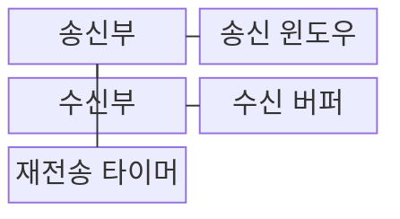
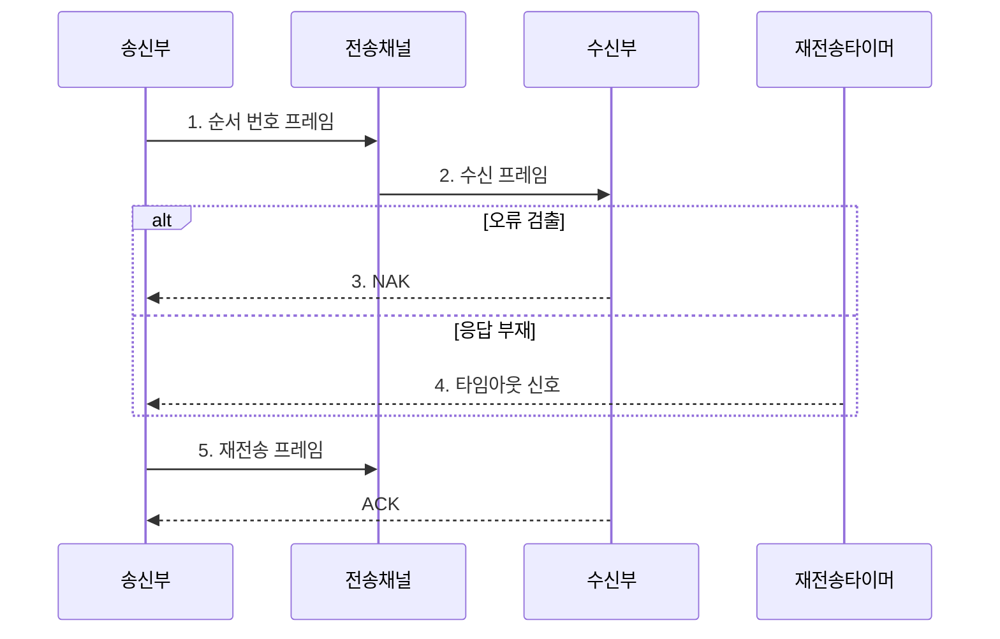

---
sidebar:
  order: 27
  label: "027. 오류 제어 : ARQ·Go-Back-N·SR (ARQ Error Control)"
  badge:
    text: "기출 · 30%"
    variant: note
title: "오류 제어 : ARQ·Go-Back-N·SR (ARQ Error Control)"
date: "2026-07-31T10:59:57+09:00"
tags:
  - "notes-network"
weight: 27
extra:
  question_no: "027"
  source_status: "기출"
  source_history: "128회"
  priority: 30
  priority_note: "비교형: 125·128회 ARQ 오류 제어 반복"
---

## Ⅰ. 개요

핵심 용어

- **ARQ**: ACK·NAK와 타임아웃으로 유실·오류 프레임을 재전송하는 오류 제어 방식이다.

- 정의/개념: **ACK·NAK·타임아웃**으로 유실·오류 프레임을 재전송하는 **오류 제어 방식**
- 배경/필요성: 오류 검출만으로는 **유실·손상 데이터 복구 불가**

### 쉽게 이해하기 (학습용)

- 택배 상자가 빠지거나 훼손되면 수령 확인표나 약속 시간 초과를 보고 필요한 상자를 다시 보내듯 ARQ가 프레임을 복구한다

## Ⅱ. 특징

핵심 용어

- **ACK·NAK·순서 번호**: 정상·손상 수신을 알리고 새 프레임과 재전송을 구별하는 정보이다.

- 순서 번호의 **신규·재전송 프레임 구분**
- ACK·NAK·타임아웃의 **재전송 시점 결정**
- 큰 송수신 윈도의 **처리량 향상·버퍼 증가**

### 쉽게 이해하기 (학습용)

- 분실 상자만 다시 보내면 운송량은 줄지만 창고가 상자별 도착표와 보관 공간을 더 세밀하게 관리해야 한다

## Ⅲ. 구조 및 구성요소

핵심 용어

- **송신 윈도·RTT**: ACK 전 연속 전송 범위와 전송 후 응답까지의 왕복 시간이다.

| 구성요소 | 책임 |
|:---|:---|
| 송신부 | 순서 번호·ACK·타이머로 **재전송 범위** 결정 |
| 송신 윈도우 | ACK 없이 전송 가능한 **순서 번호 범위** 관리 |
| 수신부 | **오류·번호 공백** 검사 후 ACK·NAK 생성 |
| 수신 버퍼 | 순서가 다른 **후속 프레임** 보관 |
| 재전송 타이머 | ACK 지연 시 **타임아웃 신호** 생성 |

### 쉽게 이해하기 (학습용)

- 발송 창구의 번호표와 시간계, 수령 창구의 보관함이 함께 움직이듯 송신 윈도·타이머와 수신 버퍼가 재전송 범위를 맞춘다

## Ⅳ. 흐름도

핵심 용어

- **타임아웃 재전송**: 정한 시간 안에 확인 응답이 없으면 프레임을 다시 보내는 동작이다.

**동작 원리**

1. **순서 번호 프레임**: **송신 윈도우** 범위의 새 프레임 식별
2. **수신 프레임**: 체크 결과와 **순서 번호 공백**으로 오류·유실 판정
3. **NAK**: 오류가 검출된 프레임의 **재전송** 요구
4. **타임아웃 신호**: ACK 부재를 **프레임 유실**로 판정
5. **재전송 프레임**: ARQ 방식에 따라 누락 하나 또는 이후 범위 재전송

### 쉽게 이해하기 (학습용)

- 수령표가 훼손 상자를 표시하거나 시간계가 응답 지연을 알리면 발송 창구가 선택한 ARQ 범위만큼 상자를 다시 보낸다

## Ⅴ. 종류 및 비교

핵심 용어

- **Stop-and-Wait·Go-Back-N·SR**: 한 프레임, 누락 이후 전체, 누락 프레임만 재전송하는 방식이다.

| ARQ 방식 | Go-Back-N ARQ | 선택 재전송 ARQ | 정지-대기 ARQ |
|:---|:---|:---|:---|
| 적용 기준 | 낮은 오류율·**작은 수신 버퍼** | 높은 오류율·RTT·**충분한 버퍼** | 적은 전송량·**단순성 우선** |
| 핵심 특징 | 누락 이후 **미확인 프레임 일괄 재전송** | 누락 프레임만 **선택 재전송** | 프레임별 **ACK 후 다음 전송** |
| 한계 | 후속 프레임 **중복 재전송** | ACK·수신 버퍼 **관리 복잡** | RTT 동안 **링크 유휴** |

> 요약: 오류율·RTT·버퍼로 ARQ 선택

### 쉽게 이해하기 (학습용)

- 오류가 드물면 뒤 프레임을 함께 다시 보내고 오류·RTT가 크면 누락 프레임만 골라 보낸다

## Ⅵ. 실무 고려사항 및 대책

핵심 용어

- **FEC**: 추가 정정 정보를 보내 수신 측이 일부 오류를 직접 복구하는 방식이다.

| 문제 | 대책 | 효과 |
|:---|:---|:---|
| 타임아웃이 RTT보다 짧아 **조기 재전송** | **RTT 분포**에 따라 타임아웃 동적 조정 | 불필요한 **중복 재전송** 감소 |
| 순서 번호가 윈도보다 빨리 순환 | 윈도 크기에 맞는 **번호 공간** 설계 | 신·구 프레임 **오인** 방지 |
| 선택 재전송의 **수신 버퍼** 부족 | 오류율·RTT에 맞춰 **ARQ·윈도** 선택 | 정상 후속 프레임 **재수신 비용** 감소 |
| 높은 오류율로 **ARQ 재전송** 반복 | **FEC** 병행·물리 링크 품질 개선 | 재전송 **대역폭 비용** 절감 |

### 쉽게 이해하기 (학습용)

- 먼 창고처럼 왕복 시간이 길고 분실이 잦으면 누락 상자만 골라 보내고 보관함이 작으면 뒤 상자를 함께 다시 보낸다

## Ⅶ. 결론

핵심 용어

- **재전송 효율**: 오류율·왕복 시간·수신 버퍼를 기준으로 ARQ 방식을 선택하는 기준이다.

- 오류율이 낮고 버퍼가 작으면 **Go-Back-N**, 오류율·RTT가 크면 **SR ARQ**

### 쉽게 이해하기 (학습용)

- 분실이 드물고 보관함이 작으면 뒤 상자를 함께 보내고, 분실이 잦고 왕복이 길면 빠진 상자만 골라 다시 보낸다
