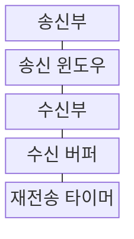
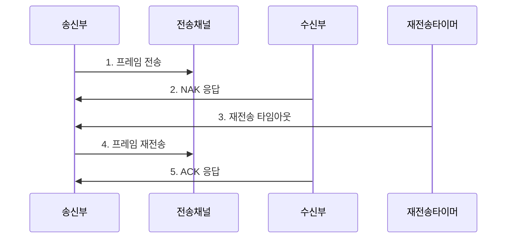

---
sidebar:
  order: 27
  label: "027. 오류 제어 : ARQ·Go-Back-N·SR (ARQ Error Control)"
  badge:
    text: "기출 · 30%"
    variant: note
title: "오류 제어 : ARQ·Go-Back-N·SR (ARQ Error Control)"
date: "2026-07-30T18:00:00+09:00"
tags:
  - "notes-network"
weight: 27
extra:
  question_no: "027"
  source_status: "기출"
  source_history: "128회"
  priority: 30
  priority_note: "비교형: 125·128회 ARQ 오류 제어 반복"
---

## 미리 알고가기

- **프레임**: 데이터 링크 계층에서 헤더와 오류 검사용 값을 붙여 전송하는 데이터 단위
- **자동 재전송 요구(Automatic Repeat reQuest, ARQ)**: ‘에이알큐’로 읽고 영문 핵심 글자를 딴 약어이며, 확인 응답과 타임아웃으로 유실·오류 프레임을 재전송함
- **긍정 확인 응답(Acknowledgment, ACK)**: ‘액’으로 읽고 영문 핵심 글자를 딴 표기이며, 프레임의 정상 도착을 송신 측에 알림
- **부정 확인 응답(Negative Acknowledgment, NAK)**: ‘낵’으로 읽고 영문 핵심 글자를 딴 표기이며, 프레임 손상을 송신 측에 알림
- **순서 번호**: 새 프레임과 재전송 프레임의 순서·중복을 구별하기 위해 붙이는 번호
- **송신 윈도우**: ACK를 기다리지 않고 연속해서 보낼 수 있는 순서 번호의 범위
- **왕복 시간(Round-Trip Time, RTT)**: 프레임을 보낸 뒤 응답을 받을 때까지 소요되는 시간
- **순방향 오류 정정(Forward Error Correction, FEC)**: 추가 오류 정정 정보를 보내 수신 측이 일부 오류를 직접 복구하는 방식
- **혼합 자동 재전송 요구(Hybrid Automatic Repeat reQuest, HARQ)**: FEC로 먼저 복구하고 부족할 때 재전송하는 방식
- **Go-Back-N 자동 재전송 요구(Go-Back-N ARQ)**: 누락된 프레임부터 뒤의 미확인 프레임을 모두 다시 보내는 방식
- **선택 재전송 자동 재전송 요구(Selective Repeat ARQ, SR ARQ)**: 수신 버퍼에 정상 프레임을 보관하고 누락 프레임만 다시 보내는 방식
- **정지-대기 자동 재전송 요구(Stop-and-Wait ARQ)**: 프레임 하나의 ACK를 받은 뒤 다음 프레임을 보내는 방식

## Ⅰ. 개요

- 정의/개념: ACK·NAK·타임아웃으로 **유실·오류 프레임 재전송**
- 배경/필요성: 오류 검출만으로는 **유실·손상 데이터 복구 불가**

### 쉽게 이해하기 (학습용)

- 택배 상자가 빠지거나 훼손되면 수령 확인과 대기 시간을 보고 필요한 상자를 다시 보낸다

## Ⅱ. 특징

- 순서 번호의 **신규·재전송 프레임 구분**
- ACK·NAK·타임아웃의 **재전송 시점 결정**
- 송수신 윈도의 **처리량·버퍼 절충**

### 쉽게 이해하기 (학습용)

- 필요한 프레임만 다시 보내면 통신량은 줄지만 양쪽이 프레임별 도착 상태를 더 세밀하게 기억해야 한다

## Ⅲ. 구조 및 구성요소

| 구성요소 | 책임 |
|:---|:---|
| 송신부 | 번호·ACK·타이머로 재전송 결정 |
| 송신 윈도우 | ACK 없는 연속 전송 번호 범위 |
| 수신부 | 오류·번호 공백 검사 후 응답 |
| 수신 버퍼 | 순서가 다른 후속 프레임 보관 |
| 재전송 타이머 | ACK 지연 시 재전송 시작 |

### 쉽게 이해하기 (학습용)

- 순서 번호가 너무 빨리 반복되면 오래된 프레임과 새 프레임이 섞이므로 윈도보다 충분한 번호 범위가 필요하다

## Ⅳ. 흐름도

**동작 원리**

1. **프레임 전송**: 순서 번호를 붙여 윈도 범위 전송
2. **NAK 응답**: 오류 프레임의 재전송을 요청
3. **재전송 타임아웃**: ACK가 없으면 유실로 판정
4. **프레임 재전송**: ARQ 방식에 따른 범위를 다시 전송
5. **ACK 응답**: 정상 수신 범위를 알려 윈도 이동

### 쉽게 이해하기 (학습용)

- ACK가 확인한 범위와 타임아웃을 함께 보고 언제 무엇을 다시 보낼지 정한다

## Ⅴ. 종류 및 비교

| ARQ 방식 | Go-Back-N ARQ | 선택 재전송 ARQ | 정지-대기 ARQ |
|:---|:---|:---|:---|
| 적용 기준 | 낮은 오류율·**작은 수신 버퍼** | 높은 오류율·RTT·**충분한 버퍼** | 적은 전송량·**단순성 우선** |
| 핵심 특징 | 누락 이후 **미확인 프레임 일괄 재전송** | 누락 프레임만 **선택 재전송** | 프레임별 **ACK 후 다음 전송** |
| 한계 | 후속 프레임 **중복 재전송** | ACK·수신 버퍼 **관리 복잡** | RTT 동안 **링크 유휴** |

> 요약: 오류율·RTT·버퍼로 ARQ 선택

### 쉽게 이해하기 (학습용)

- 오류가 드물면 뒤 프레임을 함께 다시 보내고 오류·RTT가 크면 누락 프레임만 골라 보낸다

## Ⅵ. 실무 고려사항 및 대책

| 고려사항 | 대책 | 효과 |
|:---|:---|:---|
| 타임아웃 과소 설정 | 왕복시간 분포 기반 동적 조정 | 불필요 재전송 감소 |
| 순서번호 공간 부족 | 윈도 크기와 번호 범위 함께 설계 | 프레임 혼동 방지 |
| 수신 버퍼 부족 | ARQ 방식별 윈도·버퍼 산정 | 후속 프레임 손실 예방 |
| 높은 오류율 반복 전송 | FEC·변조·링크 품질 개선 | 재전송 비용 절감 |

### 쉽게 이해하기 (학습용)

- RTT가 길면 누락 프레임만 다시 보내 대기와 전송량을 함께 줄인다

## Ⅶ. 결론

- **오류율·왕복시간·버퍼에 따른 ARQ 재전송 범위 선택**

### 쉽게 이해하기 (학습용)

- 필요한 프레임만 다시 보내면 통신량은 줄지만 도착 상태를 더 세밀하게 기억해야 한다.
