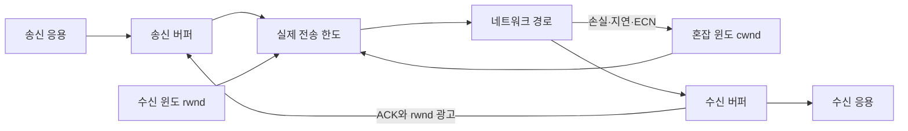
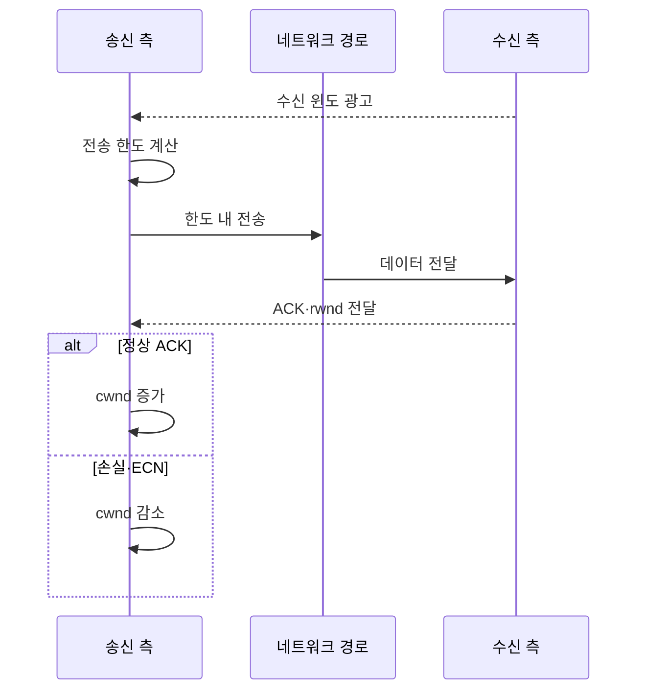

---
sidebar:
  order: 28
  label: "028. 흐름 제어 — Slow Start·슬라이딩 윈도우 (Flow Control)"
  badge:
    text: "기출 · 50%"
    variant: note
title: "흐름 제어 — Slow Start·슬라이딩 윈도우 (Flow Control)"
date: "2026-07-27T23:59:59+09:00"
tags:
  - "notes-network"
weight: 28
extra:
  question_no: "028"
  source_status: "기출"
  source_history: "125회"
  priority: 50
  priority_note: "비교·설명형: 흐름·혼잡 제어 통합 판단축"
---

## 미리 알고가기

- **전송 제어 프로토콜(Transmission Control Protocol, TCP)**: ‘티시피’로 읽고 영문 머리글자를 딴 약어이며, 순서·재전송·흐름·혼잡 제어를 제공함
- **흐름 제어**: 송신 속도가 수신 측의 처리 능력을 넘지 않도록 전송량을 제한하는 기능
- **혼잡 제어**: 송신 데이터가 네트워크 경로의 처리 능력을 넘지 않도록 전송량을 조절하는 기능
- **슬라이딩 윈도(Sliding Window)**: ACK를 기다리지 않고 정해진 범위의 데이터를 연속 전송하고 ACK를 받으면 범위를 앞으로 이동하는 방식
- **느린 시작(Slow Start)**: 연결 초기나 혼잡 복구 후 혼잡 윈도를 ACK 수에 따라 빠르게 키워 경로 수용량을 탐색하는 방식
- **수신 윈도 rwnd(알윈도, Receive Window)**: receive와 window의 약식 표기로 수신 측이 현재 추가로 받을 수 있다고 광고하는 데이터 양임
- **혼잡 윈도 cwnd(씨윈도, Congestion Window)**: congestion과 window의 약식 표기로 송신 측이 네트워크 혼잡을 일으키지 않고 보낼 수 있다고 추정한 데이터 양임
- **느린 시작 임계값 ssthresh(에스에스스레시, Slow Start Threshold)**: slow start와 threshold를 줄인 표기로 cwnd 증가 방식을 느린 시작에서 완만한 혼잡 회피로 바꾸는 기준값임
- **긍정 확인 응답(Acknowledgment, ACK)**: 데이터가 정상 도착한 범위를 송신 측에 알리는 응답
- **명시적 혼잡 알림(Explicit Congestion Notification, ECN)**: 패킷을 버리지 않고도 경로 혼잡을 송수신 측에 알리는 표시
- **왕복 시간(Round-Trip Time, RTT)**: 데이터를 보낸 뒤 ACK를 받을 때까지 걸리는 왕복 시간
- **제로 윈도(Zero Window)**: 수신 버퍼가 가득 차 rwnd를 0으로 광고한 상태

## Ⅰ. 개요

- 정의/개념: rwnd·cwnd 중 작은 값으로 **미확인 전송량 제한**
- 기존 한계: 과속 송신의 **수신 버퍼 초과·경로 혼잡**

### 쉽게 이해하기 (학습용)
- 물통과 통로 중 좁은 쪽에 맞추듯 TCP도 수신 버퍼와 네트워크 경로 중 작은 한도로 보낸다

## Ⅱ. 특징

- rwnd의 **수신 버퍼 여유 광고**
- cwnd의 **네트워크 혼잡 한도 추정**
- `min(rwnd,cwnd)`의 **실제 송신 한도 결정**

### 쉽게 이해하기 (학습용)

- 느린 시작은 이름과 달리 작은 cwnd를 ACK마다 빠르게 늘리다가 임계값 이후 완만하게 바꾸는 단계다

## Ⅲ. 아키텍처 및 구성요소

| 설계 요소 | 설명 |
|:---|:---|
| 송신 응용 | 전송 데이터를 송신 버퍼에 제공 |
| 송신 버퍼 | 미확인 데이터를 재전송까지 보관 |
| 실제 전송 한도 | rwnd·cwnd 중 작은 미확인량 제한 |
| 수신 윈도 rwnd | 수신 버퍼 여유로 흐름 제어 상한 결정 |
| 혼잡 윈도 cwnd | 경로 혼잡으로 혼잡 제어 상한 결정 |
| 네트워크 경로 | 손실·ECN으로 혼잡 신호 제공 |
| 수신 버퍼 | 데이터 보관 후 남은 rwnd 광고 |
| 수신 응용 | 데이터를 읽어 수신 버퍼 공간 확보 |

> 요약: 작은 rwnd·cwnd로 전송량 제한

### 쉽게 이해하기 (학습용)

- rwnd와 cwnd 중 하나라도 작으면 송신 한도가 줄어 수신 버퍼나 네트워크 경로 중 좁은 쪽만큼 보낸다

## Ⅳ. 원리 및 절차 흐름도

| 절차 | 설명 |
|:---|:---|
| 수신 윈도 광고 | 수신 범위·버퍼 여유를 알림 |
| 전송 한도 계산 | rwnd·cwnd 중 작은 값 선택 |
| 한도 내 전송 | 상한 안에서 여러 데이터 전송 |
| 데이터 전달 | 네트워크 경로가 수신 측에 전달 |
| ACK·rwnd 전달 | 수신 범위·새 버퍼 여유를 알림 |
| cwnd 증가 | 정상 ACK에 따라 전송 한도 확대 |
| cwnd 감소 | 손실·ECN에 따라 전송 한도 축소 |

> 요약: ACK·윈도로 전송 한도 갱신

### 쉽게 이해하기 (학습용)

- rwnd는 수신 측이 버퍼 여유를 알리고 cwnd는 송신 측이 ACK·혼잡 신호로 경로 여유를 추정한다

## Ⅴ. 종류 및 비교

| 전송량 제어 | 느린 시작 기반 혼잡 제어 | 슬라이딩 윈도 기반 흐름 제어 |
|:---|:---|:---|
| 적용 기준 | 경로 수용량 **탐색·혼잡 대응** | 수신 버퍼 **오버플로 방지** |
| 핵심 특징 | cwnd 증가 후 **혼잡 시 축소** | rwnd 안의 **연속 전송** |
| 한계 | 경로 큐·**손실 증가** | 응용 지연·**버퍼 부족** |

> 요약: rwnd는 수신, cwnd는 경로 보호

### 쉽게 이해하기 (학습용)

- rwnd가 작으면 수신 측을 보고 cwnd가 작으면 네트워크 경로의 손실·혼잡 신호를 본다

## Ⅵ. 실무 사례

1. 제로 윈도는 수신 버퍼·응용 읽기 지연 점검

### 쉽게 이해하기 (학습용)

- rwnd가 0이면 경로 증설보다 수신 응용과 버퍼를 먼저 점검한다

## Ⅶ. 결론

- rwnd·cwnd 중 작은 병목을 먼저 조정

### 쉽게 이해하기 (학습용)

- 수신 측이 더 받을 수 있는지와 경로가 더 전달할 수 있는지를 나눠 묻고 작은 한도부터 조정한다
