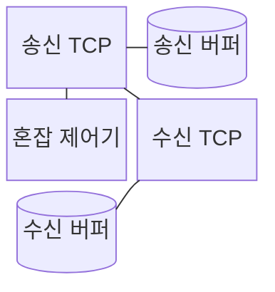
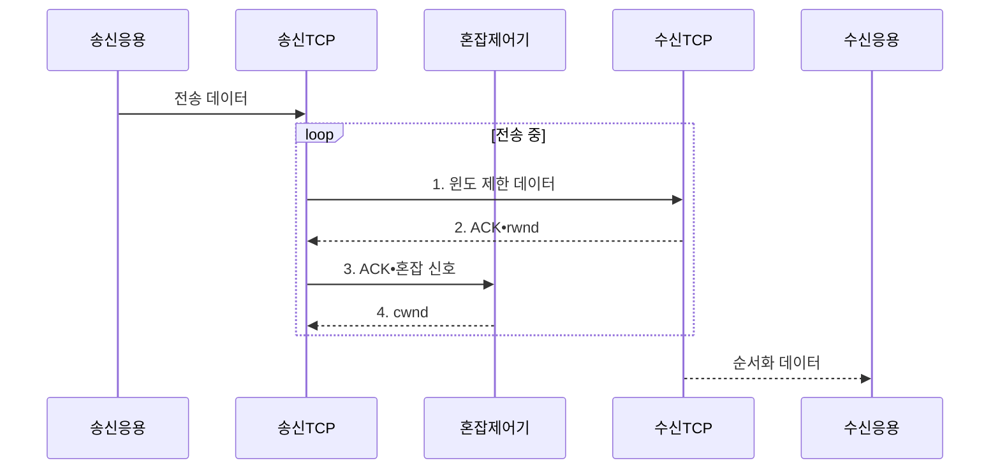

---
sidebar:
  order: 28
  label: "028. TCP 흐름•혼잡 제어 : 슬라이딩 윈도우•Slow Start"
  badge:
    text: "기출 • 50%"
    variant: note
title: "TCP 흐름•혼잡 제어 : 슬라이딩 윈도우•Slow Start"
date: "2026-08-03T15:05:00+09:00"
tags:
  - "notes-network"
weight: 28
extra:
  question_no: "028"
  source_status: "기출"
  source_history: "125회"
  priority: 50
  priority_note: "비교•설명형: 흐름•혼잡 제어 통합 판단축"
---

## Ⅰ. 개요

핵심 용어

- **흐름•혼잡 제어**: 수신 처리 능력과 네트워크 경로 능력을 각각 넘지 않게 송신량을 제한하는 기능이다.
- **전송 제어 프로토콜(Transmission Control Protocol, TCP)**: 수신 상태와 경로 혼잡을 함께 반영해 신뢰성 있는 바이트 스트림을 전달하는 프로토콜이다.

- 정의/개념: **TCP 전송량 제어** — 수신 흐름 제어의 `rwnd`와 네트워크 혼잡 제어의 `cwnd` 중 작은 값으로 미확인 전송량을 제한하는 **방식**
- 배경/필요성: 과도한 송신량으로 **수신 버퍼 초과•경로 혼잡** 발생

#### 한줄 요약

- 물통 입구와 통로 중 좁은 쪽에 맞춰 물을 흘리듯 TCP는 수신 버퍼와 네트워크 경로 중 작은 한도로 보낸다

## Ⅱ. 특징

핵심 용어

- **수신 윈도•혼잡 윈도•실제 윈도(Receive Window/Congestion Window/Effective Window, rwnd•cwnd•실제 윈도)**: 수신 여유, 경로 추정량, 둘 중 작은 전송 한도이다.
- **확인 응답•느린 시작 임계값(Acknowledgment/Slow Start Threshold, ACK•ssthresh)**: 수신 확인과 혼잡 윈도 증가 방식을 전환하는 기준값이다.

> 수신 윈도를 64KiB로 고정한 예시에서 초록 실제 송신 한도는 cwnd가 더 작을 때 함께 증가하지만 64KiB 이후에는 rwnd에 막히며, 실제 값은 연결의 ACK와 혼잡 신호에 따라 계속 변한다.

- rwnd의 **수신 버퍼 여유 광고**
- cwnd의 **네트워크 혼잡 한도 추정**
- `min(rwnd,cwnd)`의 **실제 송신 한도 결정**

#### 한줄 요약

- 좁은 길에서 차를 처음엔 빠르게 늘리다가 정체 징후 뒤 천천히 늘리듯 느린 시작은 cwnd를 ssthresh까지 키운 뒤 증가 폭을 줄인다

## Ⅲ. 구조 및 구성요소

핵심 용어

- **슬라이딩 윈도•확인 응답(Sliding Window/Acknowledgment, 슬라이딩 윈도•ACK)**: 여러 데이터를 연속 전송하고 확인에 따라 범위를 이동하는 방식과 응답이다.
- **전송 제어 프로토콜•명시적 혼잡 알림(Transmission Control Protocol/Explicit Congestion Notification, TCP•ECN)**: 신뢰성 있는 전송과 패킷 폐기 없이 혼잡을 알리는 기능이다.

| 구성요소 | 책임 |
|:---|:---|
| 송신 TCP | **rwnd•cwnd** 중 작은 값으로 전송 범위 제한 |
| 송신 버퍼 | 미확인 데이터를 **재전송**까지 보관 |
| 혼잡 제어기 | ACK•손실•ECN으로 **cwnd** 조정 |
| 수신 TCP | ACK에 현재 **rwnd** 광고 |
| 수신 버퍼 | 응용이 읽기 전 **수신 데이터** 보관 |

#### 한줄 요약

- 송신 창구가 수신 창고의 빈자리와 도로 관제소의 통행량 중 작은 값을 택하듯 송신 TCP가 rwnd•cwnd를 함께 적용한다

## Ⅳ. 흐름도

핵심 용어

- **느린 시작•느린 시작 임계값(Slow Start/Slow Start Threshold, Slow Start•ssthresh)**: 혼잡 윈도를 빠르게 키우고 완만한 증가로 전환하는 방식과 기준값이다.
- **확인 응답•수신 윈도•혼잡 윈도•명시적 혼잡 알림(Acknowledgment/Receive Window/Congestion Window/Explicit Congestion Notification, ACK•rwnd•cwnd•ECN)**: 수신 확인, 수신 여유, 경로 한도와 혼잡 표시이다.

**동작 원리**

1. **윈도 제한 데이터**: **rwnd•cwnd** 중 작은 범위까지만 연속 전송
2. **ACK•rwnd**: 누적 수신 번호와 **수신 버퍼 여유** 회신
3. **ACK•혼잡 신호**: ACK•손실•ECN을 **경로 수용량** 근거로 전달
4. **cwnd**: 느린 시작•혼잡 회피 결과로 **혼잡 윈도** 갱신

#### 한줄 요약

- 수신 창고가 빈자리표 rwnd를 보내고 도로 관제기가 혼잡표 cwnd를 갱신하면 송신 창구가 작은 표만큼 상자를 보낸다

## Ⅴ. 종류 및 비교

핵심 용어

- **수신자•네트워크 병목(Receiver/Network Bottleneck)**: rwnd와 cwnd 중 작은 값이 실제 전송량을 제한하는 두 원인이다.
- **수신 윈도•혼잡 윈도•느린 시작 임계값(Receive Window/Congestion Window/Slow Start Threshold, rwnd•cwnd•ssthresh)**: 수신 여유, 경로 한도와 혼잡 회피 전환 기준이다.

| 전송량 제어 | 느린 시작 기반 혼잡 제어 | 슬라이딩 윈도 기반 흐름 제어 |
|:---|:---|:---|
| 적용 기준 | 경로 수용량 **탐색•혼잡 대응** | 수신 버퍼 **오버플로 방지** |
| 핵심 특징 | cwnd를 ssthresh까지 늘린 뒤 **혼잡 시 축소** | rwnd 안의 **연속 전송** |
| 한계 | 경로 큐•**손실 증가** | 응용 지연•**버퍼 부족** |

> 요약: rwnd는 수신, cwnd는 경로 보호

#### 한줄 요약

- rwnd가 작으면 수신 측을 보고 cwnd가 작으면 네트워크 경로의 손실•혼잡 신호를 본다

## Ⅵ. 실무 고려사항 및 대책

핵심 용어

- **대역폭 지연 곱•명시적 혼잡 알림(Bandwidth-Delay Product/Explicit Congestion Notification, BDP•ECN)**: 경로에 동시에 채울 데이터량과 폐기 없이 혼잡을 알리는 표시이다.
- **수신 윈도•혼잡 윈도•왕복 시간(Receive Window/Congestion Window/Round-Trip Time, rwnd•cwnd•RTT)**: 수신 여유, 경로 한도와 전송 후 응답까지 걸리는 시간이다.

| 문제 | 대책 | 효과 |
|:---|:---|:---|
| rwnd•cwnd 감소 원인을 혼동 | 수신 버퍼와 **경로 혼잡 신호** 분리 관측 | **흐름•혼잡 병목** 구분 |
| rwnd 0 광고로 **제로 윈도** 지속 | 수신 응용 소비율•**윈도 갱신** 점검 | 송신 측 **영구 대기** 방지 |
| 버퍼가 **BDP**보다 커 큐 지연 증가 | BDP에 맞춰 **버퍼•윈도** 설정 | 과도한 **버퍼 지연** 완화 |
| 무선 손실을 **경로 혼잡** 으로 오판 | **ECN•RTT•재전송** 함께 분석 | 불필요한 **cwnd 축소** 방지 |

#### 한줄 요약

- 창고 빈자리표가 0이면 도로를 넓히기보다 창고의 소비 속도를 먼저 보고, 정체표가 작으면 네트워크 경로를 점검한다

## Ⅶ. 결론

핵심 용어

- **제로 윈도**: 수신 버퍼가 가득 차 추가 수신 가능량을 0으로 알린 상태이다.
- **수신 윈도•혼잡 윈도(Receive Window/Congestion Window, rwnd•cwnd)**: 수신 버퍼와 네트워크 경로가 각각 허용하는 미확인 전송량이다.

- rwnd가 작으면 **흐름 제어**, cwnd가 작으면 **혼잡 제어** 우선 조정

#### 한줄 요약

- 창고 빈자리표가 작으면 수신 처리를 고치고 도로 정체표가 작으면 혼잡 제어를 조정해 더 좁은 병목부터 푼다
