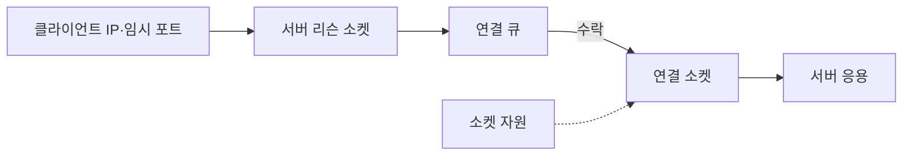
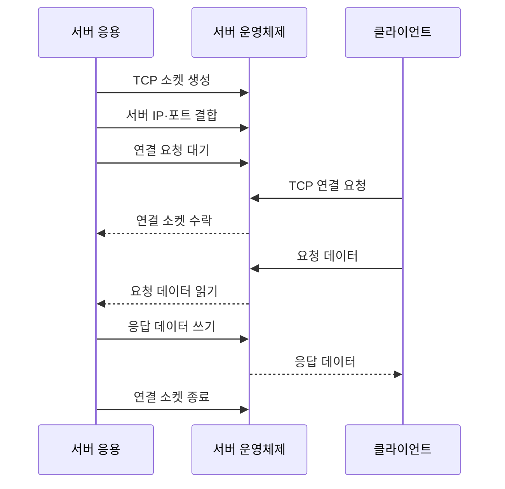

---
sidebar:
  order: 29
  label: "029. 포트 번호·소켓 통신 (Port Socket Communication)"
  badge:
    text: "기출 · 30%"
    variant: note
title: "포트 번호·소켓 통신 (Port Socket Communication)"
date: "2026-07-27T23:59:59+09:00"
tags:
  - "notes-network"
weight: 29
extra:
  question_no: "029"
  source_status: "기출"
  source_history: "128회"
  priority: 30
  priority_note: "설명형: 128회 주소 구조와 Socket 식별"
---

## 미리 알고가기

- **인터넷 프로토콜(Internet Protocol, IP)**: ‘아이피’로 읽고 영문 머리글자를 딴 약어이며, 송수신 장치를 주소로 식별하고 패킷을 전달함
- **포트 번호(Port Number)**: 한 장치 안에서 데이터를 받을 응용 서비스나 프로세스를 구별하는 16비트 번호
- **운영체제(Operating System, OS)**: ‘오에스’로 읽고 영문 머리글자를 딴 약어이며, 프로세스와 장치 사이의 소켓·버퍼를 관리함
- **소켓(Socket)**: 응용이 운영체제의 네트워크 기능을 통해 데이터를 주고받는 통신 종단 객체
- **전송 제어 프로토콜(Transmission Control Protocol, TCP)**: 연결을 설정하고 데이터의 순서·재전송·흐름을 관리하는 전송 프로토콜
- **사용자 데이터그램 프로토콜(User Datagram Protocol, UDP)**: 연결 설정 없이 독립된 메시지를 전달하는 전송 프로토콜
- **입출력(Input/Output, I/O)**: 응용이 소켓을 통해 데이터를 읽거나 쓰는 동작
- **파일 서술자(File Descriptor, FD)**: ‘에프디’로 읽고 영문 머리글자를 딴 약어이며, 프로세스가 열린 소켓·파일을 참조하는 정수형 식별자
- **표준 포트**: 널리 쓰이는 서비스에 관례적으로 배정된 포트 번호
- **임시 포트**: 클라이언트가 연결을 시작할 때 운영체제가 일정 범위에서 일시적으로 배정하는 포트 번호
- **리슨 소켓**: 서버가 특정 IP·포트에서 TCP 연결 요청을 기다리는 소켓
- **연결 소켓**: 개별 TCP 연결의 상대와 실제 데이터를 주고받는 소켓
- **데이터그램**: UDP가 메시지 경계를 유지해 전달하는 독립 데이터 단위

## Ⅰ. 개요

- **정의/개념**: 포트는 **서비스 식별**, 소켓은 **통신 종단·상태 관리**
- **기존 한계**: IP 주소만으로는 **호스트 내 서비스·연결 구분 불가**

### 쉽게 이해하기 (학습용)
- IP가 건물 주소이고 포트가 부서 번호라면 소켓은 특정 상대와 대화하도록 운영체제가 연 창구다

## Ⅱ. 특징

- 서버의 **고정 포트·클라이언트 임시 포트**
- 5-튜플의 **TCP 연결 고유 식별**
- 리슨·연결 소켓의 **수락·데이터 처리 분리**

### 쉽게 이해하기 (학습용)

- 리슨 소켓이 요청을 받으면 운영체제는 클라이언트마다 연결 소켓을 따로 만들어 통신 상태를 분리한다

## Ⅲ. 아키텍처 및 구성요소

| 설계 요소 | 설명 |
|:---|:---|
| 클라이언트 IP·임시 포트 | 클라이언트 통신 창구 식별 |
| 연결 큐 | 수락 전 TCP 연결을 임시 보관 |
| 서버 리슨 소켓 | 서버 IP·포트에서 새 연결 대기 |
| 연결 소켓 | 클라이언트별 TCP 데이터 송수신 |
| 소켓 자원 | FD·송수신 버퍼·TCP 상태 관리 |
| 서버 응용 | 연결 FD로 요청·응답 처리 |

> 요약: IP·포트 조합별 연결 소켓 분리

### 쉽게 이해하기 (학습용)

- 연결 큐는 수락을 기다리는 대기실이고 연결 소켓은 클라이언트마다 배정되는 전용 상담 창구다

## Ⅳ. 원리 및 절차 흐름도

| 절차 | 설명 |
|:---|:---|
| TCP 소켓 생성 | 운영체제에 TCP 종단 생성을 요청 |
| 서버 IP·포트 결합 | 소켓을 서버 주소·고정 포트에 결합 |
| 연결 요청 대기 | 리슨 상태로 연결 큐를 관리 |
| TCP 연결 요청 | 임시 포트에서 서버로 연결 요청 |
| 연결 소켓 수락 | 개별 연결 소켓·FD를 응용에 반환 |
| 요청 데이터 | 운영체제가 연결 소켓에 수신 |
| 요청 데이터 읽기 | 응용이 연결 소켓에서 요청을 읽음 |
| 응답 데이터 쓰기 | 응용이 연결 소켓에 응답을 기록 |
| 응답 데이터 | 운영체제가 클라이언트에 전송 |
| 연결 소켓 종료 | FD·버퍼·연결 상태 회수 |

> 요약: 리슨 수락 뒤 연결 FD로 통신

### 쉽게 이해하기 (학습용)

- 리슨 소켓은 다음 요청을 계속 기다리고 실제 데이터는 새로 수락한 연결 소켓에서 주고받는다

## Ⅴ. 종류 및 비교

| 소켓 방식 | TCP 소켓 | UDP 소켓 |
|:---|:---|:---|
| 적용 기준 | 순서·신뢰가 필요한 **연속 통신** | 짧은 질의·**실시간 메시지** |
| 핵심 특징 | 연결 상태의 **바이트 흐름 전달** | 데이터그램별 **독립 메시지 전달** |
| 한계 | 대량 연결의 **FD·버퍼 고갈** | 도착·순서·**중복 응용 처리** |

> 요약: TCP는 상태, UDP는 데이터그램 관리

### 쉽게 이해하기 (학습용)

- TCP는 상대마다 연결 소켓을 만들고 UDP는 한 소켓에서 독립 데이터그램을 구분해 받는다

## Ⅵ. 실무 사례

1. 대량 접속은 FD·버퍼 한도를 관측
2. 중계 서버는 연결 재사용으로 임시 포트 보존

### 쉽게 이해하기 (학습용)

- 대량 접속 한도는 포트보다 연결 소켓의 FD·메모리에서 먼저 생길 수 있다
- 중계 서버도 임시 포트를 쓰므로 연결 재사용으로 고갈을 줄인다

## Ⅶ. 결론

- 접속 수·통신 방식으로 포트·FD·버퍼 한도 결정

### 쉽게 이해하기 (학습용)

- 포트가 열렸다는 말은 리슨 소켓이 기다린다는 뜻이며 수락된 연결 소켓과 응용이 실제 데이터를 처리한다
