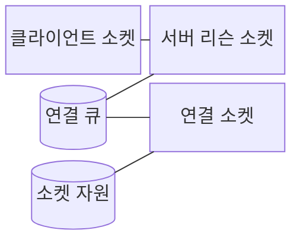
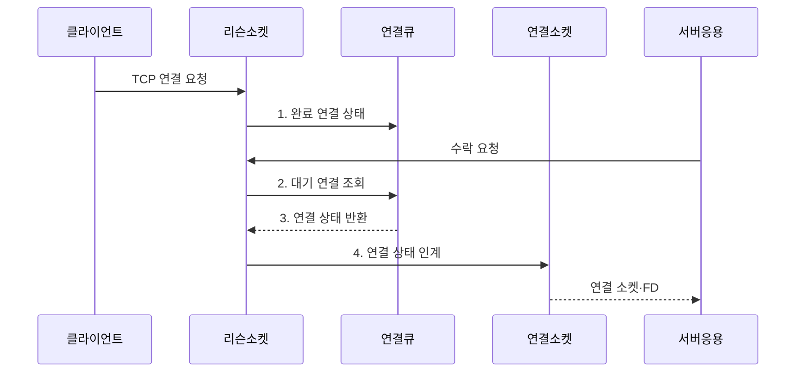

---
sidebar:
  order: 29
  label: "029. 포트 번호·소켓 통신 (Port Socket Communication)"
  badge:
    text: "기출 · 30%"
    variant: note
title: "포트 번호·소켓 통신 (Port Socket Communication)"
date: "2026-07-31T00:55:42+09:00"
tags:
  - "notes-network"
weight: 29
extra:
  question_no: "029"
  source_status: "기출"
  source_history: "128회"
  priority: 30
  priority_note: "설명형: 128회 주소 구조와 Socket 식별"
---

## 미리 알고가기

- **인터넷 프로토콜(Internet Protocol, IP)**: 송수신 장치를 주소로 식별하고 패킷을 전달하는 네트워크 프로토콜
- **포트 번호(Port Number)**: 한 장치 안에서 데이터를 받을 응용 서비스나 프로세스를 구별하는 16비트 번호
- **운영체제(Operating System, OS)**: 프로세스와 네트워크 장치 사이의 소켓·버퍼를 관리하는 시스템 소프트웨어
- **소켓(Socket)**: 응용이 운영체제의 네트워크 기능을 통해 데이터를 주고받는 통신 종단 객체
- **전송 제어 프로토콜(Transmission Control Protocol, TCP)**: 연결을 설정하고 데이터의 순서·재전송·흐름을 관리하는 전송 프로토콜
- **사용자 데이터그램 프로토콜(User Datagram Protocol, UDP)**: 연결 설정 없이 독립된 메시지를 전달하는 전송 프로토콜
- **파일 서술자(File Descriptor, FD)**: 프로세스가 열린 소켓·파일을 참조하는 정수형 식별자
- **임시 포트**: 클라이언트가 연결을 시작할 때 운영체제가 일정 범위에서 일시적으로 배정하는 포트 번호
- **리슨 소켓**: 서버가 특정 IP·포트에서 TCP 연결 요청을 기다리는 소켓
- **연결 소켓**: 개별 TCP 연결의 상대와 실제 데이터를 주고받는 소켓
- **데이터그램**: UDP가 메시지 경계를 유지해 전달하는 독립 데이터 단위
- **5-튜플(5-Tuple)**: 출발지·목적지 IP 주소와 포트, 전송 프로토콜을 묶어 하나의 통신 흐름을 구별하는 식별자
- **백로그(Backlog)**: 응용이 수락하기 전까지 운영체제가 완료 연결을 대기시킬 수 있는 큐 한도
- **방화벽(Firewall)**: 허용한 주소·포트·프로토콜의 트래픽만 통과시키는 네트워크 접근 통제 장치

## Ⅰ. 개요

- 정의/개념: **포트 번호**는 서비스를 식별하고 **소켓**은 주소·상태를 관리하는 통신 종단 객체
- 배경/필요성: IP 주소만으로는 **호스트 내 서비스·연결 구분 불가**

### 쉽게 이해하기 (학습용)

- IP가 건물 주소이고 포트가 부서 번호라면 소켓은 운영체제가 특정 상대와 대화하도록 연 전용 창구다

## Ⅱ. 특징

- 서버의 **고정 포트·클라이언트 임시 포트**
- 5-튜플의 **TCP 연결 고유 식별**
- 리슨·연결 소켓의 **수락·데이터 처리 분리**

### 쉽게 이해하기 (학습용)

- 안내 창구인 리슨 소켓이 손님을 받으면 운영체제가 5-튜플마다 전용 상담 창구인 연결 소켓을 만들어 상태를 분리한다

## Ⅲ. 구조 및 구성요소

| 구성요소 | 책임 |
|:---|:---|
| 클라이언트 소켓 | **임시 포트·서버 주소**로 통신 상대 지정 |
| 서버 리슨 소켓 | 서버 IP·**고정 포트**에서 새 연결 대기 |
| 연결 큐 | 응용 수락 전 **완료 연결 상태** 보관 |
| 연결 소켓 | 5-튜플별 **TCP 데이터 송수신** |
| 소켓 자원 | OS의 FD·송수신 버퍼·**TCP 상태** 관리 |

### 쉽게 이해하기 (학습용)

- 건물 안내 창구인 리슨 소켓 옆 대기실이 연결 큐이고, 손님마다 배정된 상담 창구가 5-튜플 상태를 가진 연결 소켓이다

## Ⅳ. 흐름도

**동작 원리**

1. **완료 연결 상태**: 5-튜플과 TCP 상태를 **연결 큐**에 보관
2. **대기 연결 조회**: 응용의 수락 요청에 맞춰 큐 선두 상태 탐색
3. **연결 상태 반환**: 수락할 **5-튜플·TCP 상태** 제공
4. **연결 상태 인계**: 개별 **연결 소켓·FD**에 통신 상태 결합

### 쉽게 이해하기 (학습용)

- 안내 창구는 다음 손님을 계속 받고 대기실에서 호출된 손님은 전용 상담 창구로 이동하듯 리슨 소켓과 연결 소켓의 책임이 나뉜다

## Ⅴ. 종류 및 비교

| 소켓 방식 | TCP 소켓 | UDP 소켓 |
|:---|:---|:---|
| 적용 기준 | 순서·신뢰가 필요한 **연속 통신** | 짧은 질의·**실시간 메시지** |
| 핵심 특징 | 연결 상태의 **바이트 흐름 전달** | 데이터그램별 **독립 메시지 전달** |
| 한계 | 대량 연결의 **FD·버퍼 고갈** | 도착·순서·**중복 응용 처리** |

> 요약: TCP는 상태, UDP는 데이터그램 관리

### 쉽게 이해하기 (학습용)

- TCP는 상대마다 연결 소켓을 만들고 UDP는 한 소켓에서 독립 데이터그램을 구분해 받는다

## Ⅵ. 실무 고려사항 및 대책

| 고려사항 | 대책 | 효과 |
|:---|:---|:---|
| 짧은 연결 반복으로 **임시 포트** 고갈 | 연결 재사용·**포트 범위** 산정 | 신규 연결용 **출발지 포트** 확보 |
| 수락 처리보다 연결이 빨라 **연결 큐** 초과 | **백로그·수락 처리율** 조정 | 신규 접속의 **거부율** 감소 |
| 예외 경로에서 **소켓·FD** 미종료 | 소켓 시간제한·**미종료 FD** 감시 | 서버 **소켓 자원** 회수 |
| 모든 주소에 **고정 포트** 노출 | 허용 주소만 결합하고 **방화벽 규칙** 제한 | 서비스 **접근 범위** 축소 |

### 쉽게 이해하기 (학습용)

- 상담 번호가 남아도 상담실과 대기실이 차면 손님을 못 받듯 대량 접속 한도는 임시 포트·FD·연결 큐 중 먼저 찬 자원에서 생긴다

## Ⅶ. 결론

- 연결 상태가 필요하면 **TCP 연결 소켓**, 독립 메시지는 **UDP 소켓** 선택

### 쉽게 이해하기 (학습용)

- 긴 상담처럼 상태가 필요하면 상대별 TCP 창구를 만들고 한 번 묻고 끝나는 메시지는 한 UDP 창구에서 주소별로 구분한다
