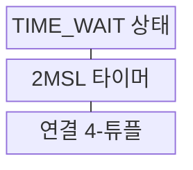
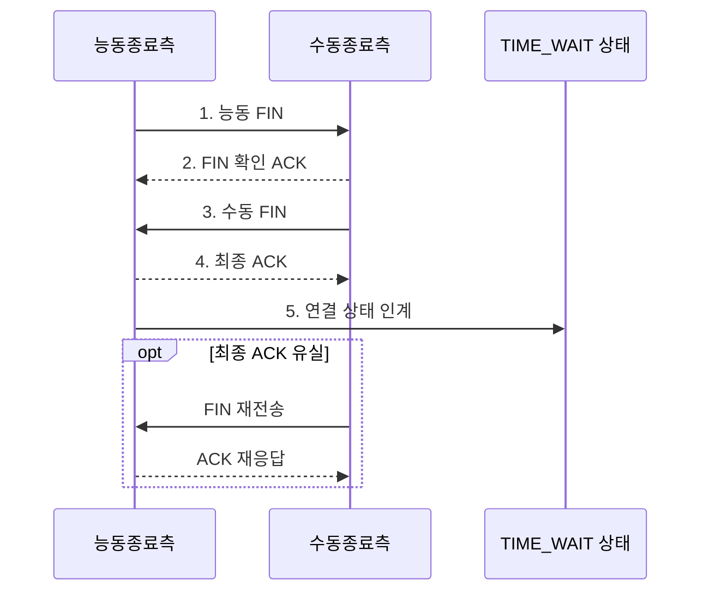

---
sidebar:
  order: 30
  label: "030. TCP TIME_WAIT 상태 (TIME_WAIT State)"
  badge:
    text: "기출 · 30%"
    variant: note
title: "TCP TIME_WAIT 상태 (TIME_WAIT State)"
date: "2026-07-31T00:56:47+09:00"
tags:
  - "notes-network"
weight: 30
extra:
  question_no: "030"
  source_status: "기출"
  source_history: "132회"
  priority: 30
  priority_note: "설명형: 132회 TCP 종료 상태 직접 출제"
---

## 미리 알고가기

- **전송 제어 프로토콜(Transmission Control Protocol, TCP)**: 연결의 순서·재전송·흐름과 정상 종료 상태를 관리하는 전송 프로토콜
- **능동 종료 측(Active Closer)**: 통신을 끝내기 위해 먼저 `FIN`을 보내는 종단
- **종료(Finish, FIN)**: 해당 방향으로 더 보낼 데이터가 없음을 알리는 TCP 제어 표시
- **긍정 응답(Acknowledgment, ACK)**: 데이터나 FIN을 정상적으로 받았음을 알리는 TCP 제어 표시
- **세그먼트**: TCP 헤더와 응용 데이터를 포함하는 TCP의 전송 단위
- **최대 세그먼트 수명(Maximum Segment Lifetime, MSL)**: 세그먼트가 네트워크 안에서 살아 있다고 가정하는 최대 시간
- **시간 대기(TIME_WAIT)**: 최종 ACK을 보낸 종단이 이전 연결의 세그먼트가 사라질 때까지 연결 정보를 유지하는 TCP 종료 상태
- **두 배 최대 세그먼트 수명(2MSL)**: 투 엠에스엘로 읽으며 숫자 2는 MSL의 두 배를 뜻하고, 세그먼트와 응답이 사라질 대기 시간을 나타냄
- **4-튜플(4-Tuple)**: 출발지·목적지 IP 주소와 포트를 묶어 하나의 TCP 연결을 식별하는 네 값
- **지연 중복 세그먼트**: 재전송되거나 경로에서 지연되어 연결 종료 후 뒤늦게 도착한 이전 연결의 세그먼트
- **임시 포트**: 클라이언트가 연결을 시작할 때 운영체제가 일정 범위에서 일시적으로 배정하는 포트 번호
- **파일 서술자(File Descriptor, FD)**: 응용이 열린 소켓을 참조하는 운영체제 번호로 CLOSE_WAIT 누적 시 함께 점유되는 자원
- **FIN 대기 2(FIN_WAIT_2)**: 능동 종료 측이 자기 FIN의 ACK를 받은 뒤 상대 FIN을 기다리는 상태
- **종료 대기(CLOSE_WAIT)**: 상대 FIN을 받은 응용이 자기 소켓을 닫아 FIN을 보낼 때까지 기다리는 상태
- **마지막 확인 대기(LAST_ACK)**: 수동 종료 측이 자기 FIN에 대한 최종 ACK를 기다리는 상태
- **TCP 타임스탬프(TCP Timestamp)**: 세그먼트의 송신 시각 정보를 이용해 오래된 세그먼트를 구별하는 TCP 옵션

> **키워드:** TCP TIME_WAIT 상태 (TIME_WAIT State)

## Ⅰ. 개요

- 정의/개념: 최종 ACK 후 **2MSL** 동안 연결 정보를 유지하는 **TCP 종료 상태**
- 배경/필요성: 최종 ACK 유실·즉시 4-튜플 재사용으로 **종료·재연결 혼선**

### 쉽게 이해하기 (학습용)

- 통화를 끊은 뒤 늦은 옛 음성이 새 통화에 섞이지 않도록 마지막 확인증과 연결 주소를 2MSL 동안 보관한다

## Ⅱ. 특징

- 재전송 FIN에 **ACK 재응답**해 상대 종료 완료
- **4-튜플 재사용 지연**으로 이전 연결의 세그먼트 격리
- 대량 누적 시 **임시 포트 조합 고갈**로 신규 연결 제한

### 쉽게 이해하기 (학습용)

- 퇴실 확인증을 잠시 보관하는 것이 정상인 것처럼 TIME_WAIT 자체는 오류가 아니며 새 입장이 막힐 때 임시 포트 고갈을 점검한다

## Ⅲ. 구조 및 구성요소

| 구성요소 | 책임 |
|:---|:---|
| TIME_WAIT 상태 | FIN 재수신 시 **ACK 재응답 정보** 유지 |
| 2MSL 타이머 | **지연 세그먼트** 소멸 대기시간 관리 |
| 연결 4-튜플 | 이전·신규 **TCP 연결** 식별 |

### 쉽게 이해하기 (학습용)

- 보관함 TIME_WAIT이 주소표 4-튜플과 폐기 시계 2MSL을 함께 들고 있어 늦은 옛 데이터와 새 연결을 구별한다

## Ⅳ. 흐름도

**동작 원리**

1. **능동 FIN**: 능동 종료 측의 **송신 종료** 통지
2. **FIN 확인 ACK**: 수동 종료 측이 FIN 순서 번호 확인
3. **수동 FIN**: 남은 데이터 전송 후 반대 방향 종료 통지
4. **최종 ACK**: 수동 FIN 수신을 확인해 상대의 **LAST_ACK** 종료
5. **연결 상태 인계**: 4-튜플을 보존하고 **2MSL 타이머** 시작

### 쉽게 이해하기 (학습용)

- 상대가 마지막 확인증을 못 받아 종료표를 다시 보내면 같은 확인증을 되돌려 주고 2MSL 시계가 끝난 뒤 연결표를 지운다

## Ⅴ. 종류 및 비교

| TCP 종료 대기 상태 | `TIME_WAIT` | `FIN_WAIT_2` | `CLOSE_WAIT` |
|:---|:---|:---|:---|
| 적용 기준 | **최종 ACK** 송신 뒤 | 로컬 FIN의 **ACK 수신** 뒤 | 상대 **FIN 수신** 뒤 |
| 핵심 특징 | FIN 재응답·**2MSL 격리** | 상대 **FIN 대기** | 로컬 **소켓 종료 대기** |
| 한계 | **임시 포트 조합** 부족 | **연결 상태** 장기 점유 | 소켓·**FD 미회수** |

> 요약: **TIME_WAIT**은 시간, FIN_WAIT_2는 상대 FIN, CLOSE_WAIT은 로컬 종료 대기

### 쉽게 이해하기 (학습용)

- 세 대기실 중 TIME_WAIT은 시계, FIN_WAIT_2는 상대의 퇴실표, CLOSE_WAIT은 로컬 응용의 문 닫기를 기다린다

## Ⅵ. 실무 고려사항 및 대책

| 고려사항 | 대책 | 효과 |
|:---|:---|:---|
| 짧은 연결로 **TIME_WAIT** 과다 누적 | 능동 종료 주체·**임시 포트 범위** 조정 | 신규 연결용 **4-튜플** 확보 |
| 2MSL 전 4-튜플 재사용 | TCP 타임스탬프·**재사용 안전성** 검증 | 이전 연결의 **지연 세그먼트** 혼입 방지 |
| 최종 ACK 유실 뒤 **FIN 재전송** | **2MSL** 동안 연결 정보 유지 | 재전송 FIN에 **ACK 재응답** |
| 근거 없는 **TIME_WAIT 타이머** 단축 | 경로 MSL·**재연결 간격** 계측 | 새 연결과 이전 세그먼트 **격리** |

### 쉽게 이해하기 (학습용)

- 퇴실 대기표가 쌓이면 확인 시간을 없애지 말고 어느 쪽이 먼저 닫는지와 새 손님용 임시 포트 범위를 조정한다

## Ⅶ. 결론

- 최종 ACK 후 **지연 세그먼트** 위험이 사라질 때까지 **TIME_WAIT** 유지

### 쉽게 이해하기 (학습용)

- 마지막 확인증을 보낸 뒤 늦은 옛 짐이 사라질 때까지 퇴실표를 보관하는 것이 TIME_WAIT의 정상 역할이다
