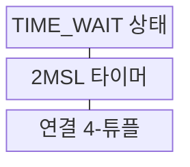
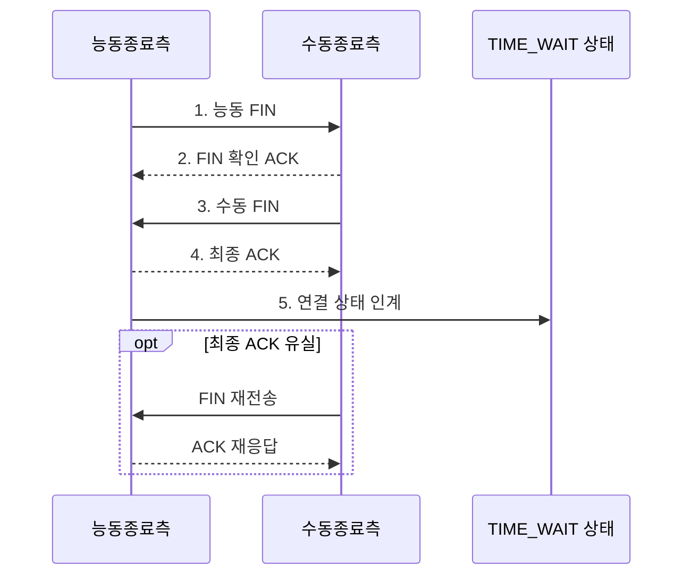

---
sidebar:
  order: 30
  label: "030. TCP TIME_WAIT 상태 (TIME_WAIT State)"
  badge:
    text: "기출 • 30%"
    variant: note
title: "TCP TIME_WAIT 상태 (TIME_WAIT State)"
date: "2026-08-03T08:48:47+09:00"
tags:
  - "notes-network"
weight: 30
extra:
  question_no: "030"
  source_status: "기출"
  source_history: "132회"
  priority: 30
  priority_note: "설명형: 132회 TCP 종료 상태 직접 출제"
---

## Ⅰ. 개요

핵심 용어

- **시간 대기(Time Wait, TIME_WAIT)**: 최종 ACK를 보낸 종단이 이전 연결의 지연 세그먼트 소멸까지 상태를 유지하는 TCP 종료 상태이다.
- **확인 응답•전송 제어 프로토콜(Acknowledgment/Transmission Control Protocol, ACK•TCP)**: 세그먼트 수신을 확인하는 응답과 연결 상태를 관리하는 전송 프로토콜이다.
- **최대 세그먼트 수명 두 배(Twice the Maximum Segment Lifetime, 2MSL)**: 이전 연결의 지연 세그먼트가 사라지도록 기다리는 시간이다.

- 정의/개념: **TIME_WAIT 상태** — 능동 종료 측이 최종 ACK를 보낸 뒤 지연 세그먼트 소멸과 ACK 재전송을 위해 연결 정보를 2MSL 동안 유지하는 **TCP 종료 상태**
- 배경/필요성: 최종 ACK 유실•즉시 4-튜플 재사용으로 **종료•재연결 혼선**

#### 한줄 요약

- 통화를 끊은 뒤 늦은 옛 음성이 새 통화에 섞이지 않도록 마지막 확인증과 연결 주소를 2MSL 동안 보관한다

## Ⅱ. 특징

핵심 용어

- **능동 종료•최대 세그먼트 수명 두 배(Active Close/Twice the Maximum Segment Lifetime, 능동 종료•2MSL)**: 먼저 FIN을 보낸 종단과 세그먼트•응답 소멸을 위해 기다리는 시간이다.
- **종료•확인 응답(Finish/Acknowledgment, FIN•ACK)**: 송신 방향 종료를 알리고 그 수신을 확인하는 제어 플래그이다.

- 재전송 FIN에 **ACK 재응답**해 상대 종료 완료
- **4-튜플 재사용 지연**으로 이전 연결의 세그먼트 격리
- 대량 누적 시 **임시 포트 조합 고갈** 로 신규 연결 제한

#### 한줄 요약

- 퇴실 확인증을 잠시 보관하는 것이 정상인 것처럼 TIME_WAIT 자체는 오류가 아니며 새 입장이 막힐 때 임시 포트 고갈을 점검한다

## Ⅲ. 구조 및 구성요소

핵심 용어

- **4-튜플•지연 중복 세그먼트(Four-Tuple/Delayed Duplicate Segment)**: TCP 연결 식별값과 종료 후 늦게 도착한 이전 연결 데이터이다.
- **전송 제어 프로토콜•최대 세그먼트 수명 두 배(Transmission Control Protocol/Twice the Maximum Segment Lifetime, TCP•2MSL)**: 연결 상태를 관리하는 프로토콜과 지연 세그먼트 소멸 대기시간이다.

| 구성요소 | 책임 |
|:---|:---|
| TIME_WAIT 상태 | FIN 재수신 시 **ACK 재응답 정보** 유지 |
| 2MSL 타이머 | **지연 세그먼트** 소멸 대기시간 관리 |
| 연결 4-튜플 | 이전•신규 **TCP 연결** 식별 |

#### 한줄 요약

- 보관함 TIME_WAIT이 주소표 4-튜플과 폐기 시계 2MSL을 함께 들고 있어 늦은 옛 데이터와 새 연결을 구별한다

## Ⅳ. 흐름도

핵심 용어

- **종료•확인 응답(Finish/Acknowledgment, FIN•ACK)**: 송신 종료를 알리고 이를 정상 수신했음을 확인하는 TCP 표시이다.
- **최종 확인 대기•최대 세그먼트 수명 두 배(Last Acknowledgment/Twice the Maximum Segment Lifetime, LAST_ACK•2MSL)**: 수동 종단의 마지막 확인 대기 상태와 능동 종단의 지연 세그먼트 대기시간이다.

**동작 원리**

1. **능동 FIN**: 능동 종료 측의 **송신 종료** 통지
2. **FIN 확인 ACK**: 수동 종료 측이 FIN 순서 번호 확인
3. **수동 FIN**: 남은 데이터 전송 후 반대 방향 종료 통지
4. **최종 ACK**: 수동 FIN 수신을 확인해 상대의 **LAST_ACK** 종료
5. **연결 상태 인계**: 4-튜플을 보존하고 **2MSL 타이머** 시작

#### 한줄 요약

- 상대가 마지막 확인증을 못 받아 종료표를 다시 보내면 같은 확인증을 되돌려 주고 2MSL 시계가 끝난 뒤 연결표를 지운다

## Ⅴ. 종류 및 비교

핵심 용어

- **종료 대기 2•닫기 대기•최종 확인 대기(Finish Wait 2/Close Wait/Last Acknowledgment, FIN_WAIT_2•CLOSE_WAIT•LAST_ACK)**: 상대 FIN, 응용 close, 자기 FIN의 최종 ACK를 기다리는 상태이다.
- **전송 제어 프로토콜•파일 서술자(Transmission Control Protocol/File Descriptor, TCP•FD)**: 연결 종료 상태를 관리하는 프로토콜과 소켓을 참조하는 운영체제 번호이다.

| TCP 종료 대기 상태 | `TIME_WAIT` | `FIN_WAIT_2` | `CLOSE_WAIT` |
|:---|:---|:---|:---|
| 적용 기준 | **최종 ACK** 송신 뒤 | 로컬 FIN의 **ACK 수신** 뒤 | 상대 **FIN 수신** 뒤 |
| 핵심 특징 | FIN 재응답•**2MSL 격리** | 상대 **FIN 대기** | 로컬 **소켓 종료 대기** |
| 한계 | **임시 포트 조합** 부족 | **연결 상태** 장기 점유 | 소켓•**FD 미회수** |

> 요약: **TIME_WAIT 상태** — 시간, FIN_WAIT_2는 상대 FIN, CLOSE_WAIT은 로컬 종료 대기

#### 한줄 요약

- 세 대기실 중 TIME_WAIT은 시계, FIN_WAIT_2는 상대의 퇴실표, CLOSE_WAIT은 로컬 응용의 문 닫기를 기다린다

## Ⅵ. 실무 고려사항 및 대책

핵심 용어

- **임시 포트•파일 서술자(Ephemeral Port/File Descriptor, 임시 포트•FD)**: 연결 생성에 일시 할당되는 포트와 응용이 소켓을 참조하는 운영체제 번호이다.
- **전송 제어 프로토콜•최대 세그먼트 수명(Transmission Control Protocol/Maximum Segment Lifetime, TCP•MSL)**: 연결 상태를 관리하는 프로토콜과 세그먼트가 네트워크에 남을 수 있는 최대 시간이다.

| 문제 | 대책 | 효과 |
|:---|:---|:---|
| 짧은 연결로 **TIME_WAIT** 과다 누적 | 능동 종료 주체•**임시 포트 범위** 조정 | 신규 연결용 **4-튜플** 확보 |
| 2MSL 전 4-튜플 재사용 | TCP 타임스탬프•**재사용 안전성** 검증 | 이전 연결의 **지연 세그먼트** 혼입 방지 |
| 최종 ACK 유실 뒤 **FIN 재전송** | **2MSL** 동안 연결 정보 유지 | 재전송 FIN에 **ACK 재응답** |
| 근거 없는 **TIME_WAIT 타이머** 단축 | 경로 MSL•**재연결 간격** 계측 | 새 연결과 이전 세그먼트 **격리** |

#### 한줄 요약

- 퇴실 대기표가 쌓이면 확인 시간을 없애지 말고 어느 쪽이 먼저 닫는지와 새 손님용 임시 포트 범위를 조정한다

## Ⅶ. 결론

핵심 용어

- **전송 제어 프로토콜 타임스탬프(Transmission Control Protocol Timestamp, TCP 타임스탬프)**: 송신 시각으로 오래된 세그먼트를 구별하는 TCP 옵션이다.
- **확인 응답•시간 대기(Acknowledgment/Time Wait, ACK•TIME_WAIT)**: 마지막 종료 수신을 확인하고 지연 세그먼트가 사라질 때까지 연결 정보를 유지하는 절차이다.

- 최종 ACK 후 **지연 세그먼트** 위험이 사라질 때까지 **TIME_WAIT** 유지

#### 한줄 요약

- 마지막 확인증을 보낸 뒤 늦은 옛 짐이 사라질 때까지 퇴실표를 보관하는 것이 TIME_WAIT의 정상 역할이다
