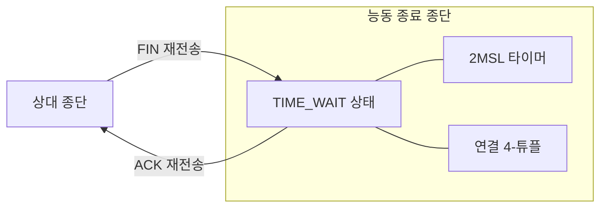
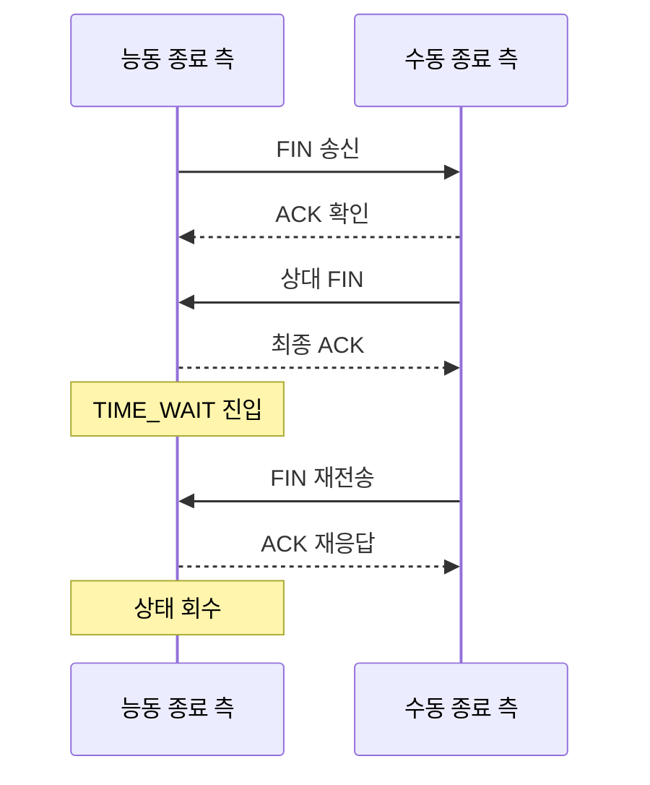

---
sidebar:
  order: 30
  label: "030. TCP TIME_WAIT 상태 (TIME_WAIT State)"
  badge:
    text: "기출 · 30%"
    variant: note
title: "TCP TIME_WAIT 상태 (TIME_WAIT State)"
date: "2026-07-27T23:59:59+09:00"
tags:
  - "notes-network"
weight: 30
extra:
  question_no: "030"
  source_status: "기출"
  source_history: "132회"
  priority: 30
  priority_note: "설명형: 132회 TCP 종료 상태 직접 출제"
---

## 미리 알고가기

- **전송 제어 프로토콜(Transmission Control Protocol, TCP)**: ‘티시피’로 읽고 세 영문 단어의 머리글자를 딴 표기이며 연결의 순서·재전송·흐름과 정상 종료 상태를 관리함
- **능동 종료 측(Active Closer)**: 통신을 끝내기 위해 먼저 `FIN`을 보내는 종단
- **종료(Finish, FIN)**: ‘핀’으로 읽고 Finish의 앞 세 글자를 딴 표기이며 해당 방향으로 더 보낼 데이터가 없음을 알리는 TCP 제어 표시
- **긍정 응답(Acknowledgment, ACK)**: ‘액’으로 읽고 Acknowledgment의 앞 세 글자를 딴 표기이며 데이터나 `FIN`을 정상적으로 받았음을 알리는 TCP 제어 표시
- **세그먼트**: TCP 헤더와 응용 데이터를 포함하는 TCP의 전송 단위
- **최대 세그먼트 수명(Maximum Segment Lifetime, MSL)**: ‘엠에스엘’로 읽고 세 영문 단어의 머리글자를 딴 표기이며 세그먼트가 네트워크 안에서 살아 있다고 가정하는 최대 시간
- **시간 대기(TIME_WAIT)**: ‘타임 웨이트’로 읽고 TCP 상태 이름을 대문자와 밑줄로 잇는 관례 표기이며 최종 `ACK`을 보낸 종단이 이전 연결의 세그먼트가 사라질 때까지 종료 상태를 유지함
- **두 배 최대 세그먼트 수명(2MSL)**: ‘투 엠에스엘’로 읽고 MSL 앞의 숫자 2로 두 배를 나타내며 세그먼트와 그 응답이 사라질 안전 대기 시간을 뜻함
- **4-튜플(4-tuple)**: ‘포 튜플’로 읽고 원소 수를 숫자 4로 나타낸 표기이며 출발지 IP·포트와 목적지 IP·포트로 한 TCP 연결을 식별함
- **지연 중복 세그먼트**: 재전송되거나 경로에서 지연되어 연결 종료 후 뒤늦게 도착한 이전 연결의 세그먼트
- **임시 포트**: 클라이언트가 연결을 시작할 때 운영체제가 일정 범위에서 일시적으로 배정하는 포트 번호
- **출발지 네트워크 주소 변환(Source Network Address Translation, SNAT)**: ‘에스냇’으로 읽고 네 영문 단어의 머리글자를 딴 표기이며 외부 패킷의 출발지 IP나 포트를 다른 값으로 바꿈
- **재설정(Reset, RST)**: ‘알에스티’로 읽고 Reset의 자음을 중심으로 줄인 표기이며 TCP 연결을 정상 종료 절차 없이 즉시 중단함
- **파일 서술자(File Descriptor, FD)**: ‘에프디’로 읽고 두 영문 단어의 머리글자를 딴 표기이며 응용이 열린 소켓을 참조하는 운영체제 번호로 `CLOSE_WAIT` 누적 시 함께 점유됨

## Ⅰ. 개요

- 정의/개념: 최종 ACK 후 **2MSL 유지하는 TCP 종료 상태**
- **배경/필요성**: 최종 ACK 유실·지연 세그먼트는 **종료·재연결 혼선** 유발

### 쉽게 이해하기 (학습용)
- 통화를 끊은 뒤 늦은 옛 음성이 새 통화에 섞이지 않도록 마지막 확인과 연결 정보를 잠시 보관한다.

## Ⅱ. 특징

- **재전송 FIN에 ACK 재응답**해 정상 종료를 보장한다.
- **4-튜플 재사용 지연**으로 이전 연결을 격리한다.
- 대량 누적 시 **임시 포트 조합 고갈**이 발생할 수 있다.

### 쉽게 이해하기 (학습용)

- `TIME_WAIT`은 정상 상태이며 새 연결 실패가 동반될 때 능동 종료 주체와 임시 포트 범위를 점검한다.

## Ⅲ. 아키텍처 및 구성요소

| 설계 요소 | 설명 |
|:---|:---|
| `TIME_WAIT` 상태 | **종료 재응답용 연결 정보 유지** |
| `2MSL` 타이머 | **지연 세그먼트 소멸 시간 확보** |
| 연결 4-튜플 | **이전·신규 연결 식별** |

> 요약: 2MSL 동안 재응답하고 이전 연결 격리

### 쉽게 이해하기 (학습용)

- 종료할 연결의 4-튜플도 기억해 이전 데이터와 새 연결의 데이터를 구별한다.

## Ⅳ. 원리 및 절차 흐름도

| 절차 | 설명 |
|:---|:---|
| FIN 송신 | 능동 종료 측의 송신 종료 통지 |
| ACK 확인 | 수동 종료 측이 FIN 수신 확인 |
| 상대 FIN | 수동 종료 측의 송신 종료 통지 |
| 최종 ACK | TIME_WAIT 진입·2MSL 시작 |
| FIN 재전송 | 최종 ACK 유실 시 다시 송신 |
| ACK 재응답 | 재전송 FIN에 ACK 반환 |
| 상태 회수 | 2MSL 만료 후 CLOSED 전환 |

> 요약: 최종 ACK 유실에 재응답한 뒤 상태를 회수한다.

### 쉽게 이해하기 (학습용)

- 상대가 최종 확인을 받지 못해 종료 통지를 다시 보내면 같은 확인을 반환하고 대기 시간이 끝난 뒤 상태를 지운다.

## Ⅴ. 종류 및 비교

| TCP 종료 대기 상태 | `TIME_WAIT` | `FIN_WAIT_2` | `CLOSE_WAIT` |
|:---|:---|:---|:---|
| 적용 기준 | 최종 ACK 송신 뒤 | 로컬 FIN의 ACK 수신 뒤 | 상대 FIN 수신 뒤 |
| 핵심 특징 | FIN 재응답·2MSL 격리 | 상대 FIN 대기 | 로컬 소켓 종료 대기 |
| 한계 | 임시 포트 조합 부족 | 연결 상태 장기 점유 | 소켓·FD 미회수 |

> 요약: 시간·상대 FIN·로컬 종료를 각각 기다린다.

### 쉽게 이해하기 (학습용)

- `TIME_WAIT`은 시간 만료, `FIN_WAIT_2`는 상대 종료, `CLOSE_WAIT`은 로컬 응용의 종료를 기다린다.

## Ⅵ. 실무 사례

1. 짧은 연결 반복은 **연결 풀로 종료 횟수 감소**
2. SNAT 포트 부족은 **주소·포트 용량 증설**

### 쉽게 이해하기 (학습용)

- 짧은 연결을 재사용하면 종료 안전성을 유지하면서 대기 소켓 수를 줄일 수 있다.
- 주소 변환 장비는 변환 후 출발지 IP·포트 조합이 고갈되지 않도록 용량을 늘린다.

## Ⅶ. 결론

- 정상 대기는 유지, 실패 시 **종료 빈도·포트 용량 조정**

### 쉽게 이해하기 (학습용)

- 정상 대기 상태를 없애지 말고 새 연결 실패 때 종료 횟수와 주소·포트 용량을 조정한다.
