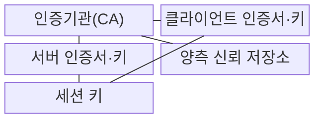
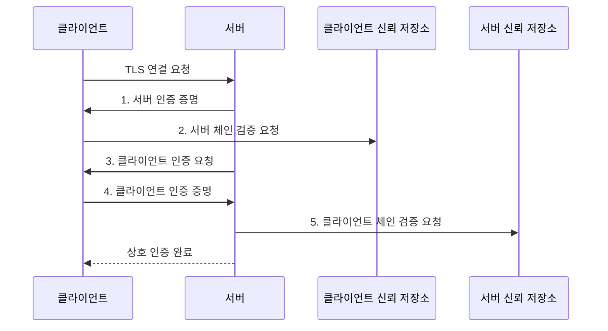

---
sidebar:
  order: 31
  label: "031. mTLS 상호 인증"
  badge: { text: "기출 · 50%", variant: note }
title: "mTLS 상호 인증"
date: "2026-07-31T00:57:54+09:00"
tags: ["notes-network"]
weight: 31
extra:
  question_no: "031"
  source_status: "기출"
  source_history: "138회"
  priority: 50
  priority_note: "138회 출제"
---

## Ⅰ. 개요

핵심 용어

- **상호 전송 계층 보안(Mutual Transport Layer Security, mTLS)**: 통신 양쪽이 인증서 체인과 개인키 소유를 검증하는 TLS 상호 인증 방식이다.
- **전송 계층 보안(Transport Layer Security, TLS)**: 통신 상대의 신원과 전송 데이터의 기밀성·무결성을 보호하는 프로토콜이다.

- 정의/개념: 양쪽 **인증서 체인·개인키 소유** 를 검증하는 **TLS 상호 인증 방식**
- 배경/필요성: 단방향 TLS는 **호출자 기계 신원 확인 부족**

#### 한줄 요약

- 두 출입자가 같은 발급기관의 신분증과 자기만 가진 서명 도장을 서로 확인하듯 양쪽 종단이 인증서와 개인키 소유를 검증한다

## Ⅱ. 특징

핵심 용어

- **인증서 체인**: 종단 인증서부터 신뢰한 루트 인증기관까지 서명 관계를 잇는 인증서 목록이다.
- **세션 키**: 상호 인증 뒤 한 연결의 데이터를 대칭키 방식으로 암호화하는 임시 비밀값이다.
- **상호 전송 계층 보안(Mutual Transport Layer Security, mTLS)**: 서버와 클라이언트가 서로 인증서와 개인키 소유를 검증하는 방식이다.

- 서버·클라이언트의 **인증서 체인** 모두 검증
- 전자서명으로 **개인키 비노출 소유 증명**
- 상호 인증 후 **세션 키 암호화**, 서비스 권한은 별도 판정

#### 한줄 요약

- 출입증이 진짜여도 모든 방에 들어갈 수 있는 것은 아니듯 mTLS 인증 뒤 서비스 권한은 별도 정책으로 판정한다

## Ⅲ. 구조 및 구성요소

핵심 용어

- **인증기관(Certificate Authority, CA)**: 인증서를 발급·서명하고 신뢰 기준을 제공하는 기관이다.
- **신뢰 저장소**: 인증서 체인을 검증할 때 허용할 인증기관 정보를 보관하는 저장소이다.

| 구성요소 | 책임 |
|:---|:---|
| 인증기관(CA) | 종단 인증서 **발급·서명** |
| 클라이언트 인증서·키 | 호출자 신원·**개인키 소유** 증명 |
| 서버 인증서·키 | 서버 신원·**개인키 소유** 증명 |
| 양측 신뢰 저장소 | 허용한 **CA 인증서 체인** 보관 |
| 세션 키 | 상호 인증 후 **응용 데이터 암호화** |

#### 한줄 요약

- 같은 신분증 발급기관을 믿는 두 출입자가 각자 신분증·도장을 제시하고 확인을 마치면 하나의 비밀 대화 키를 공유한다

## Ⅳ. 흐름도

핵심 용어

- **전자서명**: 개인키로 만든 서명값을 공개키로 검증해 메시지 무결성과 개인키 소유를 확인하는 기법이다.
- **전송 계층 보안·인증기관(Transport Layer Security/Certificate Authority, TLS·CA)**: 암호화 통신 프로토콜과 인증서 신뢰 사슬의 발급·검증 기준을 제공하는 기관이다.

**동작 원리**

1. **서버 인증 증명**: 서버 인증서 체인과 **전자서명** 제공
2. **서버 체인 검증 요청**: 신뢰 CA·이름·기간·용도로 **서버 신원** 판정
3. **클라이언트 인증 요청**: 허용 CA 목록과 함께 **호출자 증명** 요구
4. **클라이언트 인증 증명**: 클라이언트 인증서 체인과 **전자서명** 제공
5. **클라이언트 체인 검증 요청**: 신뢰 체인·기간·용도로 **호출자 신원** 판정

#### 한줄 요약

- 서버 신분증을 확인한 클라이언트가 자기 신분증과 서명 도장을 내고 서버도 같은 검사를 마치면 상호 인증이 끝난다

## Ⅴ. 종류 및 비교

핵심 용어

- **단방향 전송 계층 보안(One-Way Transport Layer Security, 단방향 TLS)**: 서버만 인증서를 제시하고 클라이언트가 서버 신원을 검증하는 TLS 방식이다.
- **상호 전송 계층 보안(Mutual Transport Layer Security, mTLS)**: 서버와 클라이언트가 모두 인증서를 제시해 양쪽 기계 신원을 검증하는 TLS 방식이다.

| TLS 인증 방식 | mTLS | 단방향 TLS |
|:---|:---|:---|
| 적용 기준 | 양방향 **기계 신원** 이 필요한 통신 | 불특정 사용자가 접속하는 **공개 서비스** |
| 핵심 특징 | 서버·클라이언트 **상호 인증** | **서버 인증** 만 수행 |
| 한계 | 인증서 발급·회전의 **운영 복잡성** | 호출자 **기계 신원 미검증** |

> 요약: 기계 신원이 필요하면 mTLS 적용

#### 한줄 요약

- 공개 상점은 손님이 상점 신분만 확인하지만 제한 구역의 기계끼리는 서로 신분증과 서명 도장을 확인한다

## Ⅵ. 실무 고려사항 및 대책

핵심 용어

- **인증서 폐기 목록(Certificate Revocation List, CRL)**: 만료 전에 폐기된 인증서의 일련번호를 인증기관이 서명해 배포하는 목록이다.
- **최소 권한**: 인증된 신원에 업무 수행에 필요한 최소 범위의 서비스 권한만 부여하는 원칙이다.
- **인증기관(Certificate Authority, CA)**: 인증서를 발급하고 폐기 정보를 서명해 신뢰 기준을 제공하는 기관이다.

| 문제 | 대책 | 효과 |
|:---|:---|:---|
| 만료 직전 인증서 미교체로 **연결 중단** | 인증서 **자동 발급·회전** 과 만료 경보 | 인증서 만료에 따른 **호출 실패** 예방 |
| 탈취·폐기 인증서가 유효하게 통과 | 단기 인증서와 **CRL 확인** | 폐기된 **기계 신원** 차단 |
| 양측 **신뢰 저장소** 의 CA 묶음 불일치 | CA 묶음 버전·**배포 검증** | 상호 인증의 **신뢰 경로 실패** 감소 |
| 인증 성공을 서비스 권한으로 오인 | 인증서 신원에 **별도 권한 정책** 매핑 | 서비스별 **최소 권한** 적용 |

#### 한줄 요약

- 출입증이 만료되기 전에 자동 교체하고 회수된 출입증은 CRL로 거부하며, 신분 확인 뒤에도 방별 권한표를 따로 적용한다

## Ⅶ. 결론

핵심 용어

- **인증과 인가 분리(Authentication/Authorization Separation)**: mTLS로 기계 신원을 확인한 뒤 서비스 접근 권한은 별도 정책으로 판정하는 원칙이다.
- **상호 전송 계층 보안(Mutual Transport Layer Security, mTLS)**: 양쪽 기계 신원을 인증서로 확인하는 TLS 방식이다.

- 양방향 기계 신원이 필요하면 **mTLS**, 서비스 권한은 **별도 정책** 적용

#### 한줄 요약

- 제한 구역의 기계끼리는 서로 신분증을 확인하되 어느 방에 들어갈지는 별도 권한표로 결정한다
