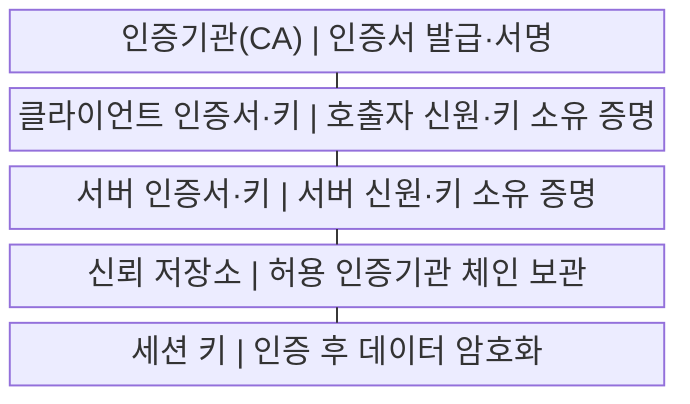
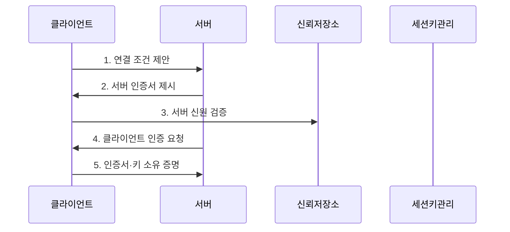

---
sidebar:
  order: 31
  label: "031. mTLS 상호 인증"
  badge: { text: "기출 · 50%", variant: note }
title: "mTLS 상호 인증"
date: "2026-07-29T21:30:00+09:00"
tags: ["notes-network"]
weight: 31
extra:
  question_no: "031"
  source_status: "기출"
  source_history: "138회"
  priority: 50
  priority_note: "138회 출제"
---

## 미리 알고가기

- **전송 계층 보안(Transport Layer Security, TLS)**: ‘티엘에스’로 읽고 세 영문 단어의 머리글자를 딴 표기이며 서버 인증과 통신 암호화를 제공하는 규약
- **상호 전송 계층 보안(Mutual Transport Layer Security, mTLS)**: ‘엠티엘에스’로 읽고 상호를 뜻하는 소문자 m을 TLS 앞에 붙인 표기이며 통신 양쪽의 인증서와 키 소유를 검증함
- **인증기관(Certificate Authority, CA)**: ‘시에이’로 읽고 두 영문 단어의 머리글자를 딴 표기이며 인증서를 발급·서명하고 신뢰 기준을 제공함
- **개인키**: 소유자만 보관하는 비밀 키
- **신뢰 저장소**: 허용 인증기관 정보를 보관
- **서비스 메시(Service Mesh)**: 서비스 간 통신의 인증·암호화·권한 정책을 응용 코드 밖에서 공통 통제하는 인프라 계층
- **세션 키(Session Key)**: 상호 인증 뒤 한 연결의 데이터를 대칭키 방식으로 암호화하는 임시 비밀값

## Ⅰ. 개요

- 정의/개념: 양쪽의 **인증서·개인키 소유를 상호 검증**
- 배경/필요성: 단방향 TLS는 **호출자 기계 신원 확인 부족**

### 쉽게 이해하기 (학습용)

- 통신 양쪽이 인증서라는 신분증과 개인키 소유를 서로 확인한다.

## Ⅱ. 특징

- **서버·클라이언트 인증서 체인**을 모두 검증한다.
- 서명으로 **개인키 비노출 소유 증명**을 수행한다.
- 상호 인증 후 **세션 키 암호화**, 권한은 별도 적용한다.

### 쉽게 이해하기 (학습용)

- 인증 성공과 서비스 권한은 별도로 판단한다.

## Ⅲ. 구조 및 구성요소

| 구성요소 | 책임 |
|:---|:---|
| 인증기관(CA) | 인증서 발급·서명 |
| 클라이언트 인증서·키 | 호출자 신원·키 소유 증명 |
| 서버 인증서·키 | 서버 신원·키 소유 증명 |
| 신뢰 저장소 | 허용 인증기관 체인 보관 |
| 세션 키 | 인증 후 데이터 암호화 |

### 쉽게 이해하기 (학습용)

- 같은 신뢰 체계를 바탕으로 상대를 검증한다.

## Ⅳ. 흐름도

**동작 원리**

1. **연결 조건 제안**: 지원 암호 방식과 난수 전달
2. **서버 인증서 제시**: 서버 신원과 공개키 제공
3. **서버 신원 검증**: 체인·이름·기간·용도 확인
4. **클라이언트 인증 요청**: 서버가 호출자 증명 요구
5. **인증서·키 소유 증명**: 인증서와 서명값 전달

### 쉽게 이해하기 (학습용)

- 인증서와 실제 개인키 소유를 함께 확인한다.

## Ⅴ. 종류 및 비교

| TLS 인증 방식 | mTLS | 단방향 TLS |
|:---|:---|:---|
| 적용 기준 | 내부 서비스·장비 통신 | 공개 웹 서비스 |
| 핵심 특징 | 서버·클라이언트 상호 인증 | 서버만 인증 |
| 한계 | 인증서 운영 복잡성 | 호출자 기계 신원 미검증 |

> 요약: 기계 신원이 필요하면 mTLS 적용

### 쉽게 이해하기 (학습용)

- 공개 접속은 서버만 확인하고 제한된 기계 간 통신은 양쪽 신원을 확인한다.

## Ⅵ. 실무 고려사항 및 대책

| 고려사항 | 대책 | 효과 |
|:---|:---|:---|
| 만료 인증서 배포 | 자동 발급·회전·만료 경보 | 연결 중단 예방 |
| 폐기 인증서 허용 | 단기 인증서·폐기 상태 확인 | 탈취 신원 차단 |
| 신뢰 저장소 불일치 | CA 묶음 버전·배포 검증 | 상호 인증 안정화 |
| 인증과 권한 혼동 | 인증서 신원에 별도 권한 매핑 | 최소 권한 적용 |

### 쉽게 이해하기 (학습용)

- 서비스 인증서를 자동 갱신해 만료로 인한 호출 중단을 방지한다.

## Ⅶ. 결론

- **양방향 인증서 검증·키 회전·권한 분리를 갖춘 mTLS**

### 쉽게 이해하기 (학습용)

- 상호 인증은 상대 신원을 확인하지만 서비스 권한은 별도 정책으로 판단해야 한다.
