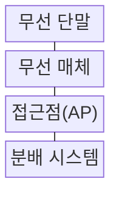
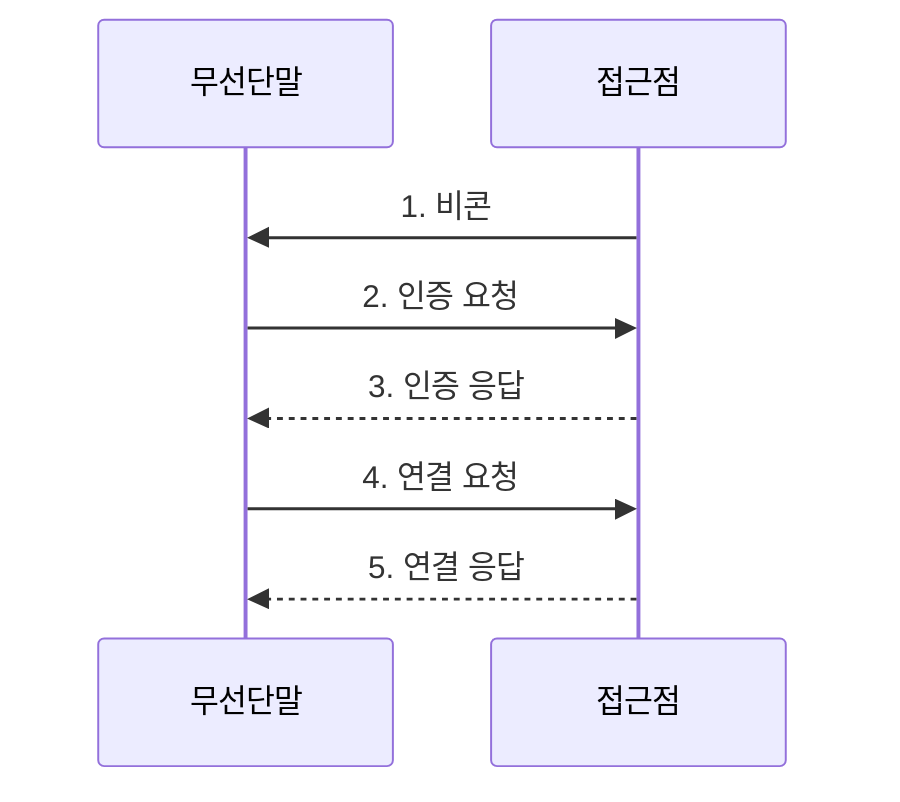

---
sidebar:
  order: 32
  label: "032. Wi-Fi 표준"
  badge: { text: "기출 · 50%", variant: note }
title: "Wi-Fi 표준"
date: "2026-07-31T00:58:46+09:00"
tags: ["notes-network"]
weight: 32
extra:
  question_no: "032"
  source_status: "기출"
  source_history: "125회, 134회"
  priority: 50
  priority_note: "125·134회 출제"
---

## Ⅰ. 개요

핵심 용어

- **전기전자공학자협회 802.11(Institute of Electrical and Electronics Engineers 802.11, IEEE 802.11)**: Wi-Fi의 물리 전송과 무선 매체 접근 방식을 정의해 장비 간 상호운용을 보장하는 표준 계열이다.
- **접근점(Access Point, AP)**: 무선 단말을 유선 분배 시스템과 외부 네트워크에 연결하는 장치이다.

- 정의/개념: **IEEE 802.11** 로 물리 전송과 매체 접근을 규정하는 **무선랜 표준군**
- 배경/필요성: 제조사별 독자 규격으로 단말·AP **상호운용·전파 공유 불가**

#### 한줄 요약

- 같은 교통 규칙을 배운 단말과 AP가 한 도로의 차례를 나누듯 IEEE 802.11 규칙으로 전파를 공유한다

## Ⅱ. 특징

핵심 용어

- **하위 호환**: 새 세대 장비가 이전 세대 장비와 공통 기능을 협상해 통신할 수 있는 성질이다.
- **실효 처리량**: 규격상 최고속도에서 간섭·경합·제어 오버헤드를 제외하고 실제 전달되는 데이터 전송량이다.
- **기가헤르츠(Gigahertz, GHz)**: 무선 주파수의 초당 진동 횟수를 10억 단위로 나타내는 단위이다.

- **세대 간 하위 호환**으로 공통 기능 협상
- **2.4·5·6GHz**별 도달 거리·채널 용량 차이
- 규제·간섭·단말 역량에 따른 **실효 처리량** 제한

#### 한줄 요약

- 자동차 최고 속도가 도로 폭·교통량·차량 성능에 막히듯 Wi-Fi 실효 속도는 대역·간섭·단말 역량에 따라 달라진다

## Ⅲ. 구조 및 구성요소

핵심 용어

- **접근점(Access Point, AP)**: 무선 단말을 분배 시스템과 외부 네트워크에 연결하는 장치이다.
- **분배 시스템**: 여러 AP와 유선망 사이에서 무선 프레임을 전달하는 논리 구성이다.

| 구성요소 | 책임 |
|:---|:---|
| 무선 단말 | AP 탐색·인증·**무선 프레임** 송수신 |
| 무선 매체 | 채널·**주파수 대역** 공유 |
| 접근점(AP) | 무선 접속과 **전송 기회** 배정 |
| 분배 시스템 | AP와 **외부 네트워크** 연결 |

#### 한줄 요약

- 교차로인 AP가 공유 도로인 무선 매체의 차례를 단말에 나누고 뒤쪽 분배 시스템이 외부망으로 이어 준다

## Ⅳ. 흐름도

핵심 용어

- **비콘**: AP가 SSID·지원 기능·동기화 정보를 주기적으로 알리는 관리 프레임이다.
- **서비스 세트 식별자(Service Set Identifier, SSID)**: 사용자가 무선 네트워크를 구별하도록 AP가 광고하는 이름이다.
- **접근점(Access Point, AP)**: 비콘을 광고하고 단말의 인증·연결 요청을 처리하는 장치이다.

**동작 원리**

1. **비콘**: AP가 **SSID·지원 기능** 과 동기화 정보 광고
2. **인증 요청**: 단말이 지원 인증 방식으로 **접속 신원** 제시
3. **인증 응답**: AP가 인증 결과와 **후속 연결 조건** 회신
4. **연결 요청**: 단말이 대역·속도·보안 **지원 기능** 제안
5. **연결 응답**: 공통 기능과 **연결 식별자** 확정

#### 한줄 요약

- 역 입구에서 시간표와 승차권을 확인하듯 단말이 비콘을 보고 인증·연결 조건을 교환한 뒤 공통 기능으로 접속한다

## Ⅴ. 종류 및 비교

핵심 용어

- **Wi-Fi 6·6E**: 직교 주파수 분할 다중 접속(Orthogonal Frequency Division Multiple Access, OFDMA)과 목표 기상 시간(Target Wake Time, TWT)으로 고밀도 효율을 높이고 6E에서 6GHz 대역까지 확장한 세대이다.
- **Wi-Fi 7**: 다중 링크 동작(Multi-Link Operation, MLO)과 320MHz 채널로 처리량과 지연 성능을 개선한 무선랜 세대이다.
- **다중 입력 다중 출력(Multiple-Input Multiple-Output, MIMO)**: 여러 안테나의 공간 스트림을 이용해 처리량과 사용자 동시 전송을 높이는 기술이다.
- **메가헤르츠(Megahertz, MHz)**: 채널 폭과 주파수를 초당 백만 진동 단위로 나타내는 단위이다.

| Wi-Fi 세대 | Wi-Fi 5 (IEEE 802.11ac) | Wi-Fi 6·6E (IEEE 802.11ax) | Wi-Fi 7 (IEEE 802.11be) |
|:---|:---|:---|:---|
| 적용 기준 | 일반 **5GHz 단말** 환경 | 고밀도 단말·**6GHz 확장** | 저지연·**다중 링크** 요구 |
| 핵심 특징 | 5GHz의 **다중 사용자 MIMO** | **OFDMA·TWT** 기반 자원 효율 | **MLO·320MHz 채널** |
| 한계 | 혼잡 환경의 **단말 경합** | 6GHz의 짧은 **도달 범위** | 기능 조합별 **단말 호환성** |

> 요약: 단말 지원과 전파 환경으로 세대 선택

#### 한줄 요약

- 새 언어를 AP만 알아서는 대화할 수 없듯 최신 세대 기능은 AP와 단말이 같은 기능을 지원할 때만 동작한다

## Ⅵ. 실무 고려사항 및 대책

핵심 용어

- **공간 재사용**: 서로 간섭하지 않는 AP가 같은 채널을 동시에 사용하도록 출력과 채널 접근 조건을 조정하는 기법이다.
- **Wi-Fi 보호 접속 3(Wi-Fi Protected Access 3, WPA3)**: 강한 인증과 암호화로 Wi-Fi 접속을 보호하는 무선 보안 규격이다.
- **접근점·서비스 세트 식별자(Access Point/Service Set Identifier, AP·SSID)**: 무선 접속 장치와 사용자가 구별하는 무선 네트워크 이름이다.

| 문제 | 대책 | 효과 |
|:---|:---|:---|
| 표준 최고속도로만 **무선 용량** 산정 | 단말·공간·동시 사용자별 **처리량 실측** | 혼잡 시간의 **용량 오차** 감소 |
| 넓은 채널이 겹쳐 **인접 AP 간섭** 증가 | 채널 폭·출력·**공간 재사용** 계획 | 동일 대역의 **전파 충돌** 감소 |
| 구형 단말이 낮은 속도로 **전송 시간** 점유 | 대역·SSID·**최저 속도** 분리 | 고속 단말의 **전송 기회** 확보 |
| WPA2·WPA3 혼재로 **보안 수준** 하향 | **WPA3** 우선·전환 구간 격리 | 취약 인증 방식의 **접속 범위** 축소 |

#### 한줄 요약

- 교실이 많을수록 확성기 폭과 출력을 줄여 목소리가 겹치지 않게 하듯 AP 밀도에 맞춰 채널 폭·출력·재사용을 계획한다

## Ⅶ. 결론

핵심 용어

- **직교 주파수 분할 다중 접속(Orthogonal Frequency Division Multiple Access, OFDMA)**: 채널의 부반송파 묶음을 사용자별로 나눠 고밀도 단말의 전송 기회를 배정하는 다중 접속 기법이다.
- **다중 링크 동작(Multi-Link Operation, MLO)**: 여러 주파수 대역의 무선 링크를 결합하거나 전환해 함께 운용하는 기능이다.

- 다단말 혼잡은 **Wi-Fi 6·6E**, 저지연·다중 링크는 **Wi-Fi 7** 선택

#### 한줄 요약

- 붐비는 교실에는 Wi-Fi 6·6E의 좌석 배분을 쓰고 여러 도로를 함께 써야 하는 저지연 환경에는 Wi-Fi 7을 고른다
