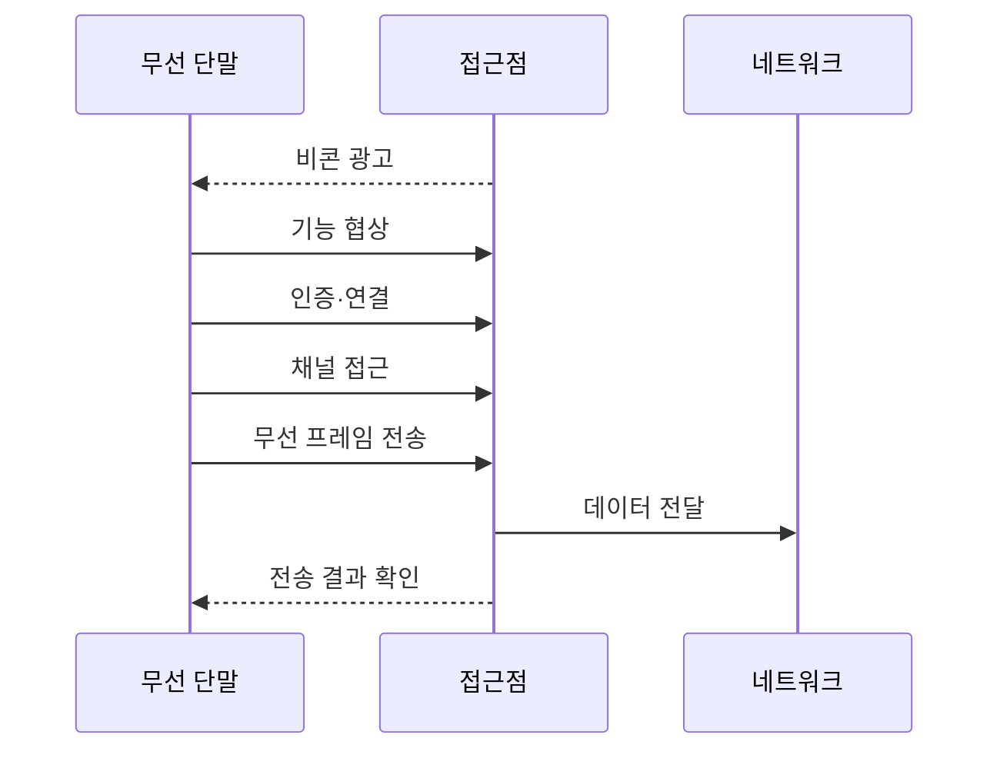

---
sidebar:
  order: 32
  label: "032. Wi-Fi 표준"
  badge: { text: "기출 · 50%", variant: note }
title: "Wi-Fi 표준"
date: "2026-07-27T23:59:59+09:00"
tags: ["notes-network"]
weight: 32
extra:
  question_no: "032"
  source_status: "기출"
  source_history: "125회, 134회"
  priority: 50
  priority_note: "125·134회 출제"
---

## 미리 알고가기

- **와이파이(Wi-Fi)**: ‘와이파이’로 읽는 Wi-Fi Alliance의 상표명으로 별도 영문 확장을 만들지 않으며 IEEE 802.11 기반 무선랜 기술을 뜻함
- **전기전자공학자협회(Institute of Electrical and Electronics Engineers, IEEE) 802.11**: ‘아이 트리플 이 팔공이 점 십일’로 읽고 표준 위원회 번호를 점(.)으로 잇는 표기이며 와이파이의 물리·매체 접근 규격을 정의함
- **접근점(Access Point, AP)**: ‘에이피’로 읽고 두 영문 단어의 머리글자를 딴 표기이며 무선 단말을 분배 시스템과 외부 네트워크에 연결함
- **다중 입력 다중 출력(Multiple-Input Multiple-Output, MIMO)**: ‘마이모’로 읽고 네 영문 핵심어의 머리글자를 딴 표기이며 여러 안테나로 공간 스트림을 병렬 전송함
- **직교 주파수 분할 다중 접속(Orthogonal Frequency-Division Multiple Access, OFDMA)**: ‘오에프디엠에이’로 읽고 다섯 영문 핵심어의 머리글자를 딴 표기이며 채널의 부반송파 묶음을 사용자별로 나눠 배정함
- **다중 링크 동작(Multi-Link Operation, MLO)**: ‘엠엘오’로 읽고 세 영문 단어의 머리글자를 딴 표기이며 여러 무선 링크를 함께 운용함
- **목표 기상 시간(Target Wake Time, TWT)**: ‘티더블유티’로 읽고 세 영문 단어의 머리글자를 딴 표기이며 단말의 통신·절전 시각을 예약함
- **기가헤르츠(Gigahertz, GHz)**: ‘기가헤르츠’로 읽고 주파수 단위의 접두사 G와 헤르츠 기호 Hz를 결합한 표기이며 2.4·5·6GHz 무선 대역을 구분함
- **변조**: 데이터를 전파 형태로 변환

## Ⅰ. 개요

- **정의/개념**: 무선랜의 **물리 전송·매체 접근 표준군**
- **배경/필요성**: 제조사별 무선 규격은 **상호운용·전파 공유 곤란**

### 쉽게 이해하기 (학습용)

- 같은 규칙을 지원하는 단말과 접근점이 전파 사용 순서를 나눠 무선으로 통신한다.

## Ⅱ. 특징

- **세대 간 하위 호환**으로 공통 기능을 협상한다.
- **2.4·5·6GHz**별 도달 거리·용량이 다르다.
- 실효 성능은 **규제·간섭·단말 역량**에 좌우된다.

### 쉽게 이해하기 (학습용)

- 표준 최고 속도와 실제 속도는 다를 수 있다.

## Ⅲ. 아키텍처 및 구성요소

| 설계 요소 | 설명 |
|:---|:---|
| 무선 단말 | **탐색·인증·프레임 송수신** |
| 무선 매체 | **채널·주파수 대역 공유** |
| 접근점(AP) | **무선 접속·자원 배정** |
| 분배 시스템 | **접근점·유선망 연결** |

### 쉽게 이해하기 (학습용)

- 접근점이 공유 전파 자원을 단말에 배정한다.

## Ⅳ. 원리 및 절차 흐름도

| 절차 | 설명 |
|:---|:---|
| 비콘 광고 | 접근점이 망과 기능을 알림 |
| 기능 협상 | 공통 대역·속도·보안 선택 |
| 인증·연결 | 단말 신원 확인과 연결 수립 |
| 채널 접근 | 빈 채널과 전송 기회 확보 |
| 무선 프레임 전송 | 선택 속도로 데이터 송신 |
| 데이터 전달 | 접근점이 목적 망으로 중계 |
| 전송 결과 확인 | 성공 확인 또는 재전송 |

> 요약: 공통 기능 협상 후 채널 기회 확보

### 쉽게 이해하기 (학습용)

- 연결 뒤에도 단말끼리 전송 순서를 나눈다.

## Ⅴ. 종류 및 비교

| Wi-Fi 세대 | Wi-Fi 5 | Wi-Fi 6·6E | Wi-Fi 7 |
|:---|:---|:---|:---|
| 적용 기준 | 일반 5GHz 환경 | 다단말·6GHz 확장 | 저지연·고처리량 |
| 핵심 특징 | 5GHz 처리량 강화 | 고밀도 자원 효율 | 다중 링크·확장 채널 |
| 한계 | 혼잡·단말 경합 | 6GHz 도달 범위 | 기능 조합·채널 부족 |

> 요약: 단말 지원과 전파 환경으로 세대 선택

### 쉽게 이해하기 (학습용)

- 최신 표준도 양쪽 장비가 지원해야 효과가 난다.

## Ⅵ. 실무 사례

1. 고밀도 사무실은 **좁은 채널로 공간 재사용**
2. 6GHz 도입 전 **규제·단말 지원·음영 확인**

### 쉽게 이해하기 (학습용)

- 접근점이 많으면 채널 폭을 좁혀 서로 겹치지 않는 전파 구역을 늘린다.
- 6GHz는 지원 단말과 사용 허가를 확인하고 짧은 도달 거리로 생길 음영을 점검한다.

## Ⅶ. 결론

- 고밀도는 **Wi-Fi 6·6E**, 다중 링크는 **Wi-Fi 7**

### 쉽게 이해하기 (학습용)

- 최신 세대 이름보다 단말 수와 지원 대역에 맞춰 접근점 배치와 채널 폭을 정한다.
