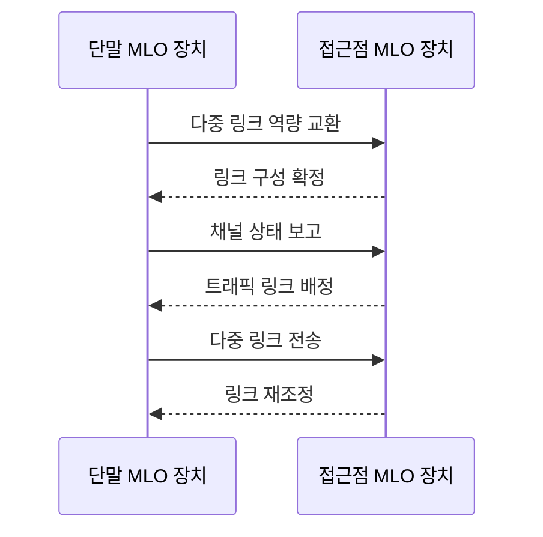

---
sidebar:
  order: 33
  label: "033. Wi-Fi 7"
  badge: { text: "기출 · 50%", variant: note }
title: "Wi-Fi 7"
date: "2026-07-25T19:33:00+09:00"
tags: ["notes-network"]
weight: 33
extra:
  question_no: "033"
  source_status: "기출"
  source_history: "134회"
  priority: 50
  priority_note: "134회 출제"
---

## 미리 알고가기

- **와이파이 7(Wi-Fi 7)**: ‘와이파이 세븐’으로 읽고 상표명 뒤에 세대 번호를 붙인 표기이며 IEEE 802.11be 기반 무선랜 세대임
- **IEEE 802.11be**: ‘아이 트리플 이 팔공이 점 십일 비이’로 읽고 위원회 번호와 개정 식별자를 점(.)으로 잇는 표기이며 와이파이 7의 기술 규격임
- **극고처리량(Extremely High Throughput, EHT)**: ‘이이에이치티’로 읽고 세 영문 핵심어의 머리글자를 딴 표기이며 802.11be가 목표로 하는 처리량 규격명임
- **다중 링크 동작(Multi-Link Operation, MLO)**: ‘엠엘오’로 읽고 세 영문 단어의 머리글자를 딴 표기이며 여러 무선 링크를 함께 운용함
- **MLO 장치**: 다중 링크를 지원하는 장비
- **4096 직교 진폭 변조(4096-Quadrature Amplitude Modulation, 4096-QAM)**: ‘사천구십육 쾀’으로 읽고 성상점 수와 변조 약어를 붙임표로 이은 표기이며 $2^{12}=4096$개 상태로 심볼당 12비트를 표현함
- **메가헤르츠(Megahertz, MHz)**: ‘메가헤르츠’로 읽고 주파수 접두사 M과 헤르츠 기호 Hz를 결합한 표기이며 320MHz는 와이파이 7의 최대 채널 폭을 나타냄
- **다중 자원 단위**: 여러 채널 조각의 묶음
- **채널 천공**: 간섭 구간을 빼고 채널 사용

## Ⅰ. 개요

- **정의/개념**: 다중 링크·320MHz를 지원하는 무선랜 세대
- **배경/필요성**: 혼잡 링크 우회와 고처리량 동시 확보

### 쉽게 이해하기 (학습용)

- 여러 무선 길을 함께 쓰거나 빠르게 바꿔 혼잡을 피하고 더 많은 데이터를 보낸다.

## Ⅱ. 특징

- 여러 링크를 결합하거나 빠르게 전환한다.
- 최대 320MHz로 전송 폭을 넓힌다.
- 좋은 신호에서 심볼당 12비트를 보낸다.
- 채널 천공으로 간섭 구간을 제외한다.
- 장비 역량과 전파 조건이 부족하면 성능 이득이 줄어든다.

### 쉽게 이해하기 (학습용)

- 넓은 길 일부가 막혀도 남은 구간을 활용한다.

## Ⅲ. 아키텍처 및 구성요소

| 설계 요소 | 설명 |
|:---|:---|
| 접근점 링크 집합 | 대역별 링크와 트래픽 통합 관리 |
| 단말 링크 집합 | 링크별 송수신·전환 수행 |

### 쉽게 이해하기 (학습용)

- 제어기가 상태에 맞는 무선 길을 고른다.

## Ⅳ. 원리 및 절차 흐름도

| 절차 | 설명 |
|:---|:---|
| 다중 링크 역량 교환 | 지원 대역과 동시성 확인 |
| 링크 구성 확정 | 사용할 링크 조합 결정 |
| 채널 상태 보고 | 간섭·신호·부하 정보 전달 |
| 트래픽 링크 배정 | 흐름별 전송 링크 선택 |
| 다중 링크 전송 | 결합 또는 교대 방식 송수신 |
| 링크 재조정 | 상태 변화에 따라 재배치 |

> 요약: 링크 상태에 따라 트래픽 재배치

### 쉽게 이해하기 (학습용)

- 혼잡한 링크의 트래픽을 다른 링크로 옮긴다.

## Ⅴ. 종류 및 비교

| 판단 기준 | Wi-Fi 7 | Wi-Fi 6·6E |
|:---|:---|:---|
| 핵심 특징 | 다중 링크·320MHz | 단일 링크·160MHz |
| 적용 기준 | 저지연·초고처리량 | 고밀도 단말 효율 |
| 주요 위험 | 링크 조합·전파 간섭 | 링크 혼잡 |

> 요약: 저지연·고처리량에는 Wi-Fi 7

### 쉽게 이해하기 (학습용)

- 최고 속도보다 링크 전환 안정성을 확인한다.

## Ⅵ. 실무 사례

1. 실시간 서비스는 링크별 지연으로 흐름 재배치
2. 고밀도 구축은 간섭 구간을 천공해 전송

### 쉽게 이해하기 (학습용)

- 실시간 흐름을 지연이 커진 링크에서 다른 링크로 옮긴다.
- 넓은 채널 중 간섭받는 구간만 빼고 나머지 구간으로 전송한다.

## Ⅶ. 결론

- 단말 역량·간섭에 따라 링크 결합·전환 선택

### 쉽게 이해하기 (학습용)

- 양쪽 장비가 지원하는 링크와 간섭 상태를 보고 동시에 쓰거나 우회할 링크를 정한다.
