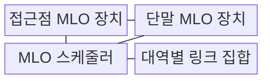
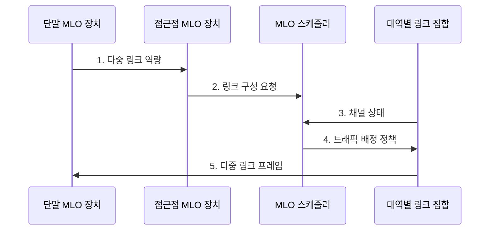

---
sidebar:
  order: 33
  label: "033. Wi-Fi 7"
  badge: { text: "기출 · 50%", variant: note }
title: "Wi-Fi 7"
date: "2026-07-31T11:00:38+09:00"
tags: ["notes-network"]
weight: 33
extra:
  question_no: "033"
  source_status: "기출"
  source_history: "134회"
  priority: 50
  priority_note: "134회 출제"
---

## Ⅰ. 개요

핵심 용어

- **Wi-Fi 7**: IEEE 802.11be 기반으로 MLO·320MHz 채널·4096-QAM을 지원하는 무선랜 세대이다.

- 정의/개념: **IEEE 802.11be EHT**로 MLO·320MHz·4096-QAM을 제공하는 **무선랜 세대**
- 배경/필요성: Wi-Fi 6의 **단일 링크·160MHz**로 혼잡 링크 전환·처리량 확장 제약

### 쉽게 이해하기 (학습용)

- 여러 차선을 함께 쓰거나 막힌 차선에서 옮겨 가듯 Wi-Fi 7은 MLO로 혼잡을 피하고 320MHz·4096-QAM으로 더 많은 데이터를 보낸다

## Ⅱ. 특징

핵심 용어

- **MLO**: 여러 주파수 대역의 무선 링크를 결합하거나 전환해 함께 운용하는 기능이다.
- **채널 천공**: 넓은 채널에서 간섭받는 일부 구간만 제외하고 나머지를 사용하는 기술이다.

- **MLO**를 통한 다중 링크 결합·전환
- **320MHz·4096-QAM**을 통한 최대 전송량 확대
- **Multi-RU·채널 천공**을 통한 유휴 주파수 활용

### 쉽게 이해하기 (학습용)

- 넓은 도로 일부가 공사 중이면 막힌 차선만 비우고 나머지 차선과 다른 도로를 함께 쓰듯 채널 천공과 MLO가 유휴 주파수를 활용한다

## Ⅲ. 구조 및 구성요소

핵심 용어

- **MLO 장치**: 여러 대역의 무선 링크를 하나의 접속으로 운용하는 단말 또는 접근점 장비이다.
- **MLO 스케줄러**: 링크별 채널 상태에 따라 트래픽을 결합하거나 전환해 배정하는 기능이다.

| 구성요소 | 책임 |
|:---|:---|
| 접근점 MLO 장치 | 여러 무선 링크의 **통합 접속** 제어 |
| 단말 MLO 장치 | 링크별 **프레임 송수신·전환** |
| MLO 스케줄러 | 채널 상태에 따른 **트래픽 링크** 배정 |
| 대역별 링크 집합 | **2.4·5·6GHz 링크** 구성 |

### 쉽게 이해하기 (학습용)

- AP와 단말의 다중 링크 장치 사이에서 교통 관제기인 MLO 스케줄러가 대역별 도로 상태에 맞춰 트래픽을 나눈다

## Ⅳ. 흐름도

핵심 용어

- **다중 링크 역량**: 양쪽 장비가 지원하는 주파수 대역과 동시 송수신 가능 여부를 나타내는 정보이다.

**동작 원리**

1. **다중 링크 역량**: 양측의 지원 대역과 **동시 송수신 능력** 확인
2. **링크 구성 요청**: 사용할 대역별 **링크 조합** 결정 요구
3. **채널 상태**: 링크별 간섭·신호·부하 정보 제공
4. **트래픽 배정 정책**: 흐름별 **결합·전환 링크** 선택
5. **다중 링크 프레임**: 선택 링크에서 동시·교대 **프레임 전송**

### 쉽게 이해하기 (학습용)

- 교통 관제기가 차선별 정체를 보고 차를 나누듯 MLO 스케줄러가 링크 상태를 받아 흐름을 결합하거나 다른 대역으로 옮긴다

## Ⅴ. 종류 및 비교

핵심 용어

- **Wi-Fi 6·6E**: OFDMA로 단일 링크의 고밀도 효율을 높이고 6E에서 6GHz 대역을 추가한 이전 세대이다.
- **극고처리량(EHT)**: IEEE 802.11be가 다중 링크와 넓은 채널로 달성하려는 처리량 규격명이다.

| Wi-Fi 세대 | Wi-Fi 7 (IEEE 802.11be) | Wi-Fi 6·6E (IEEE 802.11ax) |
|:---|:---|:---|
| 적용 기준 | 저지연·**다중 링크 처리량** | 고밀도 단말의 **단일 링크 효율** |
| 핵심 특징 | **MLO·320MHz** 채널 | **OFDMA·160MHz** 채널 |
| 한계 | 링크 조합별 **단말 호환성** | 단일 링크의 **혼잡 집중** |

> 요약: 저지연·고처리량에는 Wi-Fi 7

### 쉽게 이해하기 (학습용)

- 여러 차선 표지가 있어도 차량과 교차로가 모두 지원해야 하듯 Wi-Fi 7은 단말·AP의 MLO 조합과 실제 채널 가용성을 확인해야 한다

## Ⅵ. 실무 고려사항 및 대책

핵심 용어

- **SNR**: 수신 신호 전력과 잡음 전력의 비율로 고차 변조의 안정성을 판단하는 지표이다.
- **4096-QAM**: 심볼당 12비트를 표현해 처리량을 높이지만 높은 SNR을 요구하는 변조 방식이다.

| 문제 | 대책 | 효과 |
|:---|:---|:---|
| 지역 규제·인접망으로 **320MHz 채널** 부족 | 가용 대역에 맞춰 **채널 폭** 축소 | 인접망 간섭 없는 **실효 처리량** 확보 |
| MLO 링크별 지연·간섭 편차 | 링크 상태에 따른 **동적 트래픽 배정** | 혼잡 링크의 **지연 전파** 완화 |
| 구형 단말과 **MLO 단말** 혼재 | 세대별 대역·**SSID 정책** 분리 | 구형 단말의 **전송 시간 점유** 감소 |
| 낮은 SNR에서 **4096-QAM** 오류 증가 | 거리·**SNR**별 변조 성능 실측 | 고차 변조의 **재전송 증가** 방지 |

### 쉽게 이해하기 (학습용)

- 실시간 차량을 막힌 도로에서 빈 도로로 옮기되 도로 폭과 차량 지원 여부를 먼저 확인하듯 MLO를 채널·단말 조건에 맞춰 적용한다

## Ⅶ. 결론

핵심 용어

- **가용 채널**: 지역 규제와 인접망 간섭을 고려한 뒤 실제 전송에 사용할 수 있는 주파수 구간이다.

- MLO 지원·가용 채널이 충분하면 **Wi-Fi 7**, 아니면 **Wi-Fi 6·6E** 유지

### 쉽게 이해하기 (학습용)

- 차량과 교차로가 여러 도로를 함께 쓸 수 있고 빈 채널도 충분할 때 Wi-Fi 7을 선택하며 아니면 Wi-Fi 6·6E를 유지한다
