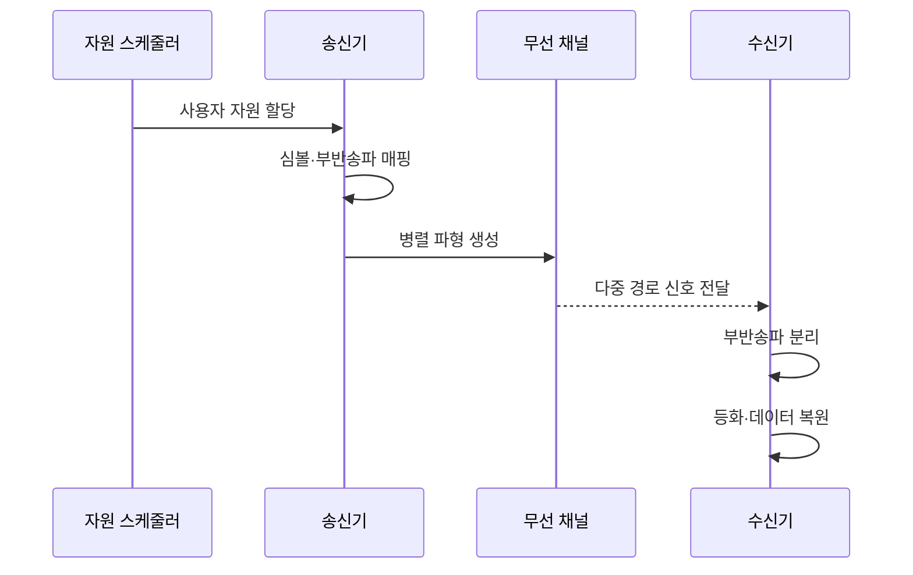

---
sidebar:
  order: 34
  label: "034. OFDM과 OFDMA"
  badge: { text: "기출 · 30%", variant: note }
title: "OFDM과 OFDMA"
date: "2026-07-25T19:34:00+09:00"
tags: ["notes-network"]
weight: 34
extra:
  question_no: "034"
  source_status: "기출"
  source_history: "125회"
  priority: 30
  priority_note: "125회 출제"
---

## 미리 알고가기

- **부반송파**: 데이터를 싣는 작은 주파수 단위
- **직교성**: 겹쳐도 서로 분리되는 파형 성질
- **직교 주파수 분할 다중화(Orthogonal Frequency-Division Multiplexing, OFDM)**: ‘오에프디엠’으로 읽고 네 영문 핵심어의 머리글자를 딴 표기이며 직교 부반송파로 한 전송의 데이터를 병렬화함
- **직교 주파수 분할 다중 접속(Orthogonal Frequency-Division Multiple Access, OFDMA)**: ‘오에프디엠에이’로 읽고 OFDM 뒤에 접속을 뜻하는 A를 붙인 표기이며 부반송파 묶음을 사용자별로 배정함
- **자원 단위**: 사용자에게 배정하는 채널 묶음
- **순환 전치**: 다중 경로 간섭을 줄이는 복제 구간
- **첨두 대 평균 전력비(Peak-to-Average Power Ratio, PAPR)**: ‘피에이피알’로 읽고 네 영문 핵심어의 머리글자를 딴 표기이며 최대 전력과 평균 전력의 비로 증폭기 효율을 좌우함

## Ⅰ. 개요

- **정의/개념**: 직교 부반송파의 병렬화·사용자 배정
- **배경/필요성**: 다중 경로 대응과 동시 사용자 수용

### 쉽게 이해하기 (학습용)

- OFDM은 차선 구성, OFDMA는 차선 배정이다.

## Ⅱ. 특징

- OFDM은 한 전송을 직교 부반송파에 병렬화한다.
- OFDMA는 자원 단위를 여러 사용자에게 배정한다.
- 순환 전치로 다중 경로 간섭을 줄인다.
- 높은 전력 첨두비는 증폭 효율을 낮춘다.

### 쉽게 이해하기 (학습용)

- 작은 채널을 나눠 여러 사용자를 동시에 보낸다.

## Ⅲ. 아키텍처 및 구성요소

| 설계 요소 | 설명 |
|:---|:---|
| 자원 스케줄러 | 사용자별 자원 단위 할당 |
| 심볼·자원 매퍼 | 데이터를 부반송파에 배치 |
| 송신 파형 변환기 | 병렬 심볼을 파형으로 변환 |
| 무선 채널 | 다중 경로와 잡음 반영 |
| 수신 파형 변환기 | 파형에서 부반송파 분리 |
| 등화·복원기 | 채널 왜곡 보정과 데이터 복원 |

### 쉽게 이해하기 (학습용)

- 송신기가 차선을 만들고 수신기가 다시 분리한다.

## Ⅳ. 원리 및 절차 흐름도

| 절차 | 설명 |
|:---|:---|
| 사용자 자원 할당 | 채널 상태별 자원 단위 배정 |
| 심볼·부반송파 매핑 | 데이터를 주파수 위치에 배치 |
| 병렬 파형 생성 | 순환 전치를 붙여 신호 생성 |
| 다중 경로 신호 전달 | 반사·잡음이 포함된 신호 수신 |
| 부반송파 분리 | 수신 파형을 주파수별 분리 |
| 등화·데이터 복원 | 왜곡을 보정해 비트 복원 |

> 요약: 파형 구성과 사용자 자원 배정 결합

### 쉽게 이해하기 (학습용)

- 정해진 차선에 신호를 싣고 다시 분리한다.

## Ⅴ. 종류 및 비교

| 판단 기준 | OFDM | OFDMA |
|:---|:---|:---|
| 핵심 특징 | 한 전송의 부반송파 병렬화 | 여러 사용자에게 자원 분할 |
| 적용 기준 | 고속 단일 링크 | 다중 사용자 동시 접속 |
| 주요 위험 | 전력 첨두비·주파수 오차 | 스케줄링 복잡성·자원 낭비 |

> 요약: OFDMA는 OFDM에 사용자 배정 추가

### 쉽게 이해하기 (학습용)

- 파형 문제는 OFDM, 배정 문제는 OFDMA이다.

## Ⅵ. 실무 사례

1. 소형 패킷은 요구량에 맞는 자원 단위 배정
2. 다중 경로 환경은 지연 확산으로 전치 길이 결정

### 쉽게 이해하기 (학습용)

- 작은 데이터에 큰 자원 단위를 주면 남는 부반송파가 낭비된다.
- 반사 신호가 늦게 오는 시간보다 전치가 짧으면 다음 심볼과 간섭한다.

## Ⅶ. 결론

- 다중 경로·사용자 요구로 전치·자원 단위 결정

### 쉽게 이해하기 (학습용)

- 반사 지연에는 전치 길이를 맞추고 사용자별 데이터량에는 자원 단위 크기를 맞춘다.
