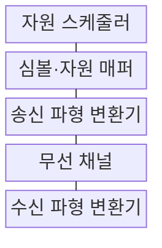
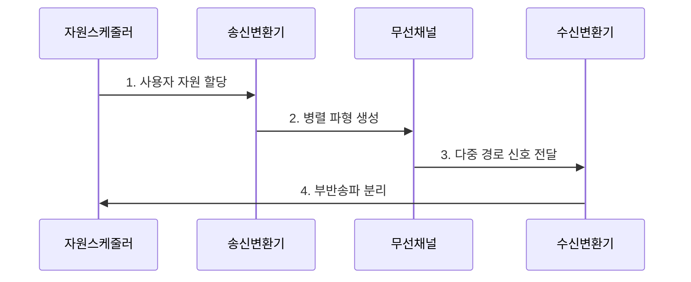

---
sidebar:
  order: 34
  label: "034. OFDM과 OFDMA"
  badge: { text: "기출 · 30%", variant: note }
title: "OFDM과 OFDMA"
date: "2026-07-29T21:30:00+09:00"
tags: ["notes-network"]
weight: 34
extra:
  question_no: "034"
  source_status: "기출"
  source_history: "125회"
  priority: 30
  priority_note: "125회 출제"
---

## 미리 알고가기

- **부반송파**: 데이터를 싣는 작은 주파수 단위
- **직교성**: 겹쳐도 서로 분리되는 파형 성질
- **직교 주파수 분할 다중화(Orthogonal Frequency-Division Multiplexing, OFDM)**: ‘오에프디엠’으로 읽고 네 영문 핵심어의 머리글자를 딴 표기이며 직교 부반송파로 한 전송의 데이터를 병렬화함
- **직교 주파수 분할 다중 접속(Orthogonal Frequency-Division Multiple Access, OFDMA)**: ‘오에프디엠에이’로 읽고 OFDM 뒤에 접속을 뜻하는 A를 붙인 표기이며 부반송파 묶음을 사용자별로 배정함
- **자원 단위(Resource Unit, RU)**: ‘알유’로 읽고 두 영문 단어의 머리글자를 딴 표기이며 사용자에게 배정하는 부반송파 묶음임
- **순환 전치(Cyclic Prefix, CP)**: ‘시피’로 읽고 두 영문 단어의 머리글자를 딴 표기이며 심볼 뒤 일부를 앞에 복제해 다중 경로 간섭을 줄임
- **첨두 대 평균 전력비(Peak-to-Average Power Ratio, PAPR)**: ‘피에이피알’로 읽고 네 영문 핵심어의 머리글자를 딴 표기이며 최대 전력과 평균 전력의 비로 증폭기 효율을 좌우함

## Ⅰ. 개요

- 정의/개념: OFDM은 **부반송파 병렬화**, OFDMA는 **사용자별 자원 배정**
- 배경/필요성: 단일 반송파는 **다중 경로 왜곡·광대역 등화 부담**

### 쉽게 이해하기 (학습용)

- OFDM은 차선 구성, OFDMA는 차선 배정이다.

## Ⅱ. 특징

- **직교 부반송파**로 주파수 선택적 채널에 대응한다.
- **OFDMA 자원 단위**로 다중 사용자가 동시 접속한다.
- **순환 전치·높은 PAPR**로 전송·전력 효율이 감소한다.

### 쉽게 이해하기 (학습용)

- 작은 채널을 나눠 여러 사용자를 동시에 보낸다.

## Ⅲ. 구조 및 구성요소

| 구성요소 | 책임 |
|:---|:---|
| 자원 스케줄러 | 사용자별 자원 단위 할당 |
| 심볼·자원 매퍼 | 데이터를 부반송파에 배치 |
| 송신 파형 변환기 | 병렬 심볼을 파형으로 변환 |
| 무선 채널 | 다중 경로·잡음 반영 |
| 수신 파형 변환기 | 파형에서 부반송파 분리 |

### 쉽게 이해하기 (학습용)

- 송신기가 차선을 만들고 수신기가 다시 분리한다.

## Ⅳ. 흐름도

**동작 원리**

1. **사용자 자원 할당**: 채널 상태별 자원 단위 배정
2. **병렬 파형 생성**: 데이터를 부반송파에 매핑하고 순환 전치를 붙여 신호 생성
3. **다중 경로 신호 전달**: 반사·잡음이 포함된 신호 수신
4. **부반송파 분리**: 수신 파형을 주파수별 분리

### 쉽게 이해하기 (학습용)

- 정해진 차선에 신호를 싣고 다시 분리한다.

## Ⅴ. 종류 및 비교

| 직교 부반송파 방식 | OFDM | OFDMA |
|:---|:---|:---|
| 적용 기준 | 고속 단일 링크 | 다중 사용자 동시 접속 |
| 핵심 특징 | 한 전송의 부반송파 병렬화 | 사용자별 자원 단위 분할 |
| 한계 | 높은 PAPR·주파수 오차 | 스케줄링 복잡성·자원 낭비 |

> 요약: OFDMA는 OFDM에 사용자 배정 추가

### 쉽게 이해하기 (학습용)

- 파형 문제는 OFDM, 배정 문제는 OFDMA이다.

## Ⅵ. 실무 고려사항 및 대책

| 고려사항 | 대책 | 효과 |
|:---|:---|:---|
| 부반송파 동기 오차 | 주파수·시간 동기 추정 보정 | 직교성 유지 |
| 높은 PAPR | 전력 증폭기 여유·저감 기법 | 파형 왜곡 감소 |
| 순환 전치 과소 | 지연 확산보다 긴 구간 설정 | 심볼 간 간섭 방지 |
| OFDMA 자원 편중 | 채널·지연·공정성 공동 스케줄 | 사용자 품질 균형 |

### 쉽게 이해하기 (학습용)

- 작은 데이터에 큰 자원 단위를 주면 남는 부반송파가 낭비된다.

## Ⅶ. 결론

- **채널 상태·PAPR·자원 공정성을 반영한 OFDM·OFDMA 운용**

### 쉽게 이해하기 (학습용)

- OFDM은 차선을 만들고 OFDMA는 그 차선을 여러 사용자에게 나눠 준다.
