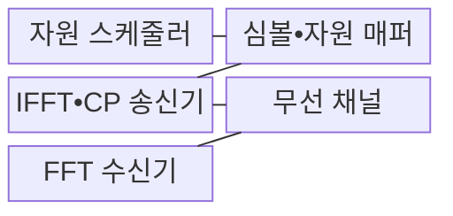
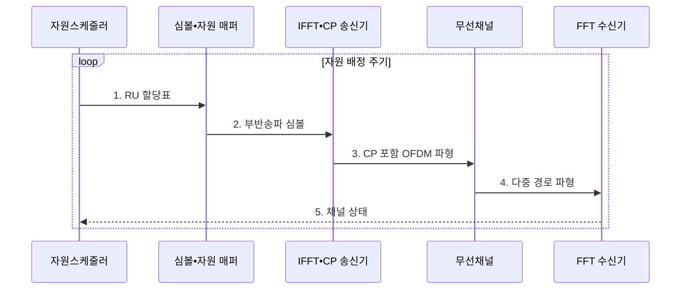

---
sidebar:
  order: 34
  label: "034. OFDM과 OFDMA"
  badge: { text: "기출 • 30%", variant: note }
title: "OFDM과 OFDMA"
date: "2026-08-03T08:48:47+09:00"
tags: ["notes-network"]
weight: 34
extra:
  question_no: "034"
  source_status: "기출"
  source_history: "125회"
  priority: 30
  priority_note: "125회 출제"
---

## Ⅰ. 개요

핵심 용어

- **직교 주파수 분할 다중화(Orthogonal Frequency Division Multiplexing, OFDM)**: 직교 부반송파에 한 전송의 데이터를 나눠 병렬화하는 다중화 방식이다.
- **직교 주파수 분할 다중 접속(Orthogonal Frequency Division Multiple Access, OFDMA)**: 부반송파 묶음을 사용자별로 배정하는 다중 접속 방식이다.
- **자원 단위(Resource Unit, RU)**: OFDMA에서 한 사용자에게 배정하는 부반송파 묶음이다.

- 정의/개념: **OFDM** 은 직교 부반송파 병렬화, **OFDMA** 는 사용자별 RU를 배정하는 방식
- 배경/필요성: 단일 반송파는 **다중 경로 왜곡•광대역 등화 부담**

#### 한줄 요약

- OFDM이 한 차량의 짐을 여러 직교 차선에 나눠 싣는다면 OFDMA는 그 차선 묶음을 여러 사용자 차량에 배정한다

## Ⅱ. 특징

핵심 용어

- **직교성**: 부반송파 스펙트럼이 겹쳐도 정해진 표본 지점에서 서로 분리되는 파형 성질이다.
- **최대 대 평균 전력비(Peak-to-Average Power Ratio, PAPR)**: 최대 전력과 평균 전력의 비로 값이 클수록 전력 증폭기 효율을 낮추는 지표이다.
- **직교 주파수 분할 다중화•다중 접속(Orthogonal Frequency Division Multiplexing/Multiple Access, OFDM•OFDMA)**: 한 전송의 병렬화와 사용자별 부반송파 배정을 각각 수행하는 방식이다.

- **직교 부반송파** 병렬화로 주파수 선택적 채널 등화 단순화
- **OFDMA 자원 단위** 배정으로 다중 사용자 동시 접속
- **순환 전치 오버헤드•높은 PAPR** 에 따른 전력•전송 효율 저하

#### 한줄 요약

- 넓은 도로를 서로 겹쳐도 구별되는 작은 차선으로 나누면 OFDM은 한 사용자의 짐을 병렬 운송하고 OFDMA는 차선을 사용자별로 나눈다

## Ⅲ. 구조 및 구성요소

핵심 용어

- **역고속 푸리에 변환(Inverse Fast Fourier Transform, IFFT)**: 주파수 영역의 부반송파 심볼을 시간 영역 OFDM 파형으로 합성하는 연산이다.
- **고속 푸리에 변환(Fast Fourier Transform, FFT)**: 수신 OFDM 파형을 주파수 영역의 부반송파 심볼로 분리하는 연산이다.
- **순환 전치•자원 단위(Cyclic Prefix/Resource Unit, CP•RU)**: 다중 경로 간섭을 줄이는 보호 구간과 사용자별 부반송파 묶음이다.

| 구성요소 | 책임 |
|:---|:---|
| 자원 스케줄러 | 사용자별 **RU 할당** |
| 심볼•자원 매퍼 | 변조 심볼을 **부반송파** 에 배치 |
| IFFT•CP 송신기 | 병렬 심볼을 파형으로 합성하고 **CP 삽입** |
| 무선 채널 | **다중 경로•잡음** 반영 |
| FFT 수신기 | 수신 파형에서 **부반송파 심볼** 분리 |

#### 한줄 요약

- 배차표를 받은 적재기가 짐을 차선에 놓고 IFFT 송신기가 하나의 도로 파형으로 합치면 FFT 수신기가 다시 차선별 짐을 분리한다

## Ⅳ. 흐름도

핵심 용어

- **자원 단위(Resource Unit, RU)**: OFDMA에서 한 사용자에게 배정하는 부반송파 묶음이다.
- **순환 전치(Cyclic Prefix, CP)**: 심볼 뒤 일부를 앞에 복제해 다중 경로의 심볼 간 간섭을 줄이는 보호 구간이다.
- **직교 주파수 분할 다중화•다중 접속(Orthogonal Frequency Division Multiplexing/Multiple Access, OFDM•OFDMA)**: 부반송파 병렬 전송과 사용자별 자원 배정을 수행하는 방식이다.
- **역고속•고속 푸리에 변환(Inverse Fast Fourier Transform/Fast Fourier Transform, IFFT•FFT)**: 부반송파 심볼을 파형으로 합성하고 다시 분리하는 연산이다.

**동작 원리**

1. **RU 할당표**: 채널 상태와 사용자 요구에 따라 **자원 단위** 배정
2. **부반송파 심볼**: 사용자 데이터의 변조 심볼을 지정 **RU** 에 배치
3. **CP 포함 OFDM 파형**: **IFFT** 로 파형 합성 후 순환 전치 삽입
4. **다중 경로 파형**: 반사•잡음과 지연이 포함된 수신 신호 전달
5. **채널 상태**: **FFT** 분리 결과로 다음 RU 배정 근거 제공

#### 한줄 요약

- 배차표대로 차선에 짐을 놓고 하나의 도로로 합쳐 보낸 뒤 수신기가 차선을 다시 분리하고 상태표를 다음 배정에 돌려준다

## Ⅴ. 종류 및 비교

핵심 용어

- **다중화**: 한 전송의 여러 신호를 하나의 전송 자원에 결합하는 방식이다.
- **다중 접속**: 하나의 전송 자원을 여러 사용자에게 구분해 배정하는 방식이다.
- **직교 주파수 분할 다중화•다중 접속(Orthogonal Frequency Division Multiplexing/Multiple Access, OFDM•OFDMA)**: 단일 전송의 병렬화와 다중 사용자의 자원 분할을 각각 수행하는 방식이다.
- **자원 단위•최대 대 평균 전력비(Resource Unit/Peak-to-Average Power Ratio, RU•PAPR)**: 사용자에게 배정하는 부반송파 묶음과 파형의 최대•평균 전력 비율이다.

| 직교 부반송파 방식 | OFDM | OFDMA |
|:---|:---|:---|
| 적용 기준 | 고속 **단일 사용자 링크** | 다중 사용자의 **동시 접속** |
| 핵심 특징 | 한 전송의 **부반송파 병렬화** | 사용자별 **RU 분할** |
| 한계 | 높은 **PAPR•주파수 오차** | **스케줄링 복잡성•RU 낭비** |

> 요약: OFDMA는 OFDM에 사용자 배정 추가

#### 한줄 요약

- 한 차량의 짐을 여러 차선에 나누는 문제면 OFDM이고 여러 차량에 차선을 나누는 문제면 OFDMA다

## Ⅵ. 실무 고려사항 및 대책

핵심 용어

- **지연 확산**: 다중 경로 신호의 도착 시간 차이가 퍼진 범위로 순환 전치 길이를 정하는 기준이다.
- **공정성 스케줄링**: 사용자별 지연과 누적 전송 기회를 함께 고려해 자원을 배정하는 방식이다.
- **최대 대 평균 전력비•순환 전치(Peak-to-Average Power Ratio/Cyclic Prefix, PAPR•CP)**: 증폭기 효율을 좌우하는 전력 지표와 다중 경로 간섭을 줄이는 보호 구간이다.
- **직교 주파수 분할 다중 접속•자원 단위(Orthogonal Frequency Division Multiple Access/Resource Unit, OFDMA•RU)**: 사용자별로 부반송파 묶음을 배정하는 방식과 그 배정 단위이다.

| 문제 | 대책 | 효과 |
|:---|:---|:---|
| 주파수•시간 오차로 **부반송파 직교성** 훼손 | 주파수•시간 **동기 추정•보정** | 부반송파 간 **간섭** 감소 |
| 높은 **PAPR** 로 전력 증폭기 포화 | 증폭기 출력 여유•**PAPR 저감** 적용 | 비선형 **파형 왜곡** 감소 |
| CP가 지연 확산보다 짧아 **심볼 간 간섭** | 지연 확산보다 긴 **순환 전치** 설정 | 다중 경로의 **심볼 중첩** 방지 |
| 일부 사용자에 **OFDMA 자원** 편중 | 채널•지연•**공정성 스케줄링** | 사용자 간 **전송 기회 편차** 감소 |

#### 한줄 요약

- 작은 짐에 큰 차선 묶음을 주면 빈 차선이 남듯 사용자 데이터량보다 큰 RU를 배정하면 부반송파가 낭비된다

## Ⅶ. 결론

핵심 용어

- **부반송파(Subcarrier)**: OFDM 파형에서 변조 심볼을 싣는 좁은 대역의 개별 주파수 성분이다.
- **직교 주파수 분할 다중화•다중 접속(Orthogonal Frequency Division Multiplexing/Multiple Access, OFDM•OFDMA)**: 단일 사용자 병렬 전송과 다중 사용자 자원 배정에 각각 적합한 방식이다.

- 단일 사용자 광대역은 **OFDM**, 다중 사용자 자원 배정은 **OFDMA** 선택

#### 한줄 요약

- 한 차량의 짐을 병렬 차선으로 옮기면 OFDM을, 여러 차량에 차선 묶음을 공정하게 나누면 OFDMA를 선택한다
