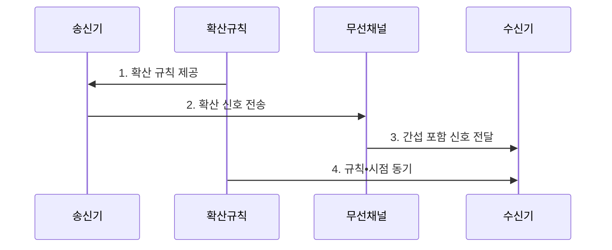

---
sidebar:
  order: 35
  label: "035. 대역 확산 FHSS•DSSS"
  badge: { text: "기출 • 30%", variant: note }
title: "대역 확산 FHSS•DSSS"
date: "2026-08-03T15:05:00+09:00"
tags: ["notes-network"]
weight: 35
extra:
  question_no: "035"
  source_status: "기출"
  source_history: "126회"
  priority: 30
  priority_note: "126회 출제"
---

## Ⅰ. 개요

핵심 용어

- **대역 확산**: 원신호의 에너지를 더 넓은 주파수 대역에 분산하고 수신 측이 같은 규칙으로 복원하는 전송 방식이다.
- **주파수 도약•직접 시퀀스 대역 확산(Frequency-Hopping Spread Spectrum/Direct-Sequence Spread Spectrum, FHSS•DSSS)**: 반송 주파수를 바꾸거나 원신호에 코드를 결합해 신호를 넓은 대역에 분산하는 방식이다.

- 정의/개념: 원신호를 **주파수 도약•코드 결합**으로 넓은 대역에 분산하는 전송 방식
- 배경/필요성: 협대역 전송은 **간섭•재밍 에너지 집중** 에 취약

#### 한줄 요약

- 신호를 옮기거나 펼쳐 간섭을 분산한다.

## Ⅱ. 특징

핵심 용어

- **의사잡음 코드(Pseudo-Noise Code, PN 코드)**: DSSS 송수신기가 신호의 확산과 역확산에 함께 사용하는 결정적 코드열이다.
- **동기화**: 송수신기가 도약 순서 또는 확산 코드의 규칙과 시작 시점을 일치시키는 과정이다.
- **주파수 도약•직접 시퀀스 대역 확산(Frequency-Hopping Spread Spectrum/Direct-Sequence Spread Spectrum, FHSS•DSSS)**: 도약 순서 또는 확산 코드로 간섭을 분산하는 방식이다.

- **FHSS** 의 도약 순서 기반 간섭 주파수 회피
- **DSSS** 의 PN 코드•칩 기반 신호 대역 확산
- **도약•코드•시점 동기** 기반 수신 역확산

#### 한줄 요약

- 넓게 퍼뜨린 뒤 같은 열쇠로 다시 모은다.

## Ⅲ. 구조 및 구성요소

핵심 용어

- **확산 변조기**: 반송 주파수를 도약시키거나 원신호에 확산 코드를 결합해 광대역 신호를 만드는 장치이다.
- **역확산 복조기**: 같은 확산 규칙을 적용해 수신한 광대역 신호에서 원신호를 복원하는 장치이다.
- **의사잡음 코드(Pseudo-Noise Code, PN 코드)**: 직접 시퀀스 확산과 역확산에 사용하는 결정적 코드열이다.

| 구성요소 | 책임 |
|:---|:---|
| 확산 규칙 생성기 | 도약 순서•**PN 코드** 생성 |
| 확산 변조기 | 반송파 도약 또는 **칩** 결합 |
| 광대역 무선 채널 | 확산 신호와 **간섭** 전달 |
| 동기 검출기 | 규칙•시작 시점 **동기화** |
| 역확산 복조기 | 규칙을 적용한 **원신호 복원** |

#### 한줄 요약

- 같은 규칙과 시작 시점이 있어야 복원된다.

## Ⅳ. 흐름도

핵심 용어

- **확산 규칙**: 주파수 도약 대역 확산(Frequency-Hopping Spread Spectrum, FHSS)의 도약 순서나 직접 시퀀스 대역 확산(Direct-Sequence Spread Spectrum, DSSS)의 코드열처럼 송수신기가 공유해야 하는 신호 분산 기준이다.

**동작 원리**

1. **확산 규칙 제공**: 도약 순서나 코드열 전달
2. **확산 신호 전송**: 주파수 이동 또는 코드 결합 후 넓은 대역으로 송신
3. **간섭 포함 신호 전달**: 채널 간섭과 함께 수신
4. **규칙•시점 동기**: 코드와 시작 위치 탐색

#### 한줄 요약

- 수신기가 같은 순서와 박자를 찾아야 한다.

## Ⅴ. 종류 및 비교

핵심 용어

- **주파수 도약 대역 확산(Frequency-Hopping Spread Spectrum, FHSS)**: 정해진 순서로 반송 주파수를 바꿔 협대역 간섭을 회피하는 대역 확산 방식이다.
- **직접 시퀀스 대역 확산(Direct-Sequence Spread Spectrum, DSSS)**: 원신호에 고속 확산 코드를 결합해 넓은 대역으로 분산하는 대역 확산 방식이다.
- **의사잡음 코드(Pseudo-Noise Code, PN 코드)**: DSSS에서 원신호를 칩 단위로 확산하는 코드열이다.

| 대역 확산 방식 | FHSS | DSSS |
|:---|:---|:---|
| 적용 기준 | **협대역 간섭** 회피 | **처리 이득**•코드 구분 |
| 핵심 특징 | 반송 주파수 **연속 도약** | **PN 코드** 로 신호 확산 |
| 한계 | 도약 **동기 이탈** | 코드 동기•**근원거리 문제** |

> 요약: FHSS는 주파수, DSSS는 코드 확산

#### 한줄 요약

- FHSS는 옮기고 DSSS는 펼친다.

## Ⅵ. 실무 고려사항 및 대책

핵심 용어

- **근원거리 문제**: 가까운 송신기의 강한 신호가 먼 송신기의 약한 신호를 덮어 코드 분리를 어렵게 하는 현상이다.
- **처리 이득**: 확산 대역폭을 원 데이터 대역폭으로 나눈 값으로 역확산 뒤의 간섭 내성을 나타내는 지표이다.
- **주파수 도약•직접 시퀀스 대역 확산(Frequency-Hopping Spread Spectrum/Direct-Sequence Spread Spectrum, FHSS•DSSS)**: 간섭 특성과 처리 이득 요구에 따라 선택하는 두 확산 방식이다.

| 문제 | 대책 | 효과 |
|:---|:---|:---|
| **도약•코드 동기** 실패 | 획득•추적 구간과 재동기 설계 | **역확산 성공률** 향상 |
| **근거리 강신호** 간섭 | 전력 제어•처리 이득 산정 | **수신 포화** 방지 |
| **확산 규칙** 노출 | 보안 키와 확산 코드를 분리 | **기밀성 오판** 방지 |
| **규제 대역** 위반 | 도약 채널•출력•점유율 검증 | **전파 규정** 준수 |

#### 한줄 요약

- 좁은 대역 간섭이 잦으면 주파수를 옮기는 FHSS를, 확산 이득이 필요하면 DSSS를 선택한다.

## Ⅶ. 결론

핵심 용어

- **협대역 간섭**: 전체 확산 대역 중 일부의 좁은 주파수 구간에 에너지가 집중되는 방해 신호이다.
- **주파수 도약•직접 시퀀스 대역 확산(Frequency-Hopping Spread Spectrum/Direct-Sequence Spread Spectrum, FHSS•DSSS)**: 협대역 간섭 회피와 처리 이득 확보에 각각 적합한 방식이다.

- 협대역 간섭 회피는 **FHSS**, 처리 이득 확보는 **DSSS** 선택

#### 한줄 요약

- 신호를 넓게 퍼뜨려 간섭을 분산하고 수신 측은 같은 규칙으로 원신호를 복원한다.
