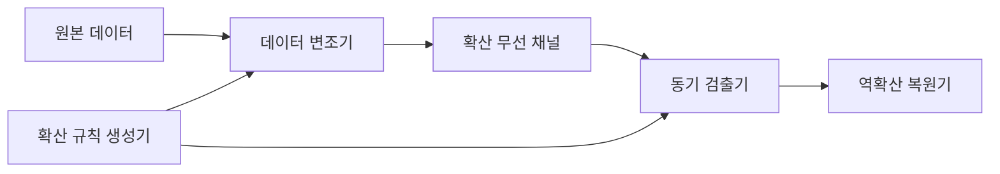
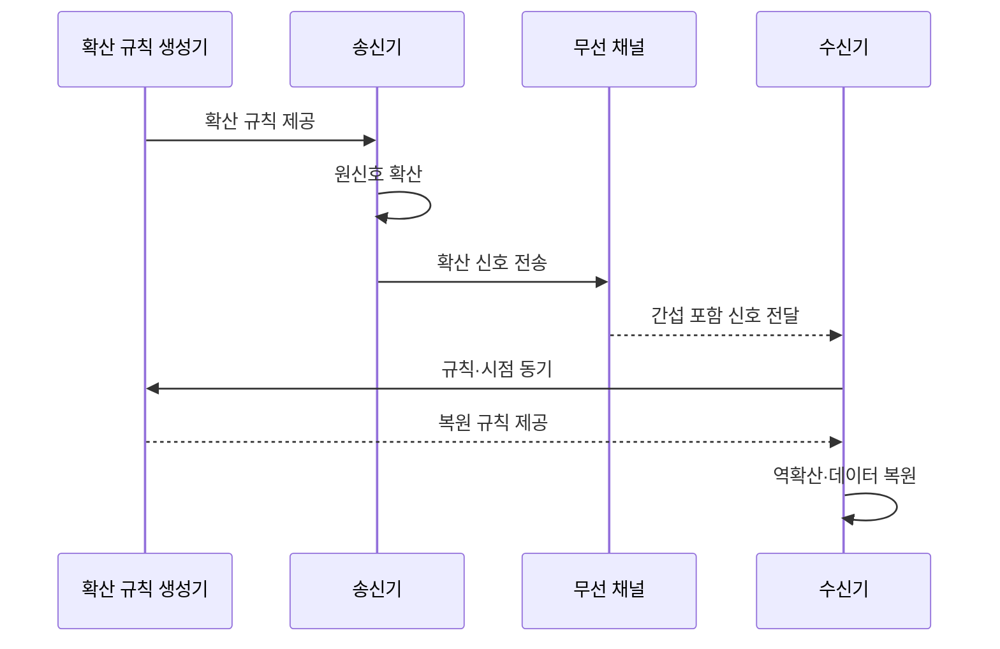

---
sidebar:
  order: 35
  label: "035. 대역 확산 FHSS·DSSS"
  badge: { text: "기출 · 30%", variant: note }
title: "대역 확산 FHSS·DSSS"
date: "2026-07-25T19:35:00+09:00"
tags: ["notes-network"]
weight: 35
extra:
  question_no: "035"
  source_status: "기출"
  source_history: "126회"
  priority: 30
  priority_note: "126회 출제"
---

## 미리 알고가기

- **대역 확산**: 원신호보다 넓은 주파수 대역에 신호 에너지를 분산하고 같은 규칙으로 복원하는 전송 방식
- **주파수 도약 대역 확산(Frequency-Hopping Spread Spectrum, FHSS)**: ‘에프에이치에스에스’로 읽고 네 영문 핵심어의 머리글자를 딴 표기이며 정해진 순서로 반송 주파수를 바꿔 간섭을 회피함
- **직접 시퀀스 대역 확산(Direct-Sequence Spread Spectrum, DSSS)**: ‘디에스에스에스’로 읽고 네 영문 핵심어의 머리글자를 딴 표기이며 원신호에 고속 확산 코드를 결합함
- **의사잡음 코드(Pseudo-Noise Code, PN Code)**: ‘피엔 코드’로 읽고 두 영문 핵심어의 머리글자를 딴 표기이며 확산·역확산에 쓰는 결정적 코드열임
- **칩**: 확산 코드의 한 비트 단위
- **처리 이득(Processing Gain)**: 확산 대역폭을 원 데이터 대역폭보다 넓혀 역확산 때 얻는 간섭 저항임
- **근원거리 문제(Near-Far Problem)**: 가까운 송신기의 강한 신호가 먼 송신기의 약한 신호를 덮어 코드 분리를 어렵게 하는 현상임
- **동기화**: 송수신 규칙과 시점을 일치

## Ⅰ. 개요

- **정의/개념**: 신호를 넓은 대역에 분산·복원하는 전송
- **배경/필요성**: 협대역 간섭의 집중 영향 완화

### 쉽게 이해하기 (학습용)

- 신호를 옮기거나 펼쳐 간섭을 분산한다.

## Ⅱ. 특징

- FHSS는 정해진 순서로 반송 주파수를 바꾼다.
- DSSS는 원신호에 고속 확산 코드를 결합한다.
- 넓은 대역에 신호를 퍼뜨려 협대역 간섭을 줄인다.
- 규칙과 시점이 어긋나면 원신호를 복원하지 못한다.

### 쉽게 이해하기 (학습용)

- 넓게 퍼뜨린 뒤 같은 열쇠로 다시 모은다.

## Ⅲ. 아키텍처 및 구성요소

| 설계 요소 | 설명 |
|:---|:---|
| 원본 데이터 | 전송할 비트열 제공 |
| 데이터 변조기 | 도약 또는 코드 확산 수행 |
| 확산 규칙 생성기 | 도약 순서·확산 코드 생성 |
| 확산 무선 채널 | 광대역 신호와 간섭 전달 |
| 동기 검출기 | 규칙의 시작 시점 탐색 |
| 역확산 복원기 | 같은 규칙으로 데이터 복원 |

### 쉽게 이해하기 (학습용)

- 같은 규칙과 시작 시점이 있어야 복원된다.

## Ⅳ. 원리 및 절차 흐름도

| 절차 | 설명 |
|:---|:---|
| 확산 규칙 제공 | 도약 순서나 코드열 전달 |
| 원신호 확산 | 주파수 이동 또는 코드 결합 |
| 확산 신호 전송 | 넓은 대역으로 신호 송신 |
| 간섭 포함 신호 전달 | 채널 간섭과 함께 수신 |
| 규칙·시점 동기 | 코드와 시작 위치 탐색 |
| 복원 규칙 제공 | 일치한 규칙을 수신기에 제공 |
| 역확산·데이터 복원 | 상관 처리로 원신호 추출 |

> 요약: 확산 규칙과 시점 동기로 복원

### 쉽게 이해하기 (학습용)

- 수신기가 같은 순서와 박자를 찾아야 한다.

## Ⅴ. 종류 및 비교

| 판단 기준 | FHSS | DSSS |
|:---|:---|:---|
| 핵심 특징 | 반송 주파수를 연속 도약 | 칩 코드로 신호를 확산 |
| 적용 기준 | 협대역 간섭 회피 | 처리 이득·코드 구분 |
| 주요 위험 | 도약 동기 이탈 | 코드 동기·근원거리 문제 |

> 요약: FHSS는 주파수, DSSS는 코드 확산

### 쉽게 이해하기 (학습용)

- FHSS는 옮기고 DSSS는 펼친다.

## Ⅵ. 실무 사례

1. FHSS는 혼잡 채널을 도약 목록에서 제외
2. DSSS 수신은 코드 동기·수신 전력 차 점검

### 쉽게 이해하기 (학습용)

- 간섭이 심한 주파수를 도약 순서에서 빼고 남은 주파수로 옮겨 다닌다.
- 같은 코드의 시작점을 맞추고 강한 신호가 먼 약한 신호를 덮는지 확인한다.

## Ⅶ. 결론

- 간섭 특성과 동기 조건으로 확산 방식을 선택한다.

### 쉽게 이해하기 (학습용)

- 좁은 간섭을 피할 때는 도약하고 코드 분리가 필요할 때는 직접 시퀀스로 펼친다.
