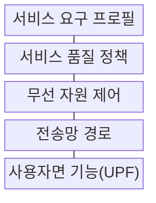
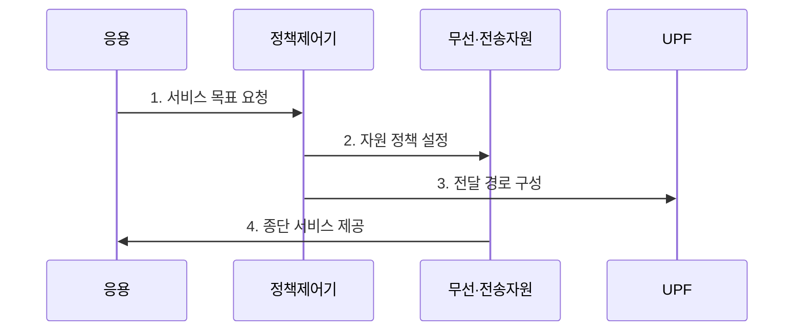

---
sidebar:
  order: 36
  label: "036. 5G 서비스 eMBB·URLLC·mMTC"
  badge: { text: "기출 · 30%", variant: note }
title: "5G 서비스 eMBB·URLLC·mMTC"
date: "2026-07-29T22:30:00+09:00"
tags: ["notes-network"]
weight: 36
extra:
  question_no: "036"
  source_status: "기출"
  source_history: "128회"
  priority: 30
  priority_note: "128회 출제"
---

## 미리 알고가기

- **5세대 이동통신(5th Generation, 5G)**: ‘파이브지’로 읽고 세대 번호 5와 Generation의 머리글자 G를 결합한 표기이며 이동통신의 다섯 번째 세대를 뜻함
- **향상된 모바일 광대역(enhanced Mobile Broadband, eMBB)**: ‘이엠비비’로 읽고 enhanced를 소문자 e로 구분한 뒤 핵심어 머리글자를 이은 표기이며 영상·확장현실의 대용량·고속 전송을 목표로 함
- **초신뢰 저지연 통신(Ultra-Reliable and Low-Latency Communications, URLLC)**: ‘유알엘엘시’로 읽고 영문 핵심어의 머리글자를 딴 표기이며 원격 제어의 높은 신뢰도와 짧은 지연을 목표로 함
- **대규모 기계형 통신(massive Machine-Type Communications, mMTC)**: ‘엠엠티시’로 읽고 massive를 소문자 m으로 구분한 표기이며 많은 저전력 센서의 동시 접속을 목표로 함
- **서비스 품질(Quality of Service, QoS)**: ‘큐오에스’로 읽고 영문 핵심어의 머리글자를 딴 표기이며 흐름별 처리량·지연·우선순위를 제어함
- **엣지 컴퓨팅(Edge Computing)**: 데이터 발생 지점과 가까운 망 가장자리에서 처리해 전송 지연과 코어망 부하를 줄임
- **사용자면 기능(User Plane Function, UPF)**: ‘유피에프’로 읽고 세 영문 단어의 머리글자를 딴 표기이며 사용자 패킷의 전달 경로를 선택함
- **서비스 수준 협약(Service Level Agreement, SLA)**: ‘에스엘에이’로 읽고 세 영문 단어의 머리글자를 딴 표기이며 공급자와 이용자가 합의한 서비스 성능·책임 목표임

## Ⅰ. 개요

- 정의/개념: 5G의 **처리량·신뢰지연·접속밀도 서비스 유형**
- 배경/필요성: 단일 품질 정책은 **상충 서비스 요구 동시 충족 곤란**

### 쉽게 이해하기 (학습용)

- 영상·제어·센서에 서로 다른 자원을 준다.

## Ⅱ. 특징

- **eMBB**는 넓은 대역·다중 안테나로 처리량을 높인다.
- **URLLC**는 우선 자원·짧은 경로로 신뢰도와 지연을 보장한다.
- **mMTC**는 경량 접속·절전으로 접속 밀도를 높인다.

### 쉽게 이해하기 (학습용)

- 모든 성능을 최대로 하기보다 목표를 선택한다.

## Ⅲ. 구조 및 구성요소

| 구성요소 | 책임 |
|:---|:---|
| 서비스 요구 프로필 | 처리량·지연·밀도 목표 정의 |
| 서비스 품질 정책 | 흐름 우선순위·격리 결정 |
| 무선 자원 제어 | 대역·재전송·접속 기회 배정 |
| 전송망 경로 | 지연·용량별 경로 전달 |
| 사용자면 기능(UPF) | 사용자 패킷 경로 선택 |

### 쉽게 이해하기 (학습용)

- 서비스 목표가 망 전 구간의 자원으로 변환된다.

## Ⅳ. 흐름도

**동작 원리**

1. **서비스 목표 요청**: 처리량·지연·밀도 목표 전달
2. **자원 정책 설정**: eMBB·URLLC·mMTC로 분류해 대역·우선순위·접속량 배정
3. **전달 경로 구성**: 사용자면과 엣지 경로 선택
4. **종단 서비스 제공**: 설정된 자원으로 통신 수행

### 쉽게 이해하기 (학습용)

- 분류보다 혼잡 때 목표 유지가 중요하다.

## Ⅴ. 종류 및 비교

| 5G 서비스 유형 | eMBB | URLLC | mMTC |
|:---|:---|:---|:---|
| 적용 기준 | 영상·확장현실 | 원격 제어·자동화 | 센서·검침 |
| 핵심 특징 | 대용량·고속 전송 | 초신뢰·저지연 | 대규모·저전력 접속 |
| 한계 | 대역 혼잡 | 종단 지연 초과 | 재접속 폭주·전력 소모 |

> 요약: 최우선 품질 지표로 서비스 유형 선택

### 쉽게 이해하기 (학습용)

- 속도·반응·연결 수 중 우선 목표를 정한다.

## Ⅵ. 실무 고려사항 및 대책

| 고려사항 | 대책 | 효과 |
|:---|:---|:---|
| 서비스 목표 동시 최대화 | 최우선 품질 지표·허용치 확정 | 자원 충돌 감소 |
| URLLC 종단 지연 초과 | 무선·전송·처리 예산 분할 | 지연 위반 구간 식별 |
| mMTC 재접속 폭주 | 접속 분산·절전 주기 차등 | 제어 채널 보호 |

### 쉽게 이해하기 (학습용)

- 공장 제어는 전체 지연 목표를 무선·전송·처리 구간에 나눠 각 구간을 제한한다.

## Ⅶ. 결론

- **처리량·지연·밀도 우선순위에 따른 5G 서비스 자원 설계**

### 쉽게 이해하기 (학습용)

- 속도·반응 시간·연결 수 중 최우선 목표를 정해 자원과 경로를 배정해야 한다.
