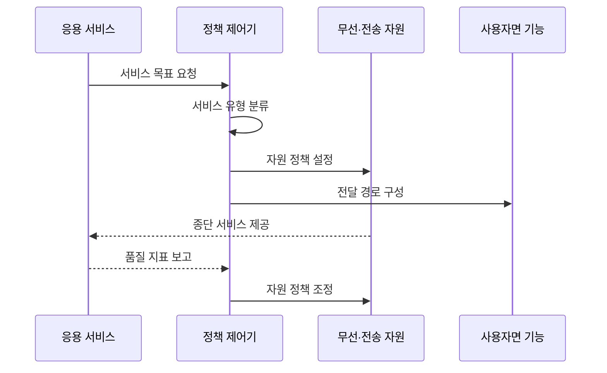

---
sidebar:
  order: 36
  label: "036. 5G 서비스 eMBB·URLLC·mMTC"
  badge: { text: "기출 · 30%", variant: note }
title: "5G 서비스 eMBB·URLLC·mMTC"
date: "2026-07-25T19:36:00+09:00"
tags: ["notes-network"]
weight: 36
extra:
  question_no: "036"
  source_status: "기출"
  source_history: "128회"
  priority: 30
  priority_note: "128회 출제"
---

## 미리 알고가기

- **향상된 모바일 광대역(enhanced Mobile Broadband, eMBB)**: ‘이엠비비’로 읽고 enhanced를 소문자 e로 구분한 뒤 핵심어 머리글자를 이은 표기이며 영상·확장현실의 대용량·고속 전송을 목표로 함
- **초신뢰 저지연 통신(Ultra-Reliable and Low-Latency Communications, URLLC)**: ‘유알엘엘시’로 읽고 영문 핵심어의 머리글자를 딴 표기이며 원격 제어의 높은 신뢰도와 짧은 지연을 목표로 함
- **대규모 기계형 통신(massive Machine-Type Communications, mMTC)**: ‘엠엠티시’로 읽고 massive를 소문자 m으로 구분한 표기이며 많은 저전력 센서의 동시 접속을 목표로 함
- **서비스 품질(Quality of Service, QoS)**: ‘큐오에스’로 읽고 영문 핵심어의 머리글자를 딴 표기이며 흐름별 처리량·지연·우선순위를 제어함
- **엣지 컴퓨팅**: 사용자 가까이에서 처리
- **사용자면 기능(User Plane Function, UPF)**: ‘유피에프’로 읽고 세 영문 단어의 머리글자를 딴 표기이며 사용자 패킷의 전달 경로를 선택함
- **서비스 수준 협약(Service Level Agreement, SLA)**: ‘에스엘에이’로 읽고 세 영문 단어의 머리글자를 딴 표기이며 공급자와 이용자가 합의한 서비스 성능·책임 목표임

## Ⅰ. 개요

- **정의/개념**: 품질 요구별 5G 자원 설계 유형
- **배경/필요성**: 처리량·지연·접속 밀도의 상충 조정

### 쉽게 이해하기 (학습용)

- 영상·제어·센서에 서로 다른 자원을 준다.

## Ⅱ. 특징

- eMBB는 넓은 대역·다중 안테나로 처리량을 높인다.
- URLLC는 짧은 경로·우선 자원으로 지연을 줄인다.
- mMTC는 경량 접속·절전으로 단말 밀도를 높인다.
- 격리·우선순위가 유형 간 자원 충돌을 줄인다.

### 쉽게 이해하기 (학습용)

- 모든 성능을 최대로 하기보다 목표를 선택한다.

## Ⅲ. 아키텍처 및 구성요소

| 설계 요소 | 설명 |
|:---|:---|
| 서비스 요구 프로필 | 처리량·지연·밀도 목표 정의 |
| 서비스 품질 정책 | 흐름 우선순위와 격리 결정 |
| 무선 자원 제어 | 대역·재전송·접속 기회 배정 |
| 전송망 경로 | 지연·용량 목표에 맞춰 전달 |
| 사용자면 기능(UPF) | 사용자 패킷 경로 선택 |
| 엣지·응용 서비스 | 가까운 위치에서 업무 처리 |

### 쉽게 이해하기 (학습용)

- 서비스 목표가 망 전 구간의 자원으로 변환된다.

## Ⅳ. 원리 및 절차 흐름도

| 절차 | 설명 |
|:---|:---|
| 서비스 목표 요청 | 처리량·지연·밀도 목표 전달 |
| 서비스 유형 분류 | eMBB·URLLC·mMTC 매핑 |
| 자원 정책 설정 | 대역·우선순위·접속량 배정 |
| 전달 경로 구성 | 사용자면과 엣지 경로 선택 |
| 종단 서비스 제공 | 설정된 자원으로 통신 수행 |
| 품질 지표 보고 | 종단 성능과 위반 상태 수집 |
| 자원 정책 조정 | 혼잡과 장애에 맞춰 재배정 |

> 요약: 서비스 목표를 종단 자원·경로로 변환

### 쉽게 이해하기 (학습용)

- 분류보다 혼잡 때 목표 유지가 중요하다.

## Ⅴ. 종류 및 비교

| 판단 기준 | eMBB | URLLC | mMTC |
|:---|:---|:---|:---|
| 핵심 특징 | 대용량·고속 전송 | 초신뢰·저지연 | 대규모·저전력 접속 |
| 적용 기준 | 영상·확장현실 | 원격 제어·자동화 | 센서·검침 |
| 주요 위험 | 대역 혼잡 | 종단 지연 초과 | 재접속 폭주·전력 소모 |

> 요약: 최우선 품질 지표로 서비스 유형 선택

### 쉽게 이해하기 (학습용)

- 속도·반응·연결 수 중 우선 목표를 정한다.

## Ⅵ. 실무 사례

1. 공장 제어는 무선부터 응용까지 지연 예산 분할
2. 대규모 검침은 동시 재접속·배터리 수명 시험

### 쉽게 이해하기 (학습용)

- 공장 제어는 전체 지연 목표를 무선·전송·처리 구간에 나눠 각 구간을 제한한다.
- 검침망은 장애 뒤 센서가 한꺼번에 다시 접속하는 부하와 배터리 소모를 시험한다.

## Ⅶ. 결론

- 최우선 품질로 무선 자원·종단 경로 결정

### 쉽게 이해하기 (학습용)

- 속도·반응 시간·연결 수 중 최우선 목표를 정하고 그 목표에 자원과 경로를 배정한다.
