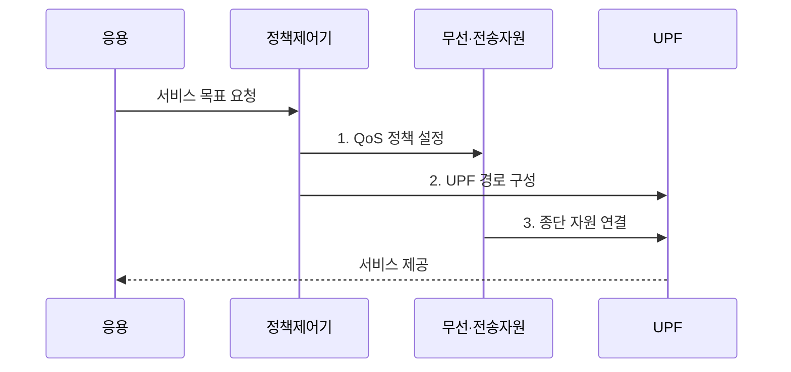

---
sidebar:
  order: 36
  label: "036. 5G 서비스 eMBB·URLLC·mMTC"
  badge: { text: "기출 · 30%", variant: note }
title: "5G 서비스 eMBB·URLLC·mMTC"
date: "2026-07-31T11:01:43+09:00"
tags: ["notes-network"]
weight: 36
extra:
  question_no: "036"
  source_status: "기출"
  source_history: "128회"
  priority: 30
  priority_note: "128회 출제"
---

## Ⅰ. 개요

핵심 용어

- **5세대 이동통신 서비스 유형(Fifth-Generation Mobile Communication Service Type, 5G 서비스 유형)**: 응용의 요구에 따라 처리량·신뢰성·지연·접속 밀도 중 우선할 품질을 특화한 이동통신 서비스 분류이다.
- **향상된 모바일 광대역·초신뢰 저지연 통신·대규모 기계형 통신(Enhanced Mobile Broadband/Ultra-Reliable and Low-Latency Communications/Massive Machine-Type Communications, eMBB·URLLC·mMTC)**: 처리량, 신뢰성·지연, 접속 밀도를 각각 우선하는 5G 서비스 유형이다.

- 정의/개념: 요구 품질에 따라 **처리량·신뢰성·지연·접속 밀도**를 특화한 5G 서비스 유형
- 배경/필요성: 단일 품질 정책으로 **처리량·지연·접속 밀도 동시 최적화 불가**

#### 한줄 요약

- 영상·제어·센서에 서로 다른 자원을 준다.

## Ⅱ. 특징

핵심 용어

- **향상된 모바일 광대역(Enhanced Mobile Broadband, eMBB)**: 영상·확장현실의 대용량·고속 전송을 목표로 하는 5G 서비스 유형이다.
- **초신뢰 저지연 통신(Ultra-Reliable and Low-Latency Communications, URLLC)**: 원격 제어의 높은 신뢰도와 짧은 지연을 목표로 하는 5G 서비스 유형이다.
- **대규모 기계형 통신(Massive Machine-Type Communications, mMTC)**: 많은 저전력 센서의 동시 접속을 목표로 하는 5G 서비스 유형이다.

- 넓은 대역·다중 안테나를 통한 **eMBB 처리량 향상**
- 우선 자원·짧은 경로를 통한 **URLLC 신뢰성·지연 보장**
- 경량 접속·절전을 통한 **mMTC 접속 밀도 향상**

#### 한줄 요약

- 모든 성능을 최대로 하기보다 목표를 선택한다.

## Ⅲ. 구조 및 구성요소

핵심 용어

- **서비스 품질(Quality of Service, QoS)**: 흐름별 처리량·지연·우선순위를 제어하는 품질 기준이다.
- **사용자 평면 기능(User Plane Function, UPF)**: 설정된 정책에 따라 사용자 패킷을 전달하고 엣지 또는 외부망 경로에 연결하는 5G 코어 기능이다.
- **5세대 이동통신(Fifth-Generation Mobile Communication, 5G)**: 다양한 서비스 품질을 정책과 자원으로 분리해 제공하는 이동통신 세대이다.

| 구성요소 | 책임 |
|:---|:---|
| 서비스 요구 프로필 | 처리량·지연·밀도 **목표 정의** |
| QoS 정책 제어 | 흐름 **우선순위·격리** 결정 |
| 무선 자원 제어 | 대역·재전송·**접속 기회** 배정 |
| 전송망 경로 제어 | 지연·용량별 **경로 선택** |
| 사용자면 기능(UPF) | 사용자 패킷의 **엣지 경로** 연결 |

#### 한줄 요약

- 서비스 목표가 망 전 구간의 자원으로 변환된다.

## Ⅳ. 흐름도

핵심 용어

- **서비스 품질 정책(Quality of Service Policy, QoS 정책)**: 서비스 목표를 무선 자원 우선순위와 전송 경로 제어 기준으로 변환한 규칙이다.
- **엣지 컴퓨팅**: 데이터 발생 지점과 가까운 망 가장자리에서 처리해 전송 지연과 코어망 부하를 줄이는 방식이다.
- **사용자 평면 기능(User Plane Function, UPF)**: 사용자 패킷을 정책에 따라 엣지 또는 외부망 경로로 전달하는 5G 코어 기능이다.

**동작 원리**

1. **QoS 정책 설정**: 서비스 유형에 따라 대역·우선순위·접속량 결정
2. **UPF 경로 구성**: 사용자면과 엣지 경로 선택
3. **종단 자원 연결**: 무선·전송 자원을 사용자면 경로에 결합

#### 한줄 요약

- 분류보다 혼잡 때 목표 유지가 중요하다.

## Ⅴ. 종류 및 비교

핵심 용어

- **처리량**: 단위 시간에 성공적으로 전달하는 데이터의 양이다.
- **접속 밀도**: 일정 면적에서 망이 동시에 수용할 수 있는 단말의 수이다.
- **향상된 모바일 광대역·초신뢰 저지연 통신·대규모 기계형 통신(Enhanced Mobile Broadband/Ultra-Reliable and Low-Latency Communications/Massive Machine-Type Communications, eMBB·URLLC·mMTC)**: 처리량, 신뢰성·지연, 접속 밀도 요구에 대응하는 서비스 유형이다.
- **5세대 이동통신(Fifth-Generation Mobile Communication, 5G)**: 세 가지 서비스 유형을 품질 요구에 따라 지원하는 이동통신 세대이다.

| 5G 서비스 유형 | eMBB | URLLC | mMTC |
|:---|:---|:---|:---|
| 적용 기준 | **영상·확장현실** | **원격 제어·자동화** | **센서·검침** |
| 핵심 특징 | **대용량·고속** 전송 | **초신뢰·저지연** | **대규모·저전력** 접속 |
| 한계 | **대역 혼잡** | **종단 지연** 초과 | **재접속 폭주**·전력 소모 |

> 요약: 최우선 품질 지표로 서비스 유형 선택

#### 한줄 요약

- 속도·반응·연결 수 중 우선 목표를 정한다.

## Ⅵ. 실무 고려사항 및 대책

핵심 용어

- **서비스 수준 협약(Service Level Agreement, SLA)**: 공급자와 이용자가 합의한 처리량·지연·가용성 등의 서비스 성능과 책임 목표이다.
- **종단 지연 예산**: 전체 지연 허용치를 무선·전송·처리 구간별 한도로 나눈 관리 기준이다.
- **향상된 모바일 광대역·초신뢰 저지연 통신·대규모 기계형 통신(Enhanced Mobile Broadband/Ultra-Reliable and Low-Latency Communications/Massive Machine-Type Communications, eMBB·URLLC·mMTC)**: SLA별 처리량, 지연, 접속 밀도 목표를 우선하는 서비스 유형이다.

| 문제 | 대책 | 효과 |
|:---|:---|:---|
| **서비스 목표** 동시 최대화 | SLA별 최우선 품질 지표·허용치 확정 | **자원 충돌** 감소 |
| **URLLC 종단 지연** 초과 | 무선·전송·처리 예산 분할 | **지연 위반 구간** 식별 |
| **mMTC 재접속** 폭주 | 접속 분산·절전 주기 차등 | **제어 채널** 보호 |
| **eMBB 대역** 혼잡 | 트래픽 예측 기반 대역·경로 확장 | **처리량 SLA** 유지 |

#### 한줄 요약

- 공장 제어는 전체 지연 목표를 무선·전송·처리 구간에 나눠 각 구간을 제한한다.

## Ⅶ. 결론

핵심 용어

- **최우선 품질 지표**: 서비스 목적을 달성하기 위해 처리량·지연·신뢰성·접속 밀도 중 먼저 보장할 성능 기준이다.
- **향상된 모바일 광대역·초신뢰 저지연 통신·대규모 기계형 통신(Enhanced Mobile Broadband/Ultra-Reliable and Low-Latency Communications/Massive Machine-Type Communications, eMBB·URLLC·mMTC)**: 최우선 품질 지표에 따라 선택하는 5G 서비스 유형이다.

- 처리량은 **eMBB**, 신뢰·지연은 **URLLC**, 접속 밀도는 **mMTC** 선택

#### 한줄 요약

- 속도·반응 시간·연결 수 중 최우선 목표를 정해 자원과 경로를 배정해야 한다.
